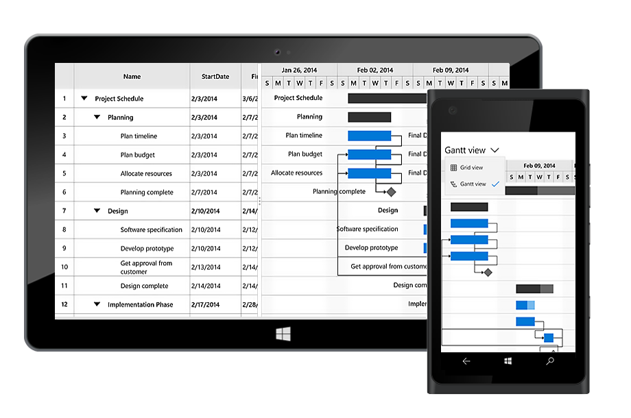

# Overview

Gantt control is designed to visualize and edit the project schedule, and track the project progress. It helps to organize and schedule the projects and you can update the project schedule through interactions like editing, dragging and resizing.

## Key features

* Task relationship
* Interactive editing
* Sorting
* Customize timescale format
