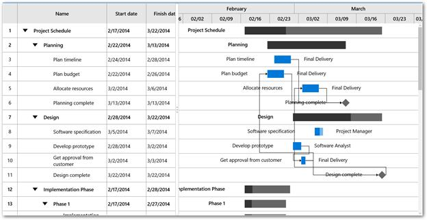
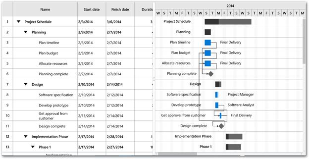
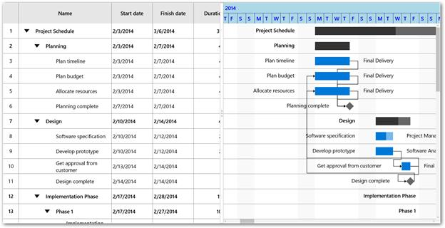
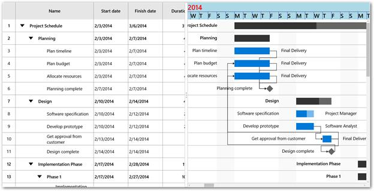
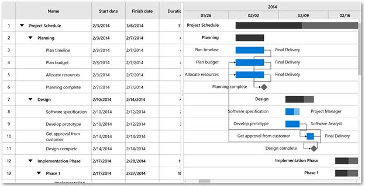

# Timescale

This topic gives an overview on the features of Timescale. The following properties are used for configuring timescale in [`TimescaleSettings`](https://help.syncfusion.com/cr/cref_files/uwp/Syncfusion.SfGantt.UWP~Syncfusion.UI.Xaml.Gantt.TimescaleSettings.html) class.

* [`TopTier`](https://help.syncfusion.com/cr/cref_files/uwp/Syncfusion.SfGantt.UWP~Syncfusion.UI.Xaml.Gantt.TimescaleSettings~TopTier.html) – Represents the top tier of the timescale.
* [`BottomTier`](https://help.syncfusion.com/cr/cref_files/uwp/Syncfusion.SfGantt.UWP~Syncfusion.UI.Xaml.Gantt.TimescaleSettings~BottomTier.html) – Represents the bottom tier of the timescale.



<Gantt:SfGantt.TimescaleSettings>
      <Gantt:TimescaleSettings>
         <Gantt:TimescaleSettings.TopTier>
             <Gantt:TimescaleTier></Gantt:TimescaleTier>
          </Gantt:TimescaleSettings.TopTier>
         <Gantt:TimescaleSettings.BottomTier>
              <Gantt:TimescaleTier IntervalType="Days"></Gantt:TimescaleTier>
          </Gantt:TimescaleSettings.BottomTier>
      </Gantt:TimescaleSettings>
 </Gantt:SfGantt.TimescaleSettings>



this.Gantt.TimescaleSettings.TopTier = new TimescaleTier();

this.Gantt.TimescaleSettings.BottomTier = new TimescaleTier();





By default, the interval type is set as Auto. We can also change the interval type and interval using the below properties in TimescaleTier class.

* [`IntervalType`](https://help.syncfusion.com/cr/cref_files/uwp/Syncfusion.SfGantt.UWP~Syncfusion.UI.Xaml.Gantt.TimescaleTier~IntervalType.html) – Used to define the type of the interval as minutes, hours, days, weeks, quarter and year.
* [`Interval`](https://help.syncfusion.com/cr/cref_files/uwp/Syncfusion.SfGantt.UWP~Syncfusion.UI.Xaml.Gantt.TimescaleTier~Interval.html) – Used to set a value that determines the interval between the timescale tier cells.

The following code example illustrates the timescale displaying year and days.



<Gantt:SfGantt.TimescaleSettings>
    <Gantt:TimescaleSettings>
       <Gantt:TimescaleSettings.TopTier>
          <Gantt:TimescaleTier Interval="1" IntervalType="Years"></Gantt:TimescaleTier>
       </Gantt:TimescaleSettings.TopTier>
       <Gantt:TimescaleSettings.BottomTier>
          <Gantt:TimescaleTier Interval="4" IntervalType="Days"></Gantt:TimescaleTier>
       </Gantt:TimescaleSettings.BottomTier>
    </Gantt:TimescaleSettings>
  </Gantt:SfGantt.TimescaleSettings>




this.Gantt.TimescaleSettings.TopTier = new TimescaleTier()
            {
                Interval = 1,
                IntervalType = IntervalType.Years
            };

this.Gantt.TimescaleSettings.BottomTier = new TimescaleTier()
            {
                Interval = 4,
                IntervalType = IntervalType.Days
            };




N>The top tier’s interval and interval type must be greater than bottom tier’s interval and interval type.

**Display** **Formats**

The display formats can be defined for each interval type. You can set the default date time format strings as display formats. Display formats can be defined using the following properties.

* [`YearsLabelFormat`](https://help.syncfusion.com/cr/cref_files/uwp/Syncfusion.SfGantt.UWP~Syncfusion.UI.Xaml.Gantt.TimescaleTier~YearsLabelFormat.html) - Used to set the format for the label for the year interval type.
* [`QuarterLabelFormat`](https://help.syncfusion.com/cr/cref_files/uwp/Syncfusion.SfGantt.UWP~Syncfusion.UI.Xaml.Gantt.TimescaleTier~QuarterLabelFormat.html) - Used to set the format for the label for the quarter interval type.
* [`WeeksLabelFormat`](https://help.syncfusion.com/cr/cref_files/uwp/Syncfusion.SfGantt.UWP~Syncfusion.UI.Xaml.Gantt.TimescaleTier~WeeksLabelFormat.html)- Used to set the format for the label for the week interval type.
* [`DaysLabelFormat`](https://help.syncfusion.com/cr/cref_files/uwp/Syncfusion.SfGantt.UWP~Syncfusion.UI.Xaml.Gantt.TimescaleTier~DaysLabelFormat.html) - Used to set the format for the label for the days interval type.
* [`HoursLabelFormat`](https://help.syncfusion.com/cr/cref_files/uwp/Syncfusion.SfGantt.UWP~Syncfusion.UI.Xaml.Gantt.TimescaleTier~HoursLabelFormat.html)- Used to set the format for the label for the hours interval type.

## Visual Customization

The default view of the timescale can be customized using the below properties.

* [`Background`](https://help.syncfusion.com/cr/cref_files/uwp/Syncfusion.SfGantt.UWP~Syncfusion.UI.Xaml.Gantt.TimescaleSettings~Background.html) - Used to set the background color for timescale.
* [`BorderBrush`](https://help.syncfusion.com/cr/cref_files/uwp/Syncfusion.SfGantt.UWP~Syncfusion.UI.Xaml.Gantt.TimescaleSettings~BorderBrush.html) - Used to set the color for the border for every timescale cell.
* [`Foreground`](https://help.syncfusion.com/cr/cref_files/uwp/Syncfusion.SfGantt.UWP~Syncfusion.UI.Xaml.Gantt.TimescaleSettings~Foreground.html) - Used to set the color for the text in the timescale.
* [`LabelAlignment`](https://help.syncfusion.com/cr/cref_files/uwp/Syncfusion.SfGantt.UWP~Syncfusion.UI.Xaml.Gantt.TimescaleTier~LabelAlignment.html) - Used to change the alignment of the label in the timescale cell.

The following code example illustrates the customization of timescale.




<Gantt:SfGantt x:Name="Gantt" ItemsSource="{Binding TaskCollection}" ProjectResources="{Binding ResourceCollection}">

     <Gantt:SfGantt.TimescaleSettings>

        <Gantt:TimescaleSettings  Background="LightBlue" BorderBrush="DarkBlue" Foreground="Blue">

           <Gantt:TimescaleSettings.TopTier>

               <Gantt:TimescaleTier LabelAlignment="Left"  IntervalType="Years" >

            </Gantt:TimescaleTier>

            </Gantt:TimescaleSettings.TopTier>

            <Gantt:TimescaleSettings.BottomTier>

                <Gantt:TimescaleTier LabelAlignment="Left" IntervalType="Days">

                </Gantt:TimescaleTier>

           </Gantt:TimescaleSettings.BottomTier>

       </Gantt:TimescaleSettings>

   </Gantt:SfGantt.TimescaleSettings>

</Gantt:SfGantt>




this.Gantt.TimescaleSettings.Background = new SolidColorBrush(Colors.LightBlue);
this.Gantt.TimescaleSettings.BorderBrush = new SolidColorBrush(Colors.DarkBlue);
this.Gantt.TimescaleSettings.Foreground = new SolidColorBrush(Colors.Blue);
this.Gantt.TimescaleSettings.TopTier.LabelAlignment = TextAlignment.Left;
this.Gantt.TimescaleSettings.BottomTier.LabelAlignment = TextAlignment.Left;





**Label** **Template**

The default appearance of the label in timescale cell can be customized using [`LabelTemplate`](https://help.syncfusion.com/cr/cref_files/uwp/Syncfusion.SfGantt.UWP~Syncfusion.UI.Xaml.Gantt.TimescaleTier~LabelTemplate.html) property in TimescaleTier class.



 <Gantt:SfGantt x:Name="Gantt" ItemsSource="{Binding TaskCollection}" AllowEditing="True" ProjectResources="{Binding ResourceCollection}">

      <Gantt:SfGantt.TimescaleSettings>

          <Gantt:TimescaleSettings >

             <Gantt:TimescaleSettings.TopTier>

                 <Gantt:TimescaleTier  IntervalType="Years" >

                     <Gantt:TimescaleTier.LabelTemplate>

                        <DataTemplate>

                            <TextBlock Text="{Binding Content}" Foreground="Red" FontSize="24"></TextBlock>

                         </DataTemplate>

                    </Gantt:TimescaleTier.LabelTemplate>

                  </Gantt:TimescaleTier>

               </Gantt:TimescaleSettings.TopTier>

         <Gantt:TimescaleSettings.BottomTier>

         <Gantt:TimescaleTier IntervalType="Days">

              <Gantt:TimescaleTier.LabelTemplate>

                   <DataTemplate>

                       <TextBlock Text="{Binding Content}" Width="30" Foreground="Black" FontSize="20"></TextBlock>

                   </DataTemplate>

                 </Gantt:TimescaleTier.LabelTemplate>

              </Gantt:TimescaleTier>

           </Gantt:TimescaleSettings.BottomTier>

       </Gantt:TimescaleSettings>

    </Gantt:SfGantt.TimescaleSettings>

</Gantt:SfGantt>




**Cell** **Width** **Customization**

The width for the timescale cell in bottom tier can be set using [`CellSize`](https://help.syncfusion.com/cr/cref_files/uwp/Syncfusion.SfGantt.UWP~Syncfusion.UI.Xaml.Gantt.TimescaleSettings~CellSize.html) property in [`TimescaleSettings`](https://help.syncfusion.com/cr/cref_files/uwp/Syncfusion.SfGantt.UWP~Syncfusion.UI.Xaml.Gantt.TimescaleSettings.html).

The following code illustrates the increasing width of the timescale cell.




<Gantt:SfGantt x:Name="Gantt" ItemsSource="{Binding TaskCollection}" ProjectResources="{Binding ResourceCollection}">

     <Gantt:SfGantt.TimescaleSettings>

        <Gantt:TimescaleSettings CellSize="350" >

        </Gantt:TimescaleSettings>

     </Gantt:SfGantt.TimescaleSettings>

</Gantt:SfGantt>





this.Gantt.TimescaleSettings.CellSize = 350;





N>The value for the cell width ranges between 25 and 1000.

## Range Customization

The start or end range of timescale can be explicitly defined using [`TimescaleStartDate`](https://help.syncfusion.com/cr/cref_files/uwp/Syncfusion.SfGantt.UWP~Syncfusion.UI.Xaml.Gantt.SfGantt~TimescaleStartDate.html) and [`TimescaleEndDate`](https://help.syncfusion.com/cr/cref_files/uwp/Syncfusion.SfGantt.UWP~Syncfusion.UI.Xaml.Gantt.SfGantt~TimescaleEndDate.html) properties in [`SfGantt`](https://help.syncfusion.com/cr/cref_files/uwp/Syncfusion.SfGantt.UWP~Syncfusion.UI.Xaml.Gantt.SfGantt.html) class. 

The following code example illustrates the timescale range customization.





<Gantt:SfGantt x:Name="Gantt" TimescaleStartDate="2014/1/1" 
               TimescaleEndDate="2014/4/1" 
               ItemsSource="{Binding TaskCollection}"
               ProjectResources="{Binding ResourceCollection}">

</Gantt:SfGantt>





this.Gantt.TimescaleStartDate = new DateTime(2014, 1, 1);

this.Gantt.TimescaleEndDate = new DateTime(2014, 5, 1);





