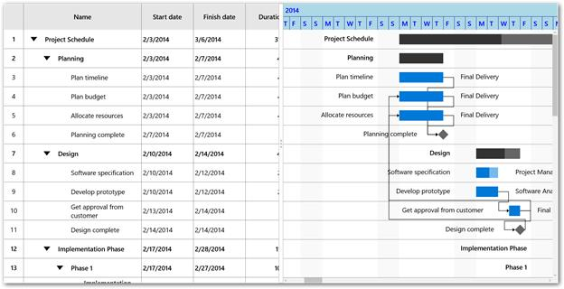
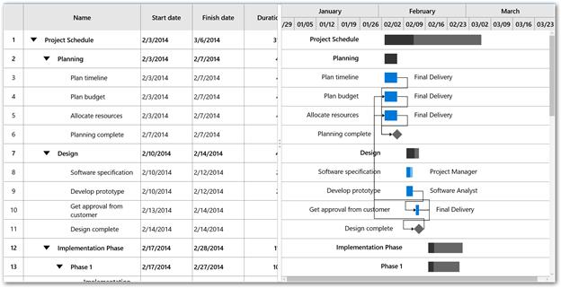

# Timescale

This topic gives an overview on the features of Timescale. The following properties is used for configuring timescale in TimescaleSettings class.

* TopTier – Represents the top tier of the timescale.
* BottomTier – Represents the bottom tier of the timescale.


<Gantt:SfGantt.TimescaleSettings>

<Gantt:TimescaleSettings>

<Gantt:TimescaleSettings.TopTier>

<Gantt:TimescaleTier></Gantt:TimescaleTier>

</Gantt:TimescaleSettings.TopTier>

<Gantt:TimescaleSettings.BottomTier>

<Gantt:TimescaleTier></Gantt:TimescaleTier>

</Gantt:TimescaleSettings.BottomTier>

</Gantt:TimescaleSettings>

</Gantt:SfGantt.TimescaleSettings>




this.Gantt.TimescaleSettings.TopTier = new TimescaleTier();

this.Gantt.TimescaleSettings.BottomTier = new TimescaleTier();



By default, the interval type is set as Auto. We can also change the interval type and interval using the below properties in TimescaleTier class.

* IntervalType – Used to define the type of the interval as minutes, hours, days, weeks, quarter and year.
* Interval – Used to set a value that determines the interval between the timescale tier cells.

The following code snippet illustrates the timescale displaying year and days.


<Gantt:SfGantt.TimescaleSettings>

<Gantt:TimescaleSettings>

<Gantt:TimescaleSettings.TopTier>

<Gantt:TimescaleTier Interval="1" IntervalType="Years" ></Gantt:TimescaleTier>

</Gantt:TimescaleSettings.TopTier>

<Gantt:TimescaleSettings.BottomTier>

<Gantt:TimescaleTier Interval="4" IntervalType="Days"></Gantt:TimescaleTier>

</Gantt:TimescaleSettings.BottomTier>

</Gantt:TimescaleSettings>

</Gantt:SfGantt.TimescaleSettings>




this.Gantt.TimescaleSettings.TopTier = new TimescaleTier()

{

Interval = 1,

IntervalType = IntervalType.Years

};

this.Gantt.TimescaleSettings.BottomTier = new TimescaleTier()

{

Interval = 4,

IntervalType = IntervalType.Days

};                                                          
};



N>The top tier’s interval and interval type must be greater the bottom tier’s interval and interval type.

**Timescale** **Display** **Formats**

The display formats can be defined for each interval type. You can set the default data time format strings as display formats. Display formats can be defined using the following properties.

* YearsLabelFormat - Used to set the format for the label for the year interval type.
* QuarterLabelFormat - Used to set the format for the label for the quarter interval type.
* WeeksLabelFormat- Used to set the format for the label for the week interval type.
* DaysLabelFormat - Used to set the format for the label for the days interval type.
* HoursLabelFormat- Used to set the format for the label for the hours interval type.

## Timescale Customization

The default view of the timescale can be customized using the below properties.

* Background - Used to set the background color for timescale.
* BorderBrush - Used to set the color for the border for every timescale cell.
* Foreground - Used to set the color for the text in the timescale.
* LabelAlignment - Used to change the alignment of the label in the timescale cell.

The following code snippet illustrates the customization of timescale.



<Gantt:SfGantt x:Name="Gantt" ItemsSource="{Binding TaskCollection}" ProjectResources="{Binding ResourceCollection}">

<Gantt:SfGantt.TimescaleSettings>

<Gantt:TimescaleSettings  Background="LightBlue" BorderBrush="DarkBlue" Foreground="Blue">

<Gantt:TimescaleSettings.TopTier>

<Gantt:TimescaleTier LabelAlignment="Left"  IntervalType="Years" >

</Gantt:TimescaleTier>

</Gantt:TimescaleSettings.TopTier>

<Gantt:TimescaleSettings.BottomTier>

<Gantt:TimescaleTier LabelAlignment="Left" IntervalType="Days">

</Gantt:TimescaleTier>

</Gantt:TimescaleSettings.BottomTier>

</Gantt:TimescaleSettings>

</Gantt:SfGantt.TimescaleSettings>

</Gantt:SfGantt>




this.Gantt.TimescaleSettings.Background = new SolidColorBrush(Colors.LightBlue);

this.Gantt.TimescaleSettings.BorderBrush = new SolidColorBrush(Colors.DarkBlue);

this.Gantt.TimescaleSettings.Foreground = new SolidColorBrush(Colors.Blue);

this.Gantt.TimescaleSettings.TopTier.LabelAlignment = TextAlignment.Left;

this.Gantt.TimescaleSettings.BottomTier.LabelAlignment = TextAlignment.Left;



**Template**

The default appearance of the label in timescale cell can be customized using LabelTemplate property in TimescaleTier class.


<Gantt:SfGantt x:Name="Gantt" ItemsSource="{Binding TaskCollection}" AllowEditing="True" ProjectResources="{Binding ResourceCollection}">

<Gantt:SfGantt.TimescaleSettings>

<Gantt:TimescaleSettings >

<Gantt:TimescaleSettings.TopTier>

<Gantt:TimescaleTier  IntervalType="Years" >

<Gantt:TimescaleTier.LabelTemplate>

<DataTemplate>

<TextBlock Text="{Binding Content}" Foreground="Red" FontSize="24"></TextBlock>

</DataTemplate>

</Gantt:TimescaleTier.LabelTemplate>

</Gantt:TimescaleTier>

</Gantt:TimescaleSettings.TopTier>

<Gantt:TimescaleSettings.BottomTier>

<Gantt:TimescaleTier IntervalType="Days">

<Gantt:TimescaleTier.LabelTemplate>

<DataTemplate>

<TextBlock Text="{Binding Content}" Width="30" Foreground="Black" FontSize="20"></TextBlock>

</DataTemplate>

</Gantt:TimescaleTier.LabelTemplate>

</Gantt:TimescaleTier>

</Gantt:TimescaleSettings.BottomTier>

</Gantt:TimescaleSettings>

</Gantt:SfGantt.TimescaleSettings>

</Gantt:SfGantt>



**Cell** **Width** **Customization**

The width for the timescale cell in bottom tier can be set using CellSize property in TimescaleSettings.

The following code illustrates the CellSize property in timescale.


<Gantt:SfGantt x:Name="Gantt" ItemsSource="{Binding TaskCollection}" ProjectResources="{Binding ResourceCollection}">

<Gantt:SfGantt.TimescaleSettings>

<Gantt:TimescaleSettings CellSize="350" >

</Gantt:TimescaleSettings>

</Gantt:SfGantt.TimescaleSettings>

</Gantt:SfGantt>





this.Gantt.TimescaleSettings.CellSize = 350;



N>The value for the cell width can range between 25 to 1000.

## Customizing the Timescale Range

The timescale range can be explicitly set using TimescaleStartDate and TimescaleEndDate properties in SfGantt class. 

The following code illustrates the timescale range customization.



<Gantt:SfGantt x:Name="Gantt" TimescaleStartDate="2014/1/1" 

TimescaleEndDate="2014/4/1"

ItemsSource="{Binding TaskCollection}" 

ProjectResources="{Binding ResourceCollection}">

</Gantt:SfGantt>





this.Gantt.TimescaleStartDate = new DateTime(2014, 1, 1);

this.Gantt.TimescaleEndDate = new DateTime(2014, 5, 1);



