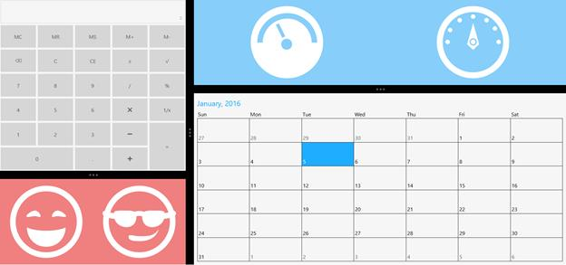
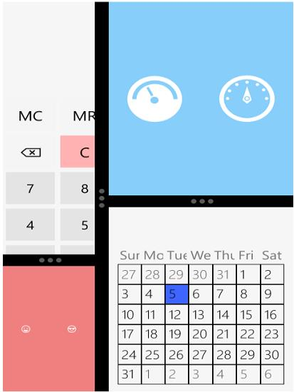
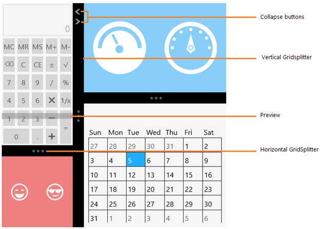

# Overview

`SfGridSplitter` provides a way to split and allow resizing elements between rows and columns.

## Features

* Support to preview the resized elements

## Visual Structure

1. WinRT

2. Windows phone

