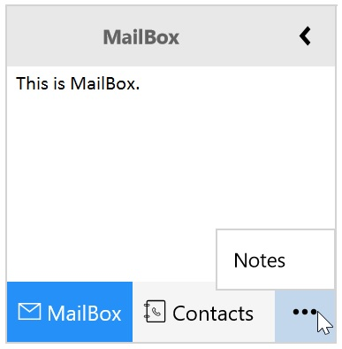

---
layout: post
title: Explains about Overflow Popup for Syncfusion SfGroupBar control 
description: Explains about Overflow Popup for Syncfusion SfGroupBar control 
platform: UWP
control: SfGroupBar
documentation: ug
--- 

# Overflow Popup

When SfGroupBar Items overflow in the items panel, those overflown items are displayed in the overflow popup. Overflow popup is placed at right bottom in Expanded mode and placed at bottom in Collapsed mode. `SfGroupBarItem` which overflow out of viewport panel can be set as SelectedItem by selecting item from the Overflow Popup.

