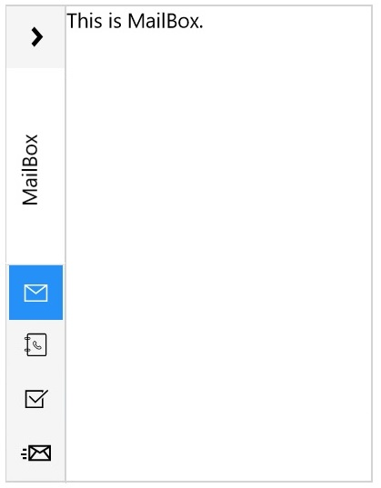
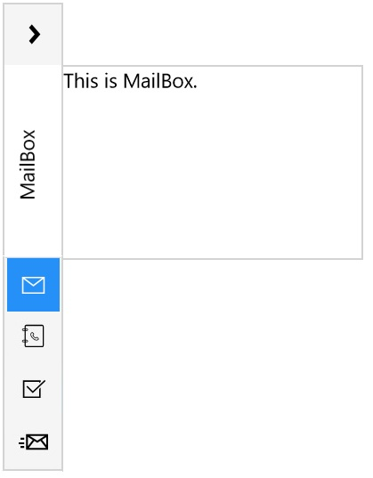
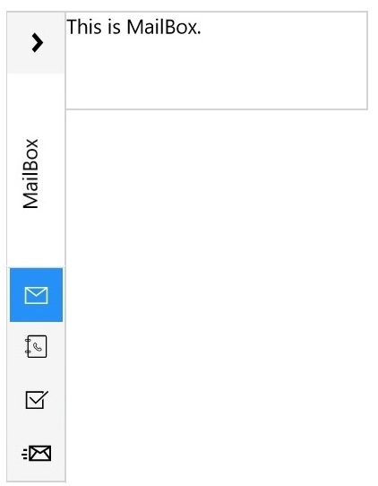

---
layout: post
title: Explains about Sizing Collapsed Content of Syncfusion SfGroupBar control
description: Explains about Sizing Collapsed Content of Syncfusion SfGroupBar control 
platform: UWP
control: SfGroupBar
documentation: ug
--- 

# Sizing Collapsed Content

Content is displayed in Popup when `SfGroupBar` is in Collapsed mode. Content popup is opened when the popup expander button is clicked. The content popup can be customized in several ways using the property `PopupSizeMode`.

## Displaying Popup in Full Size

PopUp can be displayed in full height of the `SfGroupBar` by setting `PoupSizeMode` as FullSize.





<navigation:SfGroupBar PopupSizeMode="FullSize" VerticalAlignment="Stretch">

<navigation:SfGroupBar/>





## Displaying PopUp in Default Size

PopUp can be displayed in equal height of the popup expander button in `SfGroupBar` by setting `PoupSizeMode` as DefaultSize.





<navigation:SfGroupBar PopupSizeMode="DefaultSize" VerticalAlignment="Stretch">

<navigation:SfGroupBar/>





## Displaying Popup in Custom Size 

Content popup can be set to custom size using the properties `PopupSizeMode`, `PopupHeight` and `PopupWidth`.





<navigation:SfGroupBar Margin="5 0 0 5" PopupSizeMode="CustomSize"
                       PopupWidth="500" PopupHeight="100"
					   VerticalAlignment="Stretch">

<navigation:SfGroupBar/>





