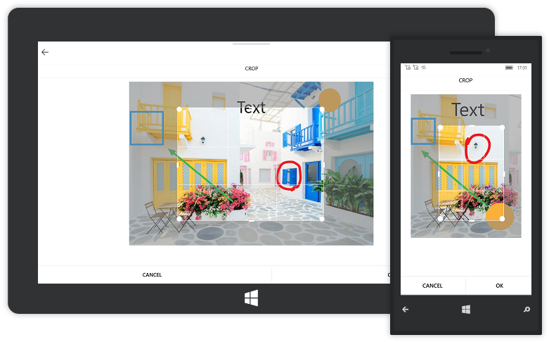

# Crop

The image editor control gives you an option to crop the image as desired. Cropping the image can be done in following two ways:

* From Toolbar
* Cropping programmatically

### From Toolbar

In the `Transforms` submenu, click the `Crop` button. It enables the cropping. A selector region will appear on top of the image which stretches to the size of the image. The toolbars will be disappeared while cropping is enabled and only `Cancel` and `OK` buttons will be available. To disable cropping, click the `Cancel` button. To save the cropped area, after selected the desired area, Click the `OK` button, the toolbars will reappear after the cropping operation is completed.

### Cropping programmatically

Cropping operation can be done programmatically in following two ways:

* Enable Cropping and Select the Crop region visually.
* Manually set the cropping area.

#### Handling the cropping tool

The `ToggleCropping` method in the SfImageEditor control is used to enable and disable the cropping region over the image to visually select the area for cropping. After the crop area has been selected, the `Crop` method is called and which in turn crops the selected region and displays the cropped image on the ImageEditor.



    imageEditor.ToggleCropping(); 

    // After selecting the crop area visually
    imageEditor.Crop(new Rect(0, 0, 0, 0));  



## Manually set the cropping area

To manually set the cropping rectangle without even enabling the cropping functionality, use overloaded Crop(Rectangle rect) method. This can be done by defining a rectangle and pass it to Crop(rect) method.



    imageEditor.Crop(new Rect(200, 150, 150, 150));



