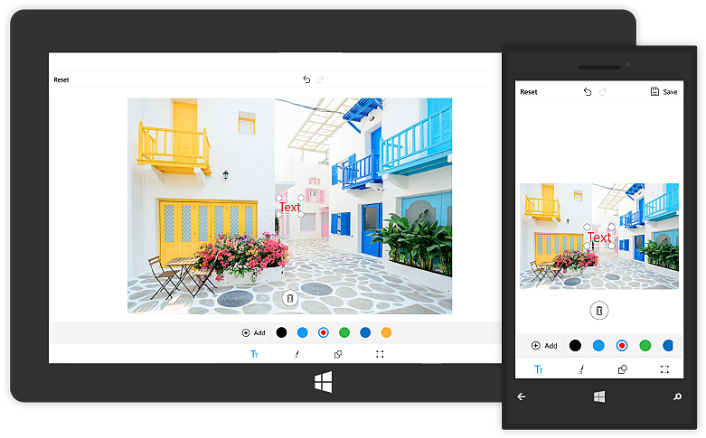
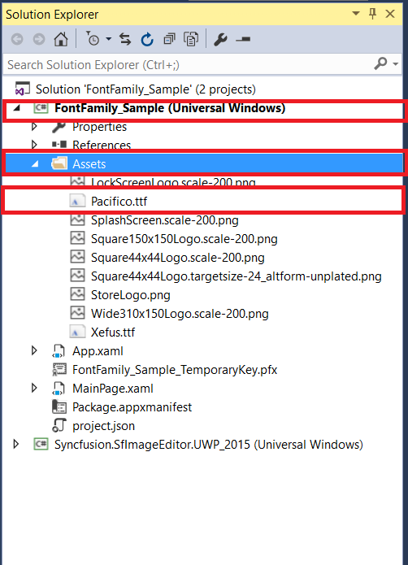
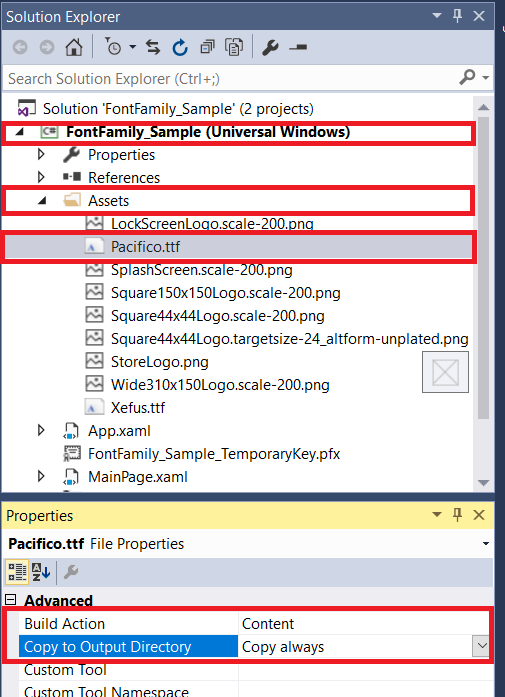

# Text

To add the desired text elements over the image, use the following two ways:

* From Toolbar
* Using Code

## From Toolbar

To add text from the toolbar, click on the `Text` icon in the toolbar. When the Text icon is tapped, a pop-up will appear. To add the text over the image, Type the desired text and click OK. To close the pop-up, click CANCEL button. By dragging, the text can be moved to the desired place.

### To Change Color of the selected Text

Select the desired text and click on the color palette available in the sub menu.

## Using Code

programmatically, the desired text elements also can be added over the image. The `AddText` method in the SfImageEditor control is used to add text based on the string value and [`TextSettings`](https://help.syncfusion.com/cr/uwp/sfimageeditor).

### TextSettings

TextSettings is defined to set the values for Color and FontSize.



    imageEditor.AddText("CustomTextView", new TextSettings() { Color = new SolidColorBrush(Colors.Orange) });



# Custom Font Family

We can able to change the font family of selected text from default font family into custom font family.

   * From Toolbar
   * Using Code

### From Toolbar

After adding text we can able to change the font family of the selected text from toolbar, Select the desired text and click the font family buttons available in the sub menu.
   
Now the font family of the selected text has been changed.

### Using Code

Download the custom fonts file in ttf file format and add these fonts into "Assets" folder in sample project. Refer the below screen shot.

   
Right click the font file and open properties, in that Change the "Build Action" property of every font file as "Content" and "Copy to output directory" to "Copy Always".
    

    
Finally use the below code snippet to apply custom font family for Universal Windows Platform.

While mention the path, You should need to mention font file name with ".ttf" extension and the symbol of "#" with font family name.





    editor.AddText("New Lighthouse Text", new TextSettings() { FontFamily = new FontFamily("Assets/Lighthouse.ttf#Lighthouse Personal Use") });





