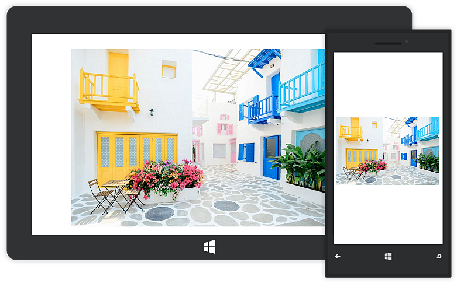
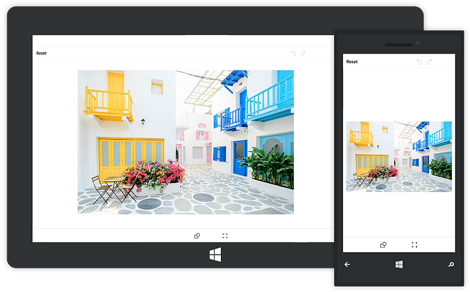

# Toolbar Customization

You can change the default colors of the ColorPalette and visibility of the toolbar.

## To customize the ColorPalette

The following code explains to change the colors of the ColorPalette.





    <control:SfImageEditor.ColorPalette>

        <SolidColorBrush>Yellow</SolidColorBrush>
        <SolidColorBrush>Pink</SolidColorBrush>
        <SolidColorBrush>Violet</SolidColorBrush>

    </control:SfImageEditor.ColorPalette>    





    List<SolidColorBrush> CustomColorPalette = new List<SolidColorBrush>()
    {
            new SolidColorBrush(Colors.Yellow),
            new SolidColorBrush(Colors.Pink),
            new SolidColorBrush(Colors.Violet)
    };
     
    imageEditor.ColorPalette = CustomColorPalette;





## To Hide/Visible the Toolbar

You can customize the toolbar as shown below,





    <control:SfImageEditor.ToolbarSettings>
        <control:ToolbarSettings IsToolbarVisiblity="False"/>
    </control:SfImageEditor.ToolbarSettings>

            



    imageEditor.ToolbarSettings.IsToolbarVisiblity = false;





## To Hide/Visible the toolbar Item

You can customize the toolbar items namely, text, path, shapes, transform, rectangle, circle, arrow, flip, crop, rotate, reset, undo, Redo and save as shown below,



    imageEditor.SetToolbarItemVisibility("text, save", false); 



## ToolbarHeight Customization

You can customize `height of the toolbar` and also toolbar items `icon` and `text`.

### Customize Toolbar Height 

SfImageEditor control supports to customize the default height of `Header`, `Footer` and `Sub item` Toolbar by using following properties,
1.	HeaderToolbarHeight
2.	FooterToolbarHeight 
3.	SubItemToolbarHeight

Header toolbar items will be resize based on the header toolbar height. To change Height of the Header Toolbar by using property HeaderToolbarHeight as like below,





        <imageeditor:SfImageEditor.ToolbarSettings>
                    <imageeditor:ToolbarSettings HeaderToolbarHeight="70"/>
                </imageeditor:SfImageEditor.ToolbarSettings>





    editor.ToolbarSettings.HeaderToolbarHeight = 70;





Footer toolbar items will be resized based on the footer toolbar height. To change Height of the Footer Toolbar by using property FooterToolbarHeight as like below,





        <imageeditor:SfImageEditor.ToolbarSettings>
                    <imageeditor:ToolbarSettings FooterToolbarHeight="70"/>
                </imageeditor:SfImageEditor.ToolbarSettings>





    editor.ToolbarSettings.FooterToolbarHeight = 70;





Sub toolbar items will be resized based on the SubItem toolbar height. To change Height of the sub toolbar by using property SubItemToolbarHeight as like below,





        <imageeditor:SfImageEditor.ToolbarSettings>
                    <imageeditor:ToolbarSettings SubItemToolbarHeight="70"/>
                </imageeditor:SfImageEditor.ToolbarSettings>





    editor.ToolbarSettings.SubItemToolbarHeight = 70;





### Individual Toolbar Item Height Customization

To arrange toolbar items aspect fit based on the toolbar height by using following properties  

1.  TextHeight
2.  IconHeight

To change the toolbar item Text and Icon height as like below,





    editor.ToolbarSettings.ToolbarItems.Add(new FooterToolbarItem() {Icon = new BitmapImage(new Uri(this.BaseUri, "ImageEditor/share.png")),Text="Share",IconHeight=40,TextHeight=20 });
    




