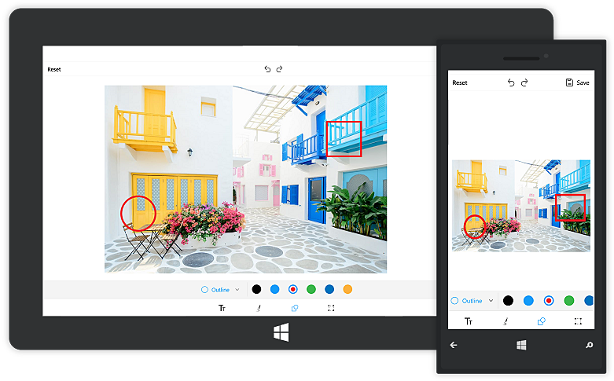

# Undo-Redo support

One of the important features of the image editor control is to perform `Undo` and `Redo` operations of adding shapes, text and drawing paths. The undo and redo operations can be done in the following two ways:

* From Toolbar
* Using Code

N> Undo and Redo will not be applied for cropping and transformations.

## Undo

### From Toolbar

The top toolbar in the Image Editor control contains the undo and redo buttons in between the `Save` and `Reset` buttons. The Undo and Redo buttons will be disabled by default. If we add a shape or text or draw path, the `undo` button will be enabled. Clicking the Undo button will clear the last performed operation. Undo can be performed for the following operations:

* Add/Delete shapes, text
* Change Positions
* Color/Fill changes
* Path Drawings

### Using Code

Programmatically, the `Undo` method can be used in the SfImageEditor control to revert the changes.



    imageEditor.Undo();



## Redo

### From Toolbar

The Redo button will be disabled by default. The redo button will be enabled only when an undo operation is performed. Clicking the `Redo` button negates the undo operations.

### Using Code

The `Redo` method is used to redo the changes reverted in the undo operation.



    imageEditor.Redo();



