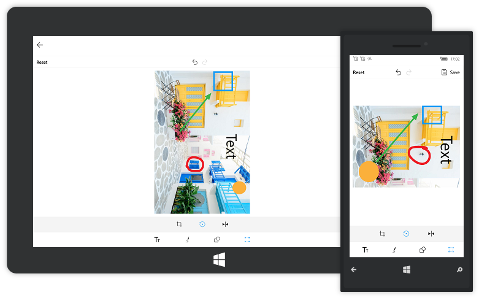

# Transformation

The image editor control can perform the image transformations namely, `rotation` and `flip`. The transformations can be achieved in the following two ways:

* From Toolbar
* Using Code

## Rotation

### From Toolbar

To rotate an image, in toolbar, click the `Rotate` button in the submenu of the `Transforms`. Clicking the button results in rotating the image to 90 degrees clockwise from the current state.

### Using Code

Programmatically, the `Rotate` method is used in the SfImageEditor control to rotate the image.

N> Angle cannot be specified in code to alter the rotation angle of the image



    imageEditor.Rotate();



## Flip

### From Toolbar

The ImageEditor control can show the mirror image. To get the mirror image of the loaded image, click `Flip` button in the submenu of the `Transforms` in the toolbar. 

### Using Code

The `Flip` method flips the image horizontally or vertically based on the [`FlipDirection`](https://help.syncfusion.com/cr/uwp/sfimageeditor); it is specified as argument for the Flip method.

N> By default, image flips horizontally.



    imageEditor.Flip(FlipDirection.Horizontal);



