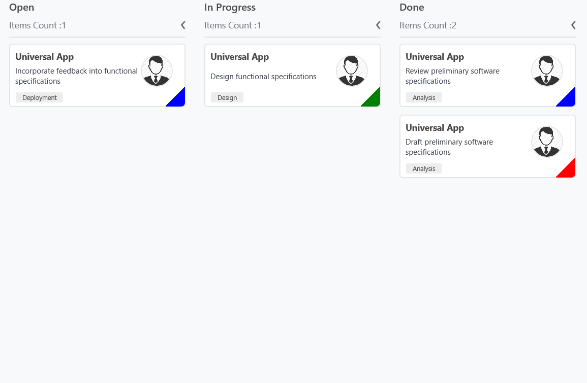
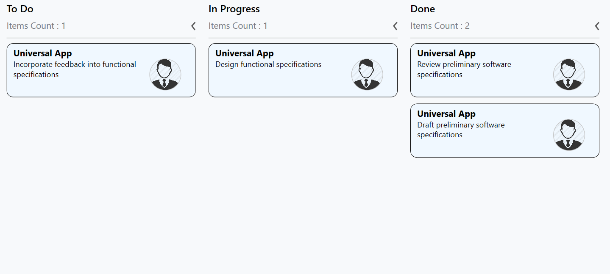

# Cards.

The default elements of a card can be customized using the below properties of [`KanbanModel`](https://help.syncfusion.com/cr/cref_files/uwp/Syncfusion.SfKanban.UWP~Syncfusion.UI.Xaml.Kanban.KanbanModel.html).

* [`Title`](https://help.syncfusion.com/cr/cref_files/uwp/Syncfusion.SfKanban.UWP~Syncfusion.UI.Xaml.Kanban.KanbanModel~Title.html)         - Used to set the title of a card.
* [`ImageURL`](https://help.syncfusion.com/cr/cref_files/uwp/Syncfusion.SfKanban.UWP~Syncfusion.UI.Xaml.Kanban.KanbanModel~ImageURL.html)      - Used to set the image URL of a card. The image will be displayed at right side in default card template.
* [`Category`](https://help.syncfusion.com/cr/cref_files/uwp/Syncfusion.SfKanban.UWP~Syncfusion.UI.Xaml.Kanban.KanbanModel~Category.html)      - Used to set the category of a card. Based on the category the cards will be added to the respective columns. 
* [`Description`](https://help.syncfusion.com/cr/cref_files/uwp/Syncfusion.SfKanban.UWP~Syncfusion.UI.Xaml.Kanban.KanbanModel~Description.html)   - Used to set the description text of a card.
* [`ColorKey`](https://help.syncfusion.com/cr/cref_files/uwp/Syncfusion.SfKanban.UWP~Syncfusion.UI.Xaml.Kanban.KanbanModel~ColorKey.html)      - Used to specify the indicator color key. The color value of the corresponding key should be added in [`IndicatorColorPalette`](https://help.syncfusion.com/cr/cref_files/uwp/Syncfusion.SfKanban.UWP~Syncfusion.UI.Xaml.Kanban.SfKanban~IndicatorColorPalette.html) collection of [`SfKanban`](https://help.syncfusion.com/cr/cref_files/uwp/Syncfusion.SfKanban.UWP~Syncfusion.UI.Xaml.Kanban.SfKanban.html).
* [`Tags`](https://help.syncfusion.com/cr/cref_files/uwp/Syncfusion.SfKanban.UWP~Syncfusion.UI.Xaml.Kanban.KanbanModel~Tags.html)     - Used to specify the tags of a card. The tags will be displayed at bottom in default card template.
* [`ID`](https://help.syncfusion.com/cr/cref_files/uwp/Syncfusion.SfKanban.UWP~Syncfusion.UI.Xaml.Kanban.KanbanModel~ID.html)     - Used to set the ID of a card.



new KanbanModel()
{

    Title = "Universal App",

    ID = "27654",

    Description = "Incorporate feedback into functional specifications",

    Category = "Open",

    ColorKey = "Low",

    Tags = new string[] { "Deployment" },

    ImageURL = new Uri("ms-appx:///images/icon.jpg")
};



Following code snippet is used to define the colors for each key.





<kanban:SfKanban.IndicatorColorPalette>

    <kanban:ColorMapping Key="Low" Color="Blue"/>

    <kanban:ColorMapping Key="Normal" Color="Green" />

    <kanban:ColorMapping Key="High" Color="Red" />

</kanban:SfKanban.IndicatorColorPalette>





IndicatorColorPalette indicatorColorPalette = new IndicatorColorPalette();

indicatorColorPalette.Add(new ColorMapping() { Key = "Low", Color = Colors.Blue });

indicatorColorPalette.Add(new ColorMapping() { Key = "High", Color = Colors.Red });

indicatorColorPalette.Add(new ColorMapping() { Key = "Normal", Color = Colors.Green });

sfKanban.IndicatorColorPalette = indicatorColorPalette;





## Template

You can replace the entire card template with your own design using [`SfKanban.CardTemplate`](https://help.syncfusion.com/cr/cref_files/uwp/Syncfusion.SfKanban.UWP~Syncfusion.UI.Xaml.Kanban.SfKanban~CardTemplate.html) property. The following code snippet and screenshot illustrates this.



<kanban:SfKanban.CardTemplate>
    
    <DataTemplate>
        
        <StackPanel Margin="0,10,0,10" Orientation="Vertical"
                    Background="Gray" Padding="10,10,10,10">

            <StackPanel Orientation="Horizontal">

                <TextBlock Text="{Binding Path=Title}" Foreground="Silver"/>

            </StackPanel>

            <StackPanel  Orientation="Horizontal">

                <TextBlock Text="{Binding Description}" Width="150"
                       FontSize="14" Foreground="Silver" TextWrapping="WrapWholeWords"/>
                
                <Image Source="{Binding ImageURL}" Margin="30,0,0,10"
                       Height="50" Width="50"/>

            </StackPanel>

        </StackPanel>
        
    </DataTemplate>
    
</kanban:SfKanban.CardTemplate>



