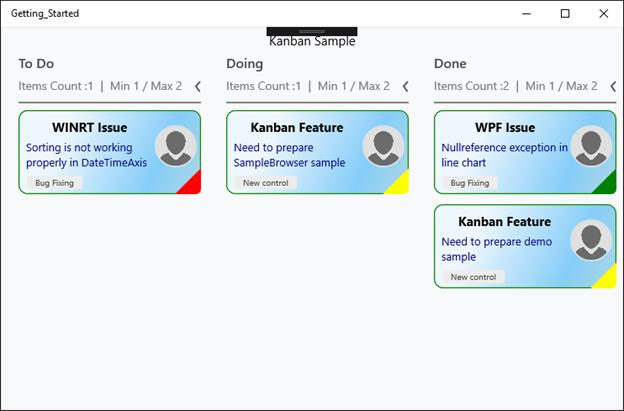
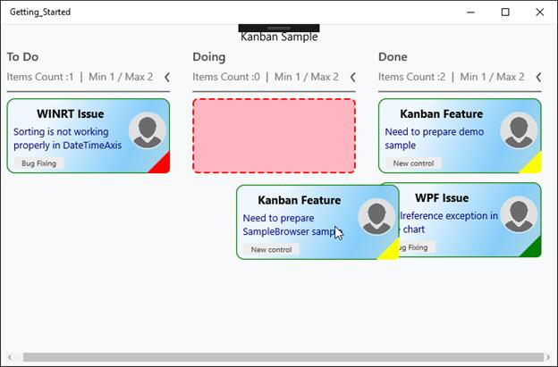
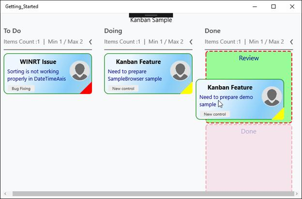

# Customization

KanbanCardStyle – It is used to customize the Kanban cards.



<syncfusion:SfKanban.CardStyle>

<syncfusion:KanbanCardStyle Foreground="DarkBlue"

Stroke="Green"

StrokeThickness="1.25"

FontSize="13"

TitleColor="Black"

TitleFontSize="15"

CornerRadius="10"

TitleHorizontalAlignment="Center">

<syncfusion:KanbanCardStyle.Background>

<LinearGradientBrush>

<GradientStop Color="AliceBlue" Offset="0.25"/>

<GradientStop Color="LightSkyBlue" Offset="0.75" />

<GradientStop Color="LightBlue" Offset="1" />

</LinearGradientBrush>

</syncfusion:KanbanCardStyle.Background>

</syncfusion:KanbanCardStyle>

</syncfusion:SfKanban.CardStyle>



PlaceHolderStyle – It is used to customize the place holder of Kanban cards.



<syncfusion:SfKanban.PlaceholderStyle>

<syncfusion:PlaceholderStyle CategoryHoverBrush="PaleGreen"

Fill="LightPink"

Stroke="Red" 

StrokeThickness="2"

Foreground="DarkBlue">

</syncfusion:PlaceholderStyle>

</syncfusion:SfKanban.PlaceholderStyle>



Category hover brush – Indicates the color, when hover on any category of multiple categories in a single column as shown in the below snapshot.

