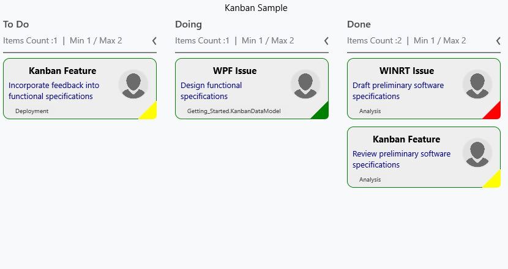
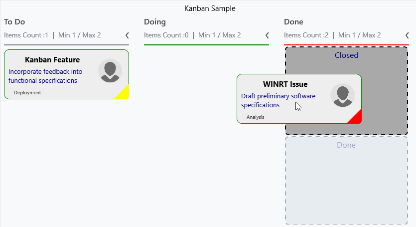

# Customization

KanbanCardStyle – It is used to customize the Kanban cards.





<syncfusion:SfKanban.CardStyle>

<syncfusion:KanbanCardStyle Foreground="DarkBlue"

Stroke="Green"

StrokeThickness="1.25"

FontSize="13"

TitleColor="Black"

TitleFontSize="15"

CornerRadius="10"

TitleHorizontalAlignment="Center"

Background="#FFEEEEEE">

</syncfusion:KanbanCardStyle>

</syncfusion:SfKanban.CardStyle>





Kanban.CardStyle = new KanbanCardStyle()
{
    Foreground = new SolidColorBrush(Colors.DarkBlue),
    Stroke = new SolidColorBrush(Colors.Green),
    StrokeThickness = new Thickness(1),
    FontSize = 13,
    TitleColor = new SolidColorBrush(Colors.Black),
    TitleFontSize = 15,
    CornerRadius = new CornerRadius(10),
    TitleHorizontalAlignment = HorizontalAlignment.Center,
    Background = new SolidColorBrush(Color.FromArgb(255, 238, 238, 238))
};





PlaceHolderStyle – It is used to customize the place holder of Kanban cards.





<syncfusion:SfKanban.PlaceholderStyle>

<syncfusion:PlaceholderStyle SelectedBackground="DarkGray" 

Fill="LightGray"

Stroke="Black" 

StrokeDashArray="4,4"

StrokeThickness="2"

Foreground="DarkBlue">

</syncfusion:PlaceholderStyle>

</syncfusion:SfKanban.PlaceholderStyle>





Kanban.PlaceholderStyle = new PlaceholderStyle()

{
    SelectedBackground = new SolidColorBrush(Colors.DarkGray),
    Fill = new SolidColorBrush(Colors.LightGray),
    Stroke = new SolidColorBrush(Colors.Black),
    StrokeThickness = 2,
    Foreground = new SolidColorBrush(Colors.DarkBlue)
};





SelectedBackground – Indicates the color, when hover on any category of multiple categories in a single column as shown in the below snapshot.

