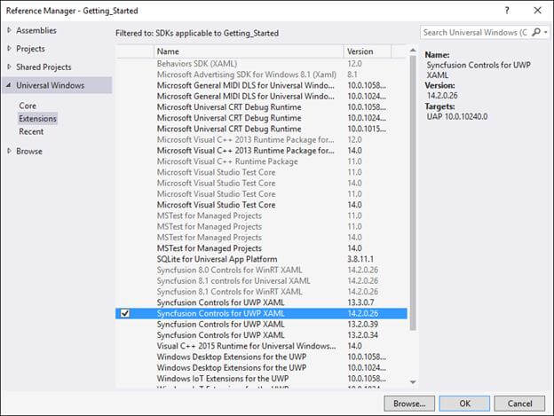
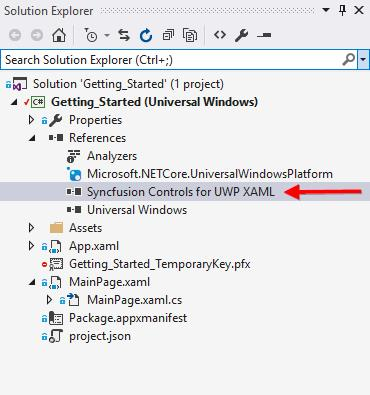
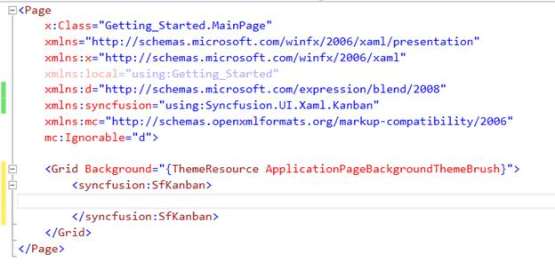
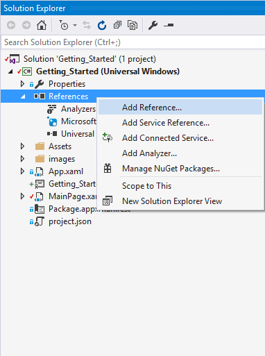
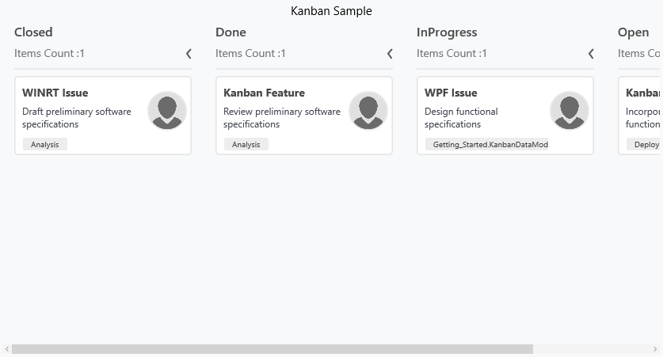
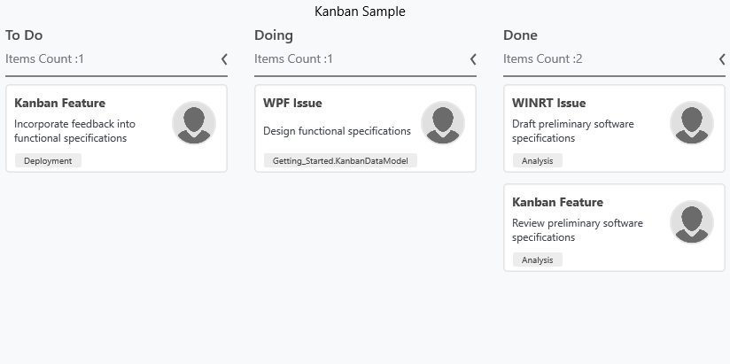

# Getting started 

The following section provides an assistance to create a simple Kanban application. 

## Create a simple Kanban from XAML

### Adding assembly reference

1. Open the Add Reference window from project.
2. Choose Windows > Extensions > SyncfusionControls for UWP XAML.

Add the following namespace in the MainPage.xaml


xmlns:syncfusion="using:Syncfusion.UI.Xaml.Kanban"



### Adding Kanban from toolbox

Drag and drop the SfKanban control from the Toolbox to your application.

Now the “Syncfusion Controls for UWP XAML” reference is added to the application references and the xmlns namespace code is generated in MainWindow.xaml as below.

### Adding Kanban DLL as reference

Individual reference can be added to the project instead of SDK “Syncfusion Controls for UWP XAML” that refers all the controls in the Syncfusion control library.

Browse and Add the reference DLL from the following location.

Installed location:\Program Files (x86)\Syncfusion\Essential Studio\14.2.0.26\Assemblies for Universal Windows\10.0\Syncfusion.SfKanban.UWP.dll

Add the following namespace in the MainPage.xaml



xmlns:syncfusion="using:Syncfusion.UI.Xaml.Kanban"



### Defining data model

KanbanModel is the pre-defined data model of SfKanban.



public class TaskDetails

{

public TaskDetails()

{

Tasks = new ObservableCollection<KanbanModel>();

KanbanModel task = new KanbanModel();

task.Title = "WINRT Issue";

task.ID = "6593";

task.Description = "Draft preliminary software specifications";

task.Category = "Closed";

task.ColorKey = "High";

task.Tags = new string[] { "Analysis" };

task.ImageURL = new Uri("ms-appx:///images/icon.jpg");

Tasks.Add(task);

task = new KanbanModel();

task.Title = "Kanban Feature";

task.ID = "25678";

task.Description = "Review preliminary software specifications";

task.Category = "Done";

task.ColorKey = "Low";

task.Tags = new string[] { "Analysis" };

task.ImageURL = new Uri("ms-appx:///images/icon.jpg");

Tasks.Add(task);

task = new KanbanModel();

task.Title = "WPF Issue";

task.ID = "29477";

task.Description = "Design functional specifications";

task.Category = "InProgress";

task.ColorKey = "Normal";

task.Tags = new string[] { "Design" };

task.ImageURL = new Uri("ms-appx:///images/icon.jpg");

Tasks.Add(task);

task = new KanbanModel(); 

task.Title = "Kanban Feature";

task.ID = "27654";

task.Description = "Incorporate feedback into functional specifications";

task.Category = "Open";

task.ColorKey = "Low";

task.Tags = new string[] { "Deployment" };

task.ImageURL = new Uri("ms-appx:///images/icon.jpg");

Tasks.Add(task);

}

public ObservableCollection<KanbanModel> Tasks { get; set; }

}



### Generating columns for Kanban

ItemsSource – Data source for Kanban can be set using the property that is available in the SfKanban.

ColumnMappingPath – it is string property used to map for Kanban column to categorize the data source. Default value of this property is Category which is available in the KanbanModel. Also we can set to any other property from the underlying model.

Auto generating columns – Columns are auto-generated if “AutoGeneratedColumns” property is enabled.



<Grid Background="{ThemeResource ApplicationPageBackgroundThemeBrush}">

<Grid.DataContext>

<local:TaskDetails/>

</Grid.DataContext>

<syncfusion:SfKanban Header="Kanban Sample" ItemsSource="{Binding Tasks}"

AutoGenerateColumns="True" ColumnMappingPath="Category">

</syncfusion:SfKanban>

</Grid>



### Defining columns

Categories – One or more category values that are defined in the property which is set to the ColumnMappingPath from the underlying model. Kanban column can be defined as shown below.

Title – Header of the individual column can be defined in this property.



<syncfusion:SfKanban Header="Kanban Sample"

ColumnMappingPath="Category"

ItemsSource="{Binding Tasks}"

AutoGenerateColumns="False">

<syncfusion:KanbanColumn Categories="Open" Title="To Do"></syncfusion:KanbanColumn>

<syncfusion:KanbanColumn Categories="InProgress" Title="Doing"></syncfusion:KanbanColumn>

<syncfusion:KanbanColumn Categories="Review,Done" Title="Done"></syncfusion:KanbanColumn>

</syncfusion:SfKanban>



## Create a simple Kanban from code behind

* Open the Add Reference window from your project.
* Choose Windows > Extensions > SyncfusionControls for UWP XAML.
* Add the following namespace in your C# file, MainWindow.xaml.cs.



using Syncfusion.UI.Xaml.Kanban;



### Initialize Kanban

You need to create instance for SfKanban as below.



SfKanban kanban=new SfKanban();



### Adding columns to Kanban

Auto generation



SfKanban kanban=new SfKanban();

kanban.ItemsSource=new TaskDetails().Tasks;

kanban.AutoGenerateColumns = true;

kanban.ColumnMappingPath = "Category";

grid.Children.Add(kanban);



Manual creation



SfKanban kanban=new SfKanban();

kanban.AutoGenerateColumns = false;

kanban.ItemsSource=new TaskDetails().Tasks;

kanban.ColumnMappingPath = "Category";

KanbanColumn column=new KanbanColumn();

column.Categories = "Open";

column.Title = "To Do";

kanban.Columns.Add(column);

column = new KanbanColumn();

column.Categories = "InProgress";

column.Title = "Doing";

kanban.Columns.Add(column);

column = new KanbanColumn();

column.Categories = "Review,Done";

column.Title = "Done";

kanban.Columns.Add(column);

grid.Children.Add(kanban);

