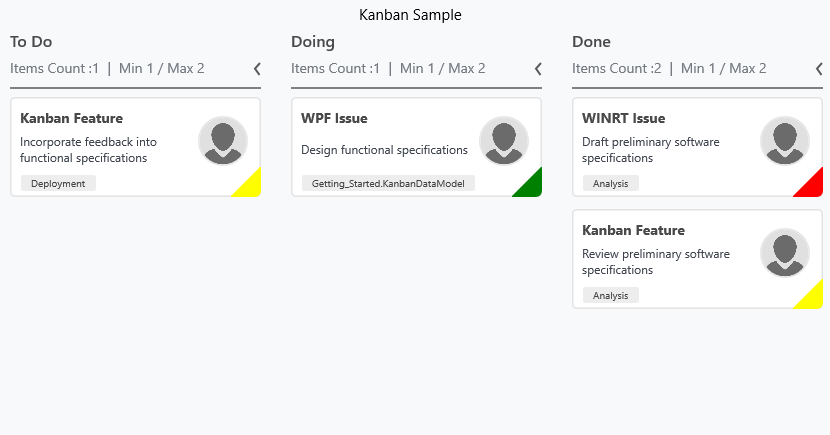

# Indicator color palette

Indicator color palette is a collection of ColorMapping that are used to set the indicator color of Kanban cards. In the underlying data model, ColorKey (predefined property) values are set as the Key and Color are mapped to the corresponding Key values as shown in the below code sample.



<syncfusion:SfKanban.IndicatorColorPalette>

<syncfusion:ColorMapping Key="High" Color="Red"/>

<syncfusion:ColorMapping Key="Low" Color="Yellow" />

<syncfusion:ColorMapping Key="Normal" Color="Green" />

</syncfusion:SfKanban.IndicatorColorPalette>



