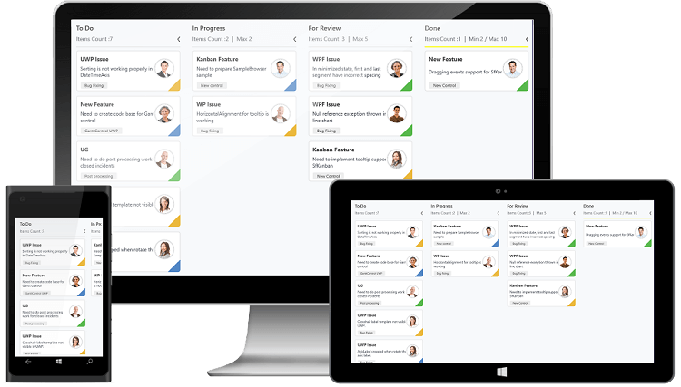

# Overview.

The Kanban control is an efficient way to visualize a workflow at each stage of completion. Kanban helps to define elegant planning and clear visualization of work progression. SfKanban also provide many features that are used to monitor the progressing tasks in software development cycle. 

## Key features

* WorkFlows – It allows user to control the transitions between tasks from one category (status) to another.
* Customization – Kanban cards and place holders can be customized. 
* WIP Limit – Visualize Work-In Progress limit.
* Indicator color customization – Indicator color for Kanban cards can be customized.
* Dragging events – Dragging events occurred while rearranging or repositioning Kanban cards.