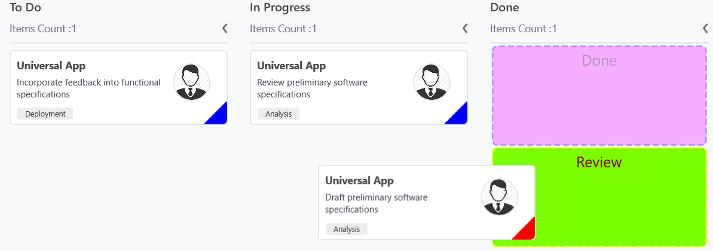

# Placeholder Style

* [`SfKanban.PlaceholderStyle`](https://help.syncfusion.com/cr/cref_files/uwp/sfkanban/frlrfSyncfusionUIXamlKanbanPlaceholderStyleClassTopic.html) property is used to customize the placeholder. Following properties are used to customize its appearance.

* [`Fill`](https://help.syncfusion.com/cr/cref_files/uwp/sfkanban/frlrfSyncfusionUIXamlKanbanPlaceholderStyleClassFillTopic.html)  	 - This property is used to change the background color of the placeholder.
* [`Stroke`](https://help.syncfusion.com/cr/cref_files/uwp/sfkanban/frlrfSyncfusionUIXamlKanbanPlaceholderStyleClassStrokeTopic.html) 	 	 - This property is used to change the border color of the placeholder.
* [`StrokeThickness`](https://help.syncfusion.com/cr/cref_files/uwp/sfkanban/frlrfSyncfusionUIXamlKanbanPlaceholderStyleClassStrokeThicknessTopic.html)  	 - This property is used to change the border width of the placeholder.
* [`StrokeDashArray`](https://help.syncfusion.com/cr/cref_files/uwp/sfkanban/frlrfSyncfusionUIXamlKanbanPlaceholderStyleClassStrokeDashArrayTopic.html)     - This property is used to change the dashes of the placeholder border.
* [`FontSize`](https://help.syncfusion.com/cr/cref_files/uwp/sfkanban/frlrfSyncfusionUIXamlKanbanPlaceholderStyleClassFontSizeTopic.html)            - This is used to change the text size of the placeholder.
* [`Foreground`](https://help.syncfusion.com/cr/cref_files/uwp/sfkanban/frlrfSyncfusionUIXamlKanbanPlaceholderStyleClassForegroundTopic.html)           - This property is used to change the text color of the placeholder.

Following properties are used to customize the selected category when you have more than one category in a column.
* [`SelectedBackground`](https://help.syncfusion.com/cr/cref_files/uwp/sfkanban/frlrfSyncfusionUIXamlKanbanPlaceholderStyleClassSelectedBackgroundTopic.html) 	- This property is used to change the background color of the selected placeholder.
* [`SelectedStroke`](https://help.syncfusion.com/cr/cref_files/uwp/sfkanban/frlrfSyncfusionUIXamlKanbanPlaceholderStyleClassSelectedStrokeTopic.html) 		- This property is used to change the border color of the selected placeholder.
* [`SelectedStrokeThickness`](https://help.syncfusion.com/cr/cref_files/uwp/sfkanban/frlrfSyncfusionUIXamlKanbanPlaceholderStyleClassSelectedStrokeThicknessTopic.html) 	- This property is used to change the border width of the selected placeholder.
* [`SelectedStrokeDashArray`](https://help.syncfusion.com/cr/cref_files/uwp/sfkanban/frlrfSyncfusionUIXamlKanbanPlaceholderStyleClassSelectedStrokeDashArrayTopic.html)     - This property is used to change the dashes of the selected placeholder.
* [`SelectedFontSize`](https://help.syncfusion.com/cr/cref_files/uwp/sfkanban/frlrfSyncfusionUIXamlKanbanPlaceholderStyleClassSelectedFontSizeTopic.html)            - This is used to change the font size of the text in selected placeholder.
* [`SelectedForeground`](https://help.syncfusion.com/cr/cref_files/uwp/sfkanban/frlrfSyncfusionUIXamlKanbanPlaceholderStyleClassSelectedForegroundTopic.html)           - This property is used to change the color of the text in selected placeholder.
The following code example describes the above behavior.





<kanban:PlaceholderStyle FontSize="20"

                         Foreground="DarkGreen"

                         Fill="Fuchsia"

                         Stroke="Blue"

                         StrokeThickness="2"

                         SelectedFontSize="20"

                         SelectedForeground="Maroon"

                         SelectedStroke="Yellow"

                         SelectedStrokeThickness="2"

                         SelectedBackground="LawnGreen">

</kanban:PlaceholderStyle>





PlaceholderStyle style = new PlaceholderStyle();

style.FontSize = 20;

style.Foreground = new SolidColorBrush(Colors.DarkGreen);

style.Fill = new SolidColorBrush(Colors.Fuchsia);

style.Stroke = new SolidColorBrush(Colors.Blue);

style.StrokeThickness = 2;

style.StrokeDashArray = new DoubleCollection() {1, 1};

style.SelectedFontSize = 20;

style.SelectedForeground = new SolidColorBrush(Colors.Maroon);

style.SelectedStroke = new SolidColorBrush(Colors.Yellow);

style.SelectedBackground = new SolidColorBrush(Colors.LawnGreen);

style.SelectedStrokeThickness = 2;

style.SelectedStrokeDashArray = new DoubleCollection() {2, 1};

sfKanban.PlaceholderStyle = style;





The following output demonstrates the above code example.

