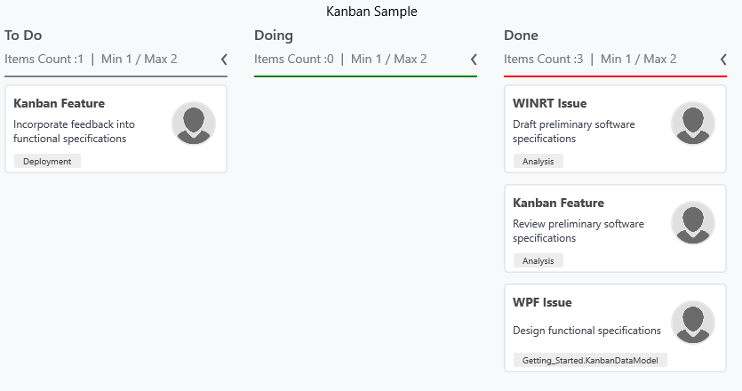

# Work-In Progress limit

MinimumLimit and MaximumLimit properties are used to show the minimum and maximum items count in the Kanban column. These properties are used to validate the error bar color using ErrorBarSettings.

Color – If items count is falls between MinimumLimit and MaximumLimit, this color is applied to ErrorBar.

MinValidationColor – If items count is lesser than MinimumLimit, this color is applied to ErrorBar.

MaxvalidationColor – If items count is greater than MaximumLimit, this color is applied to ErrorBar.



<syncfusion:KanbanColumn Categories="Closed,Done"

Title="Done"

MinimumLimit="1"

MaximumLimit="2">

<syncfusion:KanbanColumn.ErrorBarSettings>

<syncfusion:ErrorBarSettings Color="Gray"

MaxValidationColor="Red"

MinValidationColor="Green">

</syncfusion:ErrorBarSettings>

</syncfusion:KanbanColumn.ErrorBarSettings>

</syncfusion:KanbanColumn>





Column1.MinimumLimit = 1;

Column1.MaximumLimit = 2;

Column1.ErrorBarSettings = new ErrorBarSettings()

{

Color = new SolidColorBrush(Colors.Gray),

MinValidationColor = new SolidColorBrush(Colors.Green),

MaxValidationColor = new SolidColorBrush(Colors.Red)

};



