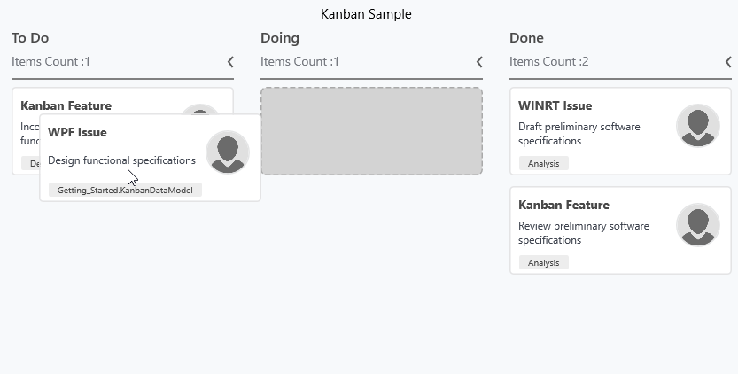

# Workflow configuration

A Kanban workflow is a set of Category and AllowedTransitions that an item moves through its lifecycle and typically represents processes within your organization.

Category – It represents a state of an item at a particular point in a specific workflow.

AllowedTransitions – It is a list of categories to where the card can be moved from the current category.



var workFlows = new WorkflowCollection();

workFlows.Add(new KanbanWorkflow()

{

Category = "Open",

AllowedTransitions = new List<object>() {"InProgress"}

});

workFlows.Add(new KanbanWorkflow()

{

Category = "InProgress",

AllowedTransitions = new List<object>() {"Review", "Done"}

});

Kanban.Workflows = workFlows;



The following snap represents Kanban does not allow user to drop the Kanban card from the column of InProgress -> Open, since workflow does not specify it. 

