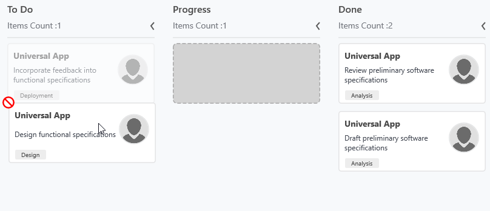
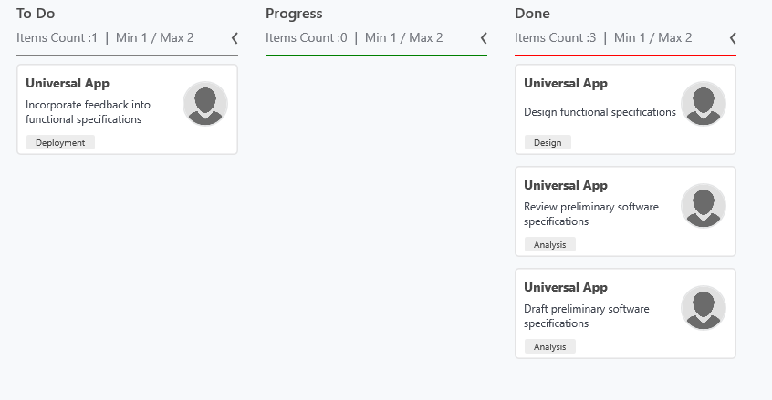

# Workflows

A Kanban [`Workflows`](https://help.syncfusion.com/cr/cref_files/uwp/Syncfusion.SfKanban.UWP~Syncfusion.UI.Xaml.Kanban.SfKanban~Workflows.html) is a set of Category and AllowedTransitions that an item moves through its life cycle and typically represents processes within your organization.

* [`Category`](https://help.syncfusion.com/cr/cref_files/uwp/Syncfusion.SfKanban.UWP~Syncfusion.UI.Xaml.Kanban.KanbanWorkflow~Category.html) – It represents a state of an item at a particular point in a specific workflow.

* [`AllowedTransitions`](https://help.syncfusion.com/cr/cref_files/uwp/Syncfusion.SfKanban.UWP~Syncfusion.UI.Xaml.Kanban.KanbanWorkflow~AllowedTransitions.html) – It is a list of categories to where the card can be moved from the current category.





<syncfusion:SfKanban.Workflows>

    <syncfusion:KanbanWorkflow Category="Open">

        <syncfusion:KanbanWorkflow.AllowedTransitions>

            <x:String>In Progress</x:String>

        </syncfusion:KanbanWorkflow.AllowedTransitions>

    </syncfusion:KanbanWorkflow>

    <syncfusion:KanbanWorkflow Category="In Progress">

        <syncfusion:KanbanWorkflow.AllowedTransitions>

            <x:String>Review</x:String>

            <x:String>Done</x:String>

        </syncfusion:KanbanWorkflow.AllowedTransitions>

    </syncfusion:KanbanWorkflow>

</syncfusion:SfKanban.Workflows>





WorkflowCollection workflows = new WorkflowCollection();

workflows.Add(new KanbanWorkflow()

{

    Category = "Open",

    AllowedTransitions = new List<object>() {"In Progress"}

});

workflows.Add(new KanbanWorkflow()

{

    Category = "In Progress",

    AllowedTransitions = new List<object>() {"Review", "Done"}

});

Kanban.Workflows = workflows;





## Work In-Progress limit

[`MinimumLimit`](https://help.syncfusion.com/cr/cref_files/uwp/Syncfusion.SfKanban.UWP~Syncfusion.UI.Xaml.Kanban.KanbanColumn~MinimumLimit.html) and [`MaximumLimit`](https://help.syncfusion.com/cr/cref_files/uwp/Syncfusion.SfKanban.UWP~Syncfusion.UI.Xaml.Kanban.KanbanColumn~MaximumLimit.html) properties are used to limit the minimum and maximum items in the Kanban column. However, this will not restrict moving the items from one column to another column. But the violation of the limit can be indicated by changing the [`ValidationColor`](https://help.syncfusion.com/cr/cref_files/uwp/Syncfusion.SfKanban.UWP~Syncfusion.UI.Xaml.Kanban.KanbanColumn~ValidationColor.html) of the error bar.

Following properties are used to customize the error bar.

* [`Color`](https://help.syncfusion.com/cr/cref_files/uwp/Syncfusion.SfKanban.UWP~Syncfusion.UI.Xaml.Kanban.ErrorBarSettings~Color.html) – used to set the default color of the error bar.

* [`MinValidationColor`](https://help.syncfusion.com/cr/cref_files/uwp/Syncfusion.SfKanban.UWP~Syncfusion.UI.Xaml.Kanban.ErrorBarSettings~MinValidationColor.html) – used to set the color of the error bar when the items count is lesser than MinimumLimit.

* [`MaxValidationColor`](https://help.syncfusion.com/cr/cref_files/uwp/Syncfusion.SfKanban.UWP~Syncfusion.UI.Xaml.Kanban.ErrorBarSettings~MaxValidationColor.html) – used to set the color of the error bar when the items count is greater than MaximumLimit.





<syncfusion:KanbanColumn x:Name="column1" Categories="Review,Done"
 
                         Title="Done"
 
                         MinimumLimit="1"
 
                         MaximumLimit="2">

	     <syncfusion:KanbanColumn.ErrorBarSettings>

			   <syncfusion:ErrorBarSettings Color="Gray" MaxValidationColor="Red"

                                            MinValidationColor="Green">

			   </syncfusion:ErrorBarSettings>

         </syncfusion:KanbanColumn.ErrorBarSettings>

</syncfusion:KanbanColumn>





column1.MinimumLimit = 1;

column1.MaximumLimit = 2;

column1.ErrorBarSettings = new ErrorBarSettings()
{

    Color = new SolidColorBrush(Colors.Gray),

    MinValidationColor = new SolidColorBrush(Colors.Green),

    MaxValidationColor = new SolidColorBrush(Colors.Red)

};





