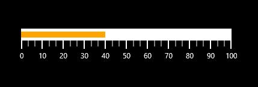
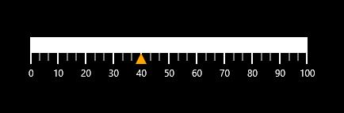

# Pointers

Multiple pointers are added to the linear gauge to point multiple values on the same linear scale. This is useful for showing a low and a high value at the same time. Value of the pointer is set by the **Value** property. There are two types of pointers from which the user can choose one by using the **PointerType** property. Movement of the pointer can be animated by enabling the **EnableAnimation** property.

## Bar Pointer

Bar pointer is an accenting line or colored bar that is placed on the linear gauge to mark the values. Bar pointer’s UI is customized by using the **BarPointerStroke** and **BarPointerStrokeThickness** properties.




    <Gauges:SfLinearGauge>
            <Gauges:SfLinearGauge.MainScale>
                    <Gauges:LinearScale.Pointers>
                        <Gauges:LinearPointer PointerType="BarPointer" Value="40" />
                    </Gauges:LinearScale.Pointers>
                </Gauges:LinearScale>
            </Gauges:SfLinearGauge.MainScale>
        </Gauges:SfLinearGauge>





            SfLinearGauge linear = new SfLinearGauge();
            linear.Orientation = Orientation.Horizontal;
            LinearScale _mainScale = new LinearScale();
            _mainScale.Pointers.Add(new LinearPointer() { PointerType = LinearPointerType.BarPointer,Value=40 });
            linear.MainScale = _mainScale;
            this.Grid.Children.Add(linear);




## Symbol Pointer

In symbol pointer type, the value is pointed by a symbol on the scale. The user can modify the symbol pointer’s size by changing the **SymbolPointerHeight** and **SymbolPointerWidth** property. The stroke of the symbol pointer is changed by using the **SymbolPointerStroke** property. **SymbolPointerStyle** property is used to select the symbol pointer style.




     <Gauges:SfLinearGauge>
            <Gauges:SfLinearGauge.MainScale>
                    <Gauges:LinearScale.Pointers>
                        <Gauges:LinearPointer PointerType="SymbolPointer" Value="40"  SymbolPointerStyle = "Triangle"/>
                    </Gauges:LinearScale.Pointers>
                </Gauges:LinearScale>
            </Gauges:SfLinearGauge.MainScale>
        </Gauges:SfLinearGauge>





            SfLinearGauge linear = new SfLinearGauge();
            linear.Orientation = Orientation.Horizontal;
            LinearScale _mainScale = new LinearScale();
            _mainScale.Pointers.Add(new LinearPointer() { PointerType = LinearPointerType.SymbolPointer,Value=40, SymbolPointerStyle = LinearSymbolPointerStyle.Triangle });
            linear.MainScale = _mainScale;
            this.Grid.Children.Add(linear);




## Pointer Position

The SymbolPointer in the scale can be placed above, below or in between the scale by choosing the following options that are available in the **SymbolPointerPosition** property. 

1. Above
2. Below (Default)
3. Cross




    <Gauges:SfLinearGauge Name="linearGauge" Orientation="Horizontal">
            <Gauges:SfLinearGauge.MainScale>
                <Gauges:LinearScale>
                    <Gauges:LinearScale.Pointers>
                        <Gauges:LinearPointer Value="40" PointerType="BarPointer" SymbolPointerPosition ="Above"/>
                        <Gauges:LinearPointer Value="40" PointerType="SymbolPointer" SymbolPointerPosition="Above"/>
                    </Gauges:LinearScale.Pointers>
                </Gauges:LinearScale>
            </Gauges:SfLinearGauge.MainScale>
        </Gauges:SfLinearGauge>





            SfLinearGauge linear = new SfLinearGauge();
            linear.Orientation = Orientation.Horizontal;
            LinearScale _mainScale = new LinearScale();
            _mainScale.Pointers.Add(new LinearPointer()
            {
                Value = 40,
                PointerType = LinearPointerType.BarPointer,
                SymbolPointerPosition = LinearSymbolPointersPosition.Above
            });
            _mainScale.Pointers.Add(new LinearPointer()
            {
                Value = 40,
                PointerType = LinearPointerType.SymbolPointer,
                SymbolPointerPosition = LinearSymbolPointersPosition.Above
            });
            linear.MainScale = _mainScale;
            this.Grid.Children.Add(linear);




