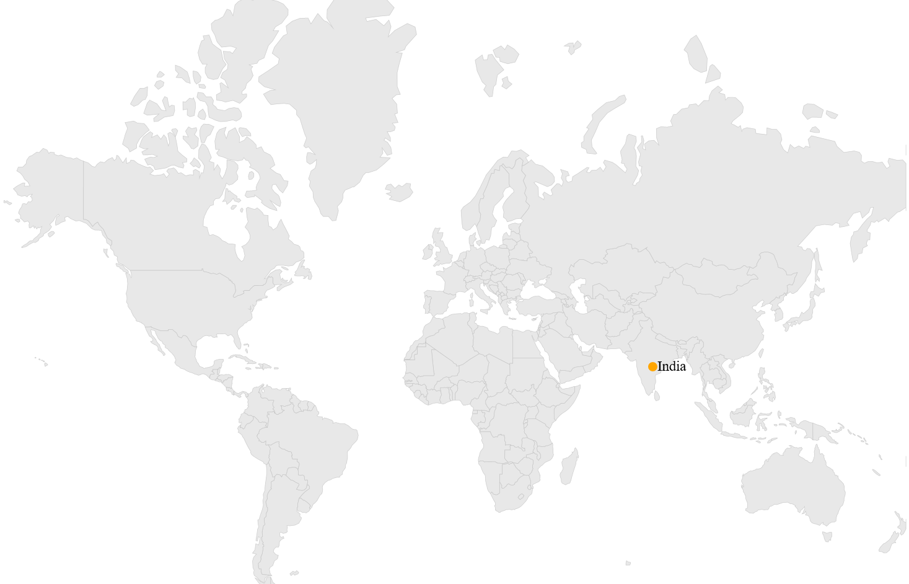

# How to

## Transform latitude and longitude value to pixel value and vice-versa

SfMaps offers two utility methods to transform the pixel values to longitude and latitude values and vice-versa. This method is used for both ShapeFileLayer and ImageryLayer.

* [`LatitudeLongitudeToPoint(double latitude, double longitude)`]()- Converts the latitude and longitude values to screen point. Here, pass the parameters as latitude and longitude values, from that values we can get screen points x and y.
* [`GetLatLonFromPoint(Point point)`]() - Converts the screen point to longitude and latitude values. Here, pass the parameters as screen points x and y, from that points we can get longitude and latitude values.





Point pixelPoint = layer.LatitudeLongitudeToPoint(21.00, 78.00);
Point longitudeLatitude = layer.GetLatLonFromPoint(new Point(pixelPoint.X, pixelPoint.Y));
mapAnnotations.Latitude = longitudeLatitude.Y;
mapAnnotations.Longitude = longitudeLatitude.X;





