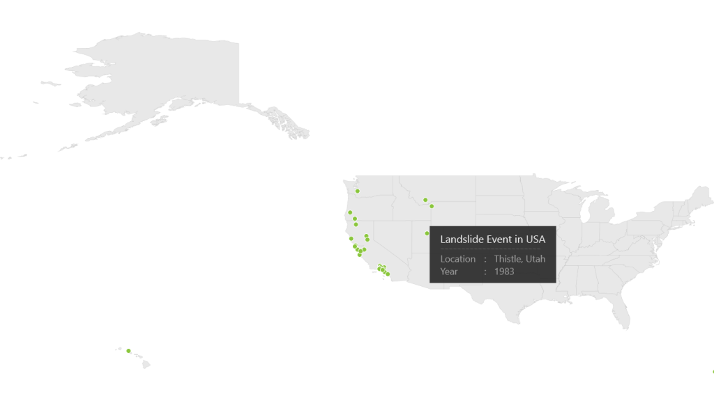

# Map Points

Points are one of the record type in `ShapeFileLayer`. `Points` are used to specify the specific point in the map. For example, Points are used to specify the capital of countries. Points in the shape file given as latitude and longitude coordinates in the shapes file. Those points should be converted as map points.

## Customizing the MapPoint

The default appearance of the `MapPoint` can be customized by using the MapPointTemplate property. The `MapPointTemplate` property is available in the ShapeFileLayer.

## About MapPointTemplate Property

`MapPointTemplate` is a DataTemplate type, used to customize or override the default template of `MapPoints`.



      <syncfusion:SfMap>
           <syncfusion:SfMap.Layers>
               <syncfusion:ShapeFileLayer ShapeIDPath="NAME"  ShapeIDTableField="Continent"                                                         
                                          EnableSelection="True”                                                                                                                   
                                          Uri=" MapApp.ShapeFiles.continent.shp">
                       <syncfusion:ShapeFileLayer.MapPointTemplate>
                           <DataTemplate>
                                  <Ellipse Height="10" Width="10” Stroke="White"      
                                                       Fill="#8AC63C"/>
                            </DataTemplate>
                      </syncfusion:ShapeFileLayer.MapPointTemplate>
               </syncfusion:ShapeFileLayer>
            </syncfusion:SfMap.Layers>
      </syncfusion:SfMap>             



## MapPointPopup

`MapPointPopup` is a popup, displayed when the point is moved on MapPoint. It shows additional information from the object bounded with the MapPoint. You can get the object from dbf file.

### MapPointPopupTemplate

`MapPointPopupTemplate` is a DataTemplate used to expose the template for the MapPoint.  



      <syncfusion:SfMap >
           <syncfusion:SfMap.Layers>
               <syncfusion:ShapeFileLayer Background="White" EnableSelection="True" 
                                          Uri="MapApp.ShapeFiles.states.shp">
                    <syncfusion:ShapeFileLayer.SubShapeFileLayers>
                        <syncfusion:SubShapeFileLayer   EnableSelection="True" 
                                   Uri="MapApp.ShapeFiles.landslide.shp">
                        <syncfusion:SubShapeFileLayer.MapPointPopupTemplate>
                              <DataTemplate>
                                   <Border Background="#FF252525" Opacity="0.9"  Height="110"
                                           BorderThickness="0.5">
                                     <StackPanel Margin="10,5,20,0">
                                         <StackPanel>
                                                  <TextBlock Text="Landslide Event in USA"  
                                                     Margin="10,5,0,0" Foreground="White" 
                                                     FontSize="20"  FontFamily="Segoe UI" />
                                          </StackPanel>
                           <Grid Margin="10,5,10,0">
                                 <Rectangle Stroke="#FF505050" StrokeDashArray="6 2" 
                                          Height="2"  VerticalAlignment="Center" />
                              </Grid>
                              <Grid Margin="10,5,0,0" >
                                        <Grid.ColumnDefinitions>
                                                <ColumnDefinition Width="0.41*"/>
                                                <ColumnDefinition Width="0.1*"/>
                                                <ColumnDefinition Width="0.49*"/>
                                         </Grid.ColumnDefinitions>
                                         <Grid.RowDefinitions>
                                                 <RowDefinition/>
                                                 <RowDefinition/>
                                          </Grid.RowDefinitions>
                                          <TextBlock Foreground="#FFACACAC" Grid.Column="0" 
                                          Grid.Row="0" FontFamily="Segoe UI" 
                                          FontWeight="Normal" FontSize="18" 
                                          Text="Location" />
                                          <TextBlock Foreground="#FFACACAC" Grid.Column="1" 
                                          Grid.Row="0" FontFamily="Segoe UI" 
                                          FontWeight="Normal" FontSize="18" Text=" : " />
                                          <TextBlock Foreground="#FFACACAC" Margin="5,0,0,0" 
                                          Grid.Column="2" Grid.Row="0" FontFamily="Segoe 
                                          UI" FontWeight="Normal" FontSize="18" 
                                          Text="{Binding [LOCALITY]}" />
                                          <TextBlock Foreground="#FFACACAC" Grid.Column="0" 
                                          Grid.Row="1" FontFamily="Segoe UI" 
                                          FontWeight="Normal" FontSize="18" Text="Year" />
                                          <TextBlock Foreground="#FFACACAC" Grid.Column="1" 
                                          Grid.Row="1" FontFamily="Segoe UI" 
                                          FontWeight="Normal" FontSize="18" Text=" : " />
                                          <TextBlock Foreground="#FFACACAC" Margin="5,0,0,0" 
                                          Grid.Column="2" Grid.Row="1" FontFamily="Segoe 
                                          UI" FontWeight="Normal" FontSize="18" 
                                          Text="{Binding [YEAR]}" />
                                                </Grid>
                                          </StackPanel>
                                    </Border>
                              </DataTemplate>
                              </syncfusion:SubShapeFileLayer.MapPointPopupTemplate>
                              <syncfusion:SubShapeFileLayer.MapPointTemplate>
                                    <DataTemplate>
                                          <Ellipse Height="10" Width="10" Margin="-10,-10,0,0" Stroke="White" 
                                                                         Fill="#8AC63C"/>
                                    </DataTemplate>
                              </syncfusion:SubShapeFileLayer.MapPointTemplate>
                        </syncfusion:SubShapeFileLayer>
                  </syncfusion:ShapeFileLayer.SubShapeFileLayers>
            </syncfusion:ShapeFileLayer>
        </syncfusion:SfMap.Layers>
      </syncfusion:SfMap>



