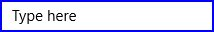

# Appearance

Appearance of the `SfMaskedEdit` control can be customized by using the `BorderBrush` and `ErrorBorderBrush` properties.

## Border

### BorderBrush

Customize the `BorderBrush` property that provides border color for the `SfMaskedEdit`.





<Input:SfMaskedEdit Width="255" Height="46" BorderBrush="Blue"/>





SfMaskedEdit maskededit = new SfMaskedEdit();
maskededit.BorderBrush = Brushes.Blue;





### ErrorBorderBrush

Customize the `ErrorBorderBrush` property that provides border color for the `SfMaskedEdit` when the validation becomes failed.





<Input:SfMaskedEdit Width="255" Height="46" ErrorBorderBrush="DarkOrange"/>





SfMaskedEdit maskededit = new SfMaskedEdit();
maskededit.ErrorBorderBrush = Brushes.DarkOrange;





## ShowPromptOnFocus

If the `ShowPromptOnFocus` property is set to true, the prompt characters will be ignored when the control lost it focus. The prompt characters will be restored when focusing the control.





<Input:SfMaskedEdit Width="255" Height="46" MaskType="Simple" Mask="(000) 000-0000" ShowPromptOnFocus="True"/>





SfMaskedEdit maskededit = new SfMaskedEdit();
maskededit.MaskType = MaskType.Simple;
maskedEdit.Mask = "(000) 000-0000";
maskedEdit.ShowPromptOnFocus = true;





Control loses focus

Control gets focus

