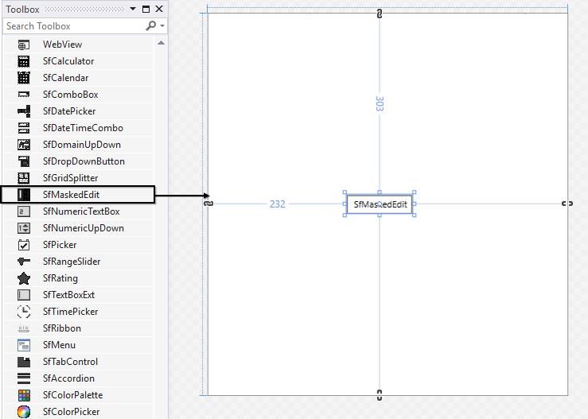
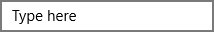

# Getting Started

## Assembly deployment

Namespace: Syncfusion.UI.Xaml.Controls.Input

Assembly: Syncfusion.SfInput.UWP

Dependent assembly: Syncfusion.SfShared.UWP

## Adding control via designer

Create a new WPF application in the Visual Studio to generate SfMaskedEdit by dragging the `SfMaskedEdit` control from toolbox to the designer.

## Adding control manually in XAML

The following code example shows how to create `SfMaskedEdit` from XAML.





<Input:SfMaskedEdit Width="255" Height="46"/>





## Adding control manually in C Sharp

To create a MaskedEdit control, follow the code.





SfMaskedEdit maskededit = new SfMaskedEdit() { Text = "SfMaskedEdit", Width = 150, Height = 50 };
this.Content = maskededit;





## Adding mask to the control

To mask the input of SfMaskedEdit, set the `MaskType` and `Mask` properties.

The `MaskType` property has different sets of mask characters combined to form a mask expression. Based on the complexity and usage, mask types are classified as Simple, Regular, and RegEx.

The `Mask` property specifies the input without writing any custom validation logic in your application. Mask can be set based on the `MaskType` elements. The `Mask` property may contain literals and special mask characters. You can use back-slash character to display any special mask character as literal.





<Input:SfMaskedEdit MaskType="Simple" Mask="00/00/0000" Width="255" Height="46"/>




SfMaskedEdit maskededit = new SfMaskedEdit();
maskededit.MaskType=MaskType.Simple;
maskedEdit.Mask="00/00/0000";





This mask expression allows only numeric inputs in the places of 0.

## Assigning value to the control

By default, value holds the characters without including the prompt characters and the literals defined in the mask. To include the literal and prompt characters, use the ValueMaskFormat property of the control.

To set value for the control, the `Value` property can be used.





<syncfusion:SfMaskedEdit MaskType="Simple" Mask="00/00/0000" Value="14/11/2014" Width="255" Height="46"/>





SfMaskedEdit maskededit = new SfMaskedEdit();
maskededit.MaskType=MaskType.Simple;
maskedEdit.Mask="00/00/0000";
maskedEdit.Value="14/11/2014";





## Defining watermark

`Watermark` guides to the end user on what should be entered in the text input. It can be displayed when the content of SfMaskedEdit is empty and the control is not focused.

To set watermark for the control, the `WaterMark` property can be used.





<Input:SfMaskedEdit  MaskType="Simple" Mask="00/00/0000" Watermark="Type here" Width="255" Height="46"/>





SfMaskedEdit maskededit = new SfMaskedEdit();
maskededit.MaskType = MaskType.Simple;
maskedEdit.Mask = "00/00/0000";
maskedEdit.Watermark = "Type here";



