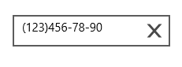

# Getting Started

This section explains how to create SfMaskedEdit control that restricts input values to the specified structure

## Add SfMaskedEdit to an application

Create a Universal Windows project in Visual Studio and refer to the following assemblies.

* Syncfusion.SfInput.UWP

* Syncfusion.SfShared.UWP

1.Include the namespace for Syncfusion.SfInput.UWP assembly in MainPage.xaml
  



 
<Page xmlns="http://schemas.microsoft.com/winfx/2006/xaml/presentation"

xmlns:x="http://schemas.microsoft.com/winfx/2006/xaml"

xmlns:input="using:Syncfusion.UI.Xaml.Controls.Input">





 2.Now add the `SfMaskedEdit` control with a required optimal name using the included namespace




	
 <syncfusion:SfMaskedEdit x:Name="maskedEdit"  Width="200" Height="40" Mask="(\d{0,3})\d{3}-\d{2}-\d{2}" MaskType="Regular" Value="(123)456-78-90"/>




	
  SfMaskedEdit maskedEdit = new SfMaskedEdit() { Width = 200, Height = 40 };
  maskedEdit.MaskType = MaskType.Simple;
  maskedEdit.Mask = "00 / 00 / 0000";
  maskedEdit.Value = "14 / 11 / 2014";




	
 Dim maskedEdit As New SfMaskedEdit() With {
	.Width = 200,
	.Height = 40
}
  maskedEdit.MaskType = MaskType.Simple
  maskedEdit.Mask = "00 / 00 / 0000"
  maskedEdit.Value = "14 / 11 / 2014"





   
   
  
   

