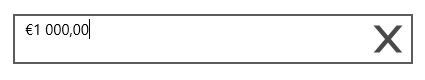

# Localization

SfMaskedEdit allows to build rich form-filling user interfaces by using culture-aware, localizable editor control. Text is formatted based on the specified Culture. 

The following code example shows how to localize the control to German culture.



<syncfusion:SfMaskedEdit Grid.Row="8" Margin="10 5" Name="maskedEdit"
                                        Mask="$\d,\d{3}.\d{2}" MaskType="Regular" 
                                        Value="$1,000.00"  Width="400" Height="50"/>





 maskedEdit.Culture=new System.Globalization.CultureInfo("fr-FR");





 maskedEdit.Culture = New System.Globalization.CultureInfo("fr-FR")



