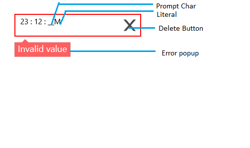

# Overview

MaskedEdit is an enhanced TextBox control that restricts input to conform to a specific structure or mask. It uses the Mask property to distinguish between proper and improper inputs. The important features of MaskedEdit are,

*	Different mask expressions support.
*	Formats Value.
*	Culture support.
*	Watermark support.

## Control Structure

