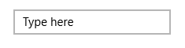
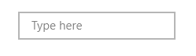

# Setting Watermark

The control prompts you with some information, when it is not in focus and contains an empty string.

### By using the Watermark

Watermark property allows you to specify some information, when the text is empty. For illustration, create a simple textbox, where you enter names separated by a comma.


 <syncfusion:SfMaskedEdit Width="200" 

                       Mask="[A-Za-z.\s]*"

                       MaskType="RegEx"

                       Watermark="Type here"/>



N> The Watermark property is the object type. So, any framework element can be hosted as Watermark content.



<syncfusion:SfMaskedEdit Width="200" 

                       Mask="[A-Za-z.\s]*"

                       MaskType="RegEx"

                       >
            <syncfusion:SfMaskedEdit.Watermark>

                <StackPanel>

                    <TextBlock Text="Type here" Opacity="0.5" Margin="5 2"/>

                </StackPanel>

            </syncfusion:SfMaskedEdit.Watermark>
            
 </syncfusion:SfMaskedEdit>



### By using the Watermark template

Any business object can be bound to the Watermark property and that object can be decorated by applying the WatermarkTemplate property.


<editors:SfMaskedEdit Mask="[A-Za-z\s]+" 

                      MaskType="RegEx"

                      Width="400">

	<editors:SfMaskedEdit.Watermark>

		<StackPanel>

            <TextBlock Text="{Binding PromptText}" Opacity="0.5" Margin="5 2"/>

        </StackPanel>

     </editors:SfMaskedEdit.Watermark>

</editors:SfMaskedEdit>



