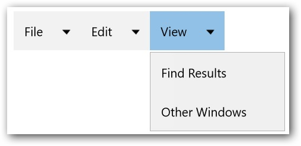
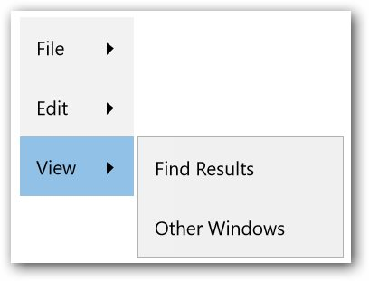

---
layout: post
title: Orientation
description: Orientation support for Syncfusion SfMenu control for UWP
platform: UWP
control: SfMenu
documentation: ug
--- 

# Orientation

The `SfMenu` control can align its content vertically and horizontally by using the `Orientation` property of the `SfMenu`.

## Change Orienatation of SfMenuItem

Items of `SfMenu` arranged horizontally, when the value of the `Orientation` property is set to Horizontal.

Similarly, when the value of the `Orientation` property is set to Vertical, the Items of `SfMenu` will be arranged vertically.

`Orientation` of `SfMenu` can be changed as mentioned in the code snippet.





<menu:SfMenu  x:Name="Sfmenu"  Orientation="Horizontal">

<menu:SfMenuItem Header="File" >

<menu:SfMenuItem  Header="New" />

<menu:SfMenuItem  Header="Open"/>

<menu:SfMenuItem Header="Close"/>

</menu:SfMenuItem>

<menu:SfMenuItem Header="Edit">

<menu:SfMenuItem Header="Undo"/>

<menu:SfMenuItem Header="Redo" />

<menu:SfMenuItem Header="Cut" />

<menu:SfMenuItem Header="Copy" />

</menu:SfMenuItem>

<menu:SfMenuItem Header="View">

<menu:SfMenuItem Header="Find Results" />

<menu:SfMenuItem Header="Other Windows" />

</menu:SfMenuItem>

</menu:SfMenu>





