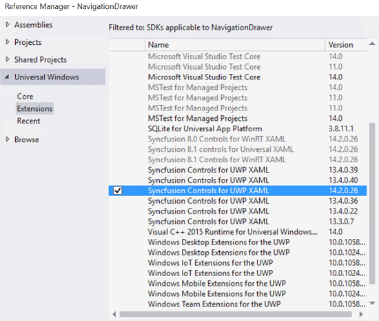
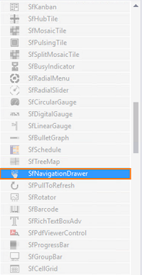
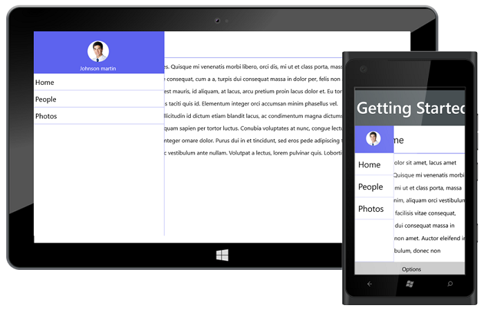

# Getting Started

The following section helps you to build your application with SfNavigationDrawer.

##Steps

* Create new Universal Windows Platform project using Visual Studio.For more [details](https://msdn.microsoft.com/en-us/windows/uwp/get-started/create-a-hello-world-app-xaml-universal))
* Add the SfNavigationDrawer assembly to your application.
* Initialize Navigationdrawer control.
* Adding contentview to the navigationdrawer control.
* Adding drawerview to the navigationdrawer control.

These steps were explained below for XAML.

##Create a simple Navigationdrawer from XAML

###Adding assembly reference

1. Open the Add Reference window from your project.
2. Choose Windows > Extensions > SyncfusionControls for UWP XAML.

Add the following namespace in your XAML window.



      
      xmlns:syncfusion="using:Syncfusion.UI.Xaml.NavigationDrawer"




## Add SfNavigationDrawer from Toolbox

Drag and drop the SfNavigationDrawer control from the Toolbox to your application.

Now the SyncfusionControls for UWP XAML reference is added to the application references and the xmlns namespace code is generated in MainWindow.xaml as below.

## Initialize the NavigationDrawer

You need to initialize the NavigationDrawer represented by the following class Syncfusion.UI.Xaml.NavigationDrawer.


        
        <syncfusion:SfNavigationDrawer>  
        
        </syncfusion:SfNavigationDrawer> 



## Adding contentview to the NavigationDrawer



	   <syncfusion:SfNavigationDrawer x:Name="drawer">
		<syncfusion:SfNavigationDrawer.ContentView>
			 <Grid>
        <StackPanel Orientation="Horizontal">
             <Button x:Name="button"  Canvas.ZIndex="5" Grid.Column="0" BorderBrush="Transparent" Height="45" Width="50" Background="Transparent"   Click="ButtonBase_OnClick">
                    <Path Data="M3.507019,20.166L28.493011,20.166C30.429993,20.166 32,21.734998 32,23.672008 32,25.609994 30.429993,27.180001 28.493011,27.180001L3.507019,27.180001C1.5710144,27.180001 0,25.609994 0,23.672008 0,21.734998 1.5710144,20.166 3.507019,20.166z M3.507019,10.082999L28.493011,10.082999C30.429993,10.082999 32,11.653006 32,13.590992 32,15.528002 30.429993,17.098985 28.493011,17.098985L3.507019,17.098985C1.5710144,17.098985 0,15.528002 0,13.590992 0,11.653006 1.5710144,10.082999 3.507019,10.082999z M3.507019,0L28.493011,0C30.429993,-8.7618901E-08 32,1.5710131 32,3.5080233 32,5.4460097 30.429993,7.0140015 28.493011,7.0140015L3.507019,7.0140015C1.5710144,7.0140015 0,5.4460097 0,3.5080233 0,1.5710131 1.5710144,-8.7618901E-08 3.507019,0z" Stretch="Uniform" Fill="#FF262626" Width="26" Height="26" Margin="0,0,0,0" RenderTransformOrigin="0.5,0.5"/>
                </Button>
            <TextBlock Text="Home" FontSize="27" Margin="10,0,0,0"  Foreground="Black" Grid.Column="1" HorizontalAlignment="Left" VerticalAlignment="Center" />
        </StackPanel>
        <Border BorderBrush="#FF5D63EE" Grid.Row="1" BorderThickness="1" VerticalAlignment="Top" Background="#FF5D63EE"/>
        <StackPanel Grid.Row="2" Orientation="Vertical"  Background="white" Margin="10" VerticalAlignment="Top">
            <TextBlock TextWrapping="Wrap" Foreground="black" LineHeight="35" FontSize="16" HorizontalAlignment="Left">
                <TextBlock.Text>
                    Lorem ipsum dolor sit amet, lacus amet amet ultricies. Quisque mi venenatis morbi libero, orci dis, mi ut et class porta, massa ligula magna enim, aliquam orci vestibulum tempus. Turpis facilisis vitae consequat, cum a a, turpis dui consequat massa in dolor per, felis non amet. Auctor eleifend in omnis elit vestibulum, donec non elementum tellus est mauris, id aliquam, at lacus, arcu pretium proin lacus dolor et. Eu tortor, vel ultrices amet dignissim mauris vehicula. Lorem tortor neque, purus taciti quis id. Elementum integer orci accumsan minim phasellus vel.
                </TextBlock.Text>
            </TextBlock>
            <TextBlock TextWrapping="Wrap" Foreground="black" LineHeight="35" FontSize="16" HorizontalAlignment="Left">
                <TextBlock.Text>
                    &#160;&#160;&#160;&#160;&#160;&#160;&#160;&#160;Vestibulum duis integer diam mi libero felis, sollicitudin id dictum etiam blandit lacus, ac condimentum magna dictumst interdum et, nam commodo mi habitasse enim fringilla nunc, amet aliquam sapien per tortor luctus. Conubia voluptates at nunc, congue lectus, malesuada nulla. Rutrum quo morbi, feugiat sed mi turpis, ac cursus integer ornare dolor. Purus dui in et tincidunt, sed eros pede adipiscing tellus, est suscipit nulla, arcu nec fringilla vel aliquam, mollis lorem rerum hac vestibulum ante nullam. Volutpat a lectus, lorem pulvinar quis. Lobortis vehicula in imperdiet orci urna.
                </TextBlock.Text>
            </TextBlock>
        </StackPanel>
        </Grid>
		</syncfusion:SfNavigationDrawer.ContentView>
    	</syncfusion:SfNavigationDrawer>



## Adding drawerview to the NavigationDrawer

The DrawerView is a panel that is the hidden content, brought to the view by manipulations like panning or swiping through the edges. The DrawerView has three sections namely:

   * DrawerHeaderView
   
   * DrawerContentView
   
   * DrawerFooterView

 

	     <syncfusion:SfNavigationDrawer x:Name="drawer">
		 <syncfusion:SfNavigationDrawer.DrawerHeaderView>
			 <StackPanel Orientation="Vertical" VerticalAlignment="Center" HorizontalAlignment="Center">
						<Image Source="/Assets/NavigationDrawer/User.png" Height="80" Width="100"/>
						<TextBlock HorizontalAlignment="Center" Margin="0 10 0 0" Text="James Pollock"/>
					</StackPanel>
		 </syncfusion:SfNavigationDrawer.DrawerHeaderView>
		 <syncfusion:SfNavigationDrawer.DrawerContentView>
			 <Grid Background="Black">
				<ListBox x:Name="list" ItemsSource="{Binding Contents}">
					<ListBox.ItemTemplate>
						<DataTemplate>
							<TextBlock  Text="{Binding Name}" Padding="15" TextAlignment="Center" FontSize="23" Foreground="White"/>
						</DataTemplate>
					</ListBox.ItemTemplate>
				</ListBox>
			</Grid>
		  </syncfusion:SfNavigationDrawer.DrawerContentView>
          <syncfusion:SfNavigationDrawer.DrawerFooterView>
		   <StackPanel Orientation="Vertical" VerticalAlignment="Center" HorizontalAlignment="Center">
						<Image Source="/Assets/NavigationDrawer/User.png" Height="80" Width="100"/>
						<TextBlock HorizontalAlignment="Center" Margin="0 10 0 0" Text="James Pollock"/>
					</StackPanel>
		 </syncfusion:SfNavigationDrawer.DrawerFooterView>
	     </syncfusion:SfNavigationDrawer>



                       

