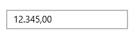
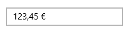

# Culture

The Culture property helps to localize the SfNumericTextBox. Text will be formatted based on the specified Culture. 

The following code sample shows how to localize the control to German culture.



SfNumericTextBox numerictxt = new SfNumericTextBox();

numerictxt.Value = 12345;

numerictxt.Culture = new CultureInfo("de-DE");



N> Note that the decimal separator and group separator are affected by the culture in this case.

N>  Since CultureInfo type does not contain a default constructor, it is not possible to set this property from XAML.

## Culture with formatting

SfNumericTextBox respects both Culture and FormatString while formatting Text. In the below Code sample, German Culture and Currency format specifier have been set for Culture and FormatString properties respectively.



<Page xmlns:editors="using:Syncfusion.UI.Xaml.Controls.Input">

    <Grid Background="{StaticResource ApplicationPageBackgroundThemeBrush}">

        <editors:SfNumericTextBox x:Name="numericTextBox"

                               HorizontalAlignment="Center"

                               VerticalAlignment="Center"

                               Width="200" 

FormatString="C"

                               Value="123.45"/>

    </Grid>

</Page>





numericTextBox.Culture = new System.Globalization.CultureInfo("de-DE");




