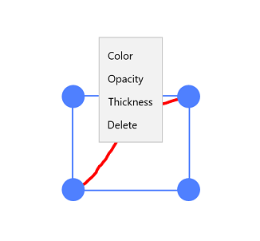

## Working with ink annotations

PDF Viewer allows you to include ink annotations in a PDF document and provides options to modify or remove the existing ink annotations.

## Adding ink annotations

### Enabling ink annotation mode

To enable an ink annotation, execute the `InkAnnotationCommand` with `true` as parameter.




<syncfusion:SfPdfViewerControl x:Name="pdfViewer"/>
<Button x:Name="inkAnnotationButton" Click="inkAnnotationButton_Click"/>





private void inkAnnotationButton_Click(object sender, RoutedEventArgs e)
{
	pdfViewer.InkAnnotationCommand.Execute(true);
}




### Disabling ink annotation mode

ink annotation can be disabled by executing the same command with `false` as parameter. 




<syncfusion:SfPdfViewerControl x:Name="pdfViewer"/>
<Button x:Name="resetAnnotationButton" Click="resetAnnotationButton_Click" />




private void resetAnnotationButton_Click(object sender, RoutedEventArgs e)
{
	pdfViewer.InkAnnotationCommand.Execute(false);
}




## Customizing the appearance of ink annotations

You can customize the default values of stroke color, opacity, and thickness of all ink annotations to be added. This will not affect the already added ink annotations.

### Setting the default stroke color

You can set the default stroke color of the ink annotations by using the `SfPdfViewerControl.InkAnnotationSettings.Color` property. Refer to the following code. 
 


SfPdfViewerControl pdfViewer = new SfPdfViewerControl();
pdfViewer.InkAnnotationSettings.Color = Color.FromArgb(255, 255, 0, 0);



### Setting the default opacity

You can set the default opacity of the ink annotations by using the `SfPdfViewerControl.InkAnnotationSettings.Opacity` property. Opacity value ranges from 0 to 1. Refer to the following code example.



SfPdfViewerControl pdfViewer = new SfPdfViewerControl();
pdfViewer.InkAnnotationSettings.Opacity = 0.5f; 



### Setting the default thickness

You can set the thickness of the ink annotations by using the `SfPdfViewerControl.InkAnnotationSettings.Thickness` property. Refer to the following code example. 



SfPdfViewerControl pdfViewer = new SfPdfViewerControl();
pdfViewer.InkAnnotationSettings.Thickness = 5;



### Changing the properties of a selected ink

You can change the properties of a selected ink annotation or remove it by right clicking it and choosing the desired property from the displayed options.

## Detecting the change in appearance properties of ink annotations

The changes made in ink annotations' properties can be detected using the `SfPdfViewerControl.InkEdited` event. The property values before and after change can be obtained using the `InkEditedEventArgs` parameter of the event's handler. 



SfPdfViewerControl pdfViewer = new SfPdfViewerControl();
pdfViewer.InkEdited += PdfViewer_InkEdited;

private void PdfViewer_InkEdited(object sender, InkEditedEventArgs e)
{
	//Obtain the thickness after change
	double newThickness = e.NewThickness;
	
	//Obtain the thickness before change
	double oldThickness = e.OldThickness;
	
	//Obtain the opacity after change
	double newOpacity = e.NewOpacity;
	
	//Obtain the opacity before change
	double oldOpacity = e.OldOpacity;
	
	//Obtain the color after change
	Color newColor = e.NewColor;
	
	//Obtain the color before change
	Color oldColor = e.OldColor;
	
	//Obtain the page number in which the ink is added
	int pageNumber = e.PageNumber;
}

