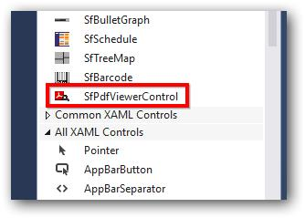
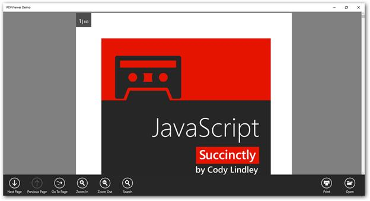

# Getting Started
This section explains about the assemblies required for the deployment of SfPdfViewer and how to create simple application using the SfPdfViewer control.

**Required Assemblies**

The following list of assemblies are required for adding a PDF viewer control to the Universal Windows Platform application.

* Syncfusion.SfPdfViewer.UWP
* Syncfusion.Pdf.UWP

**Create a simple application with the SfPdfViewer**

Follow the below steps to create a simple application with the SfPdfViewer and load a PDF document.

1. Create a new UWP application in the Visual Studio.

2. Open the Visual Studio tool box and drag the SfPdfViewerControl toolbox item to the designer window. Name the SfPdfViewerControl as pdfViewer.

When you drag the SfPdfViewer toolbox item to the window, it automatically adds the required assembly references to the current application.

To add the SfPdfViewer by using code, add the following assemblies as reference to the project.

* Syncfusion.Pdf.UWP
* Syncfusion.SfPdfViewer.UWP

Add the following code in XAML to make use of the SfPdfViewer.



<Page
    x:Class="SimpleSample.MainPage"
    xmlns="http://schemas.microsoft.com/winfx/2006/xaml/presentation"
    xmlns:x="http://schemas.microsoft.com/winfx/2006/xaml"
    xmlns:local="using:SimpleSample"
    xmlns:d="http://schemas.microsoft.com/expression/blend/2008"
    xmlns:mc="http://schemas.openxmlformats.org/markup-compatibility/2006"
    xmlns:syncfusion="using:Syncfusion.Windows.PdfViewer"
    >
    <Grid>
        <syncfusion:SfPdfViewerControl Name="pdfViewer"> </syncfusion:SfPdfViewerControl>
    </Grid>
</Page>



**Loading PDF document through binding** 

The following steps explains how to load a PDF document through binding.

1. The SfPdfViewer’s ItemSource property allows you to bind PDF documents in XAML. The ItemsSource property accepts a stream input that can be bound to the viewer during initialization.

2. To bind the PDF file, add the PDF file to the project as an asset. Right Click the PDF file and open the properties window. In the properties window, set the Build Action as Embedded Resource.

3. Create a simple class that loads a PDF report and provides the stream as a property that can be bound to the viewer as shown in the following code. Save the class file as PdfReport.cs.



class PdfReport : INotifyPropertyChanged
    {
        private Stream docStream;
        public event PropertyChangedEventHandler PropertyChanged;

        /// 

        /// Stream object to be bound to the ItemsSource of the PDF Viewer
        /// 

        public Stream DocumentStream
        {
            get
            {
                return docStream;
            }
            set
            {
                docStream = value;
                OnPropertyChanged(new PropertyChangedEventArgs("DocumentStream"));
            }
        }

        public PdfReport()
        {
            //Loads the stream from the embedded resource.
            Assembly assembly = typeof(MainPage).GetTypeInfo().Assembly;
            docStream = assembly.GetManifestResourceStream("SimpleSample.Assets.JavaScript_Succinctly.pdf");
        }

        public void OnPropertyChanged(PropertyChangedEventArgs e)
        {
            if (PropertyChanged != null)
                PropertyChanged(this, e);
        }        
    }


Class PdfReport
    Implements INotifyPropertyChanged

    Private docStream As Stream
    Private Event PropertyChanged As PropertyChangedEventHandler Implements INotifyPropertyChanged.PropertyChanged

    ''' 

    ''' Stream object to be bound to the ItemsSource of the PDF Viewer
    ''' 

    Public Property DocumentStream As Stream
        Get
            Return docStream
        End Get
        Set
            docStream = Value
            OnPropertyChanged(New PropertyChangedEventArgs("DocumentStream"))
        End Set
    End Property

    Public Sub New()
        'Loads the stream from the embedded resource.
        Dim assembly As Assembly = GetType(MainPage).GetTypeInfo().Assembly
        docStream = assembly.GetManifestResourceStream("SimpleSample.JavaScript_Succinctly.pdf")
    End Sub

    Public Sub OnPropertyChanged(e As PropertyChangedEventArgs)
        RaiseEvent PropertyChanged(Me, e)
    End Sub
End Class



In order to bind the DocumentStream property of the PdfReport class, the DataContext needs to be set for the page. To add the DataContext in XAML, use the following code example.



<Page
    x:Class="SimpleSample.MainPage"
    xmlns="http://schemas.microsoft.com/winfx/2006/xaml/presentation"
    xmlns:x="http://schemas.microsoft.com/winfx/2006/xaml"
    xmlns:local="using:SimpleSample"
    xmlns:d="http://schemas.microsoft.com/expression/blend/2008"
    xmlns:mc="http://schemas.openxmlformats.org/markup-compatibility/2006"
    xmlns:syncfusion="using:Syncfusion.Windows.PdfViewer"
    Loaded="Page_Loaded">
    <Page.DataContext>
        <local:PdfReport/>
    </Page.DataContext>
    <Grid>
        <syncfusion:SfPdfViewerControl Name="pdfViewer"></syncfusion:SfPdfViewerControl>
    </Grid>
</Page>



Once the DataContext has been set, the ItemSource dependency property can be set by using the following code in XAML.



<Page
    x:Class="SimpleSample.MainPage"
    xmlns="http://schemas.microsoft.com/winfx/2006/xaml/presentation"
    xmlns:x="http://schemas.microsoft.com/winfx/2006/xaml"
    xmlns:local="using:SimpleSample"
    xmlns:d="http://schemas.microsoft.com/expression/blend/2008"
    xmlns:mc="http://schemas.openxmlformats.org/markup-compatibility/2006"
    xmlns:syncfusion="using:Syncfusion.Windows.PdfViewer"
    Loaded="Page_Loaded">
    <Page.DataContext>
        <local:PdfReport/>
    </Page.DataContext>
    <Grid>
        <syncfusion:SfPdfViewerControl Name="pdfViewer" ItemsSource="{Binding DocumentStream}"></syncfusion:SfPdfViewerControl>
    </Grid>
</Page>



**Loading PDF document using FileOpenPicker**

Alternatively, a FileOpenPicker can also be used to load documents at run time. To achieve this, include a button to the application.



<Button Name="BtnOpen" Click="BtnOpen_Click" Content="Open"/>



Include the below code in the click event of the button.



async private void BtnOpen_Click(object sender, RoutedEventArgs e)
        {
            //Opens a file picker.
            var picker = new FileOpenPicker();
            picker.SuggestedStartLocation = PickerLocationId.DocumentsLibrary;
            picker.ViewMode = PickerViewMode.List;
            //Filters PDF files in the documents library.
            picker.FileTypeFilter.Add(".pdf");
            var file = await picker.PickSingleFileAsync();
            if (file == null) return;
            //Reads the stream of the loaded PDF document.
            var stream = await file.OpenAsync(Windows.Storage.FileAccessMode.Read);
            Stream fileStream = stream.AsStreamForRead();
            byte[] buffer = new byte[fileStream.Length];
            fileStream.Read(buffer, 0, buffer.Length);
            //Loads the PDF document.
            PdfLoadedDocument ldoc = new PdfLoadedDocument(buffer);
            pdfViewer.LoadDocument(ldoc);
        }


Private Async Sub BtnOpen_Click(sender As Object, e As RoutedEventArgs)
    'Opens a file picker.
    Dim picker = New FileOpenPicker()
    picker.SuggestedStartLocation = PickerLocationId.DocumentsLibrary
    picker.ViewMode = PickerViewMode.List
    'Filters PDF files in the documents library.
    picker.FileTypeFilter.Add(".pdf")
    Dim file = Await picker.PickSingleFileAsync()
    If file Is Nothing Then
        Return
    End If
    'Reads the stream of the loaded PDF document.
    Dim stream = Await file.OpenAsync(Windows.Storage.FileAccessMode.Read)
    Dim fileStream As Stream = stream.AsStreamForRead()
    Dim buffer As Byte() = New Byte(fileStream.Length - 1) {}
    fileStream.Read(buffer, 0, buffer.Length)
    'Loads the PDF document.
    Dim ldoc As New PdfLoadedDocument(buffer)
    pdfViewer.LoadDocument(ldoc)
End Sub



**Magnification operations**

The SfPdfViewer provides the following set of commands to perform magnification.

* IncreaseZoomCommand
* DecreaseZoomCommand

The following XAML code shows how to bind the IncreaseZoomCommand to a button


<Button Content="ZoomIn" Command="{Binding ElementName=pdfViewer, Path=IncreaseZoomCommand}" HorizontalAlignment="Left" VerticalAlignment="Top"></Button>



The following XAML code shows how to bind the DecreaseZoomCommand to a button



<Button Content="ZoomOut" Command="{Binding ElementName=pdfViewer, Path=DecreaseZoomCommand}" HorizontalAlignment="Left" VerticalAlignment="Top"></Button>



N>
* By default, the SfPdfViewer also supports the Ctrl + scroll key combination for performing magnification by using the keyboard and mouse.
* When the PDF viewer zoom value is decreased below 100%, the view will be automatically changed to show the thumbnails.

**Printing a document**

The following XAML code shows how to bind the PrintCommand to a Button


<Button Content="Print" Command="{Binding ElementName=pdfViewer, Path=PrintCommand}" ></Button>



**Search Operations**

The SearchText method can be used to search a text in the document. In addition to the current match, the method also highlights all the possible matches in the current page with a different color.

The following commands can be used for performing the Search-Next and Search-Previous operations.

* SearchNextCommand
* SearchPreviousCommand

Code example to initiate text search



private void searchButton_Click(object sender, RoutedEventArgs e)
        {
            pdfViewer.SearchText((searchTxtBx.Text));
        }


Private Sub searchButton_Click(sender As Object, e As RoutedEventArgs)
    pdfViewer.SearchText((searchTxtBx.Text))
End Sub



Binding SearchNextCommand and SearchPreviousCommand to buttons



<Button Content="Search Next" Command="{Binding ElementName=pdfViewer, Path=SearchNextCommand}" ></Button>

<Button Content="Search Previous" Command="{Binding ElementName=pdfViewer, Path=SearchPreviousCommand}" ></Button>



**Page Navigations**

The below list of commands are helpful for performing the page navigation operations.

* FirstPageCommand
* LastPageCommand
* PreviousPageCommand
* NextPageCommand

**Unloading PDF document from the viewer**

The SfPdfViewer control allows you to unload the PDF document from the viewer when the control is not in use anymore. This releases the PDF document and all its associated resources. To achieve this include a button in the application.



<Button Name="BtnUnload" Click="BtnUnload_Click" Content="Open"/>



Include the below code in the click event of the button.



private void BtnUnload_Click(object sender, RoutedEventArgs e)
        {
            //Unloads the PDF Document displayed in the PDF Viewer Control.
            pdfViewer.Unload();
        }


Private Sub BtnUnload_Click(sender As Object, e As RoutedEventArgs)
    pdfViewer.Unload()
End Sub



The following image shows the final SfPdfViewer with all the features being implemented.

