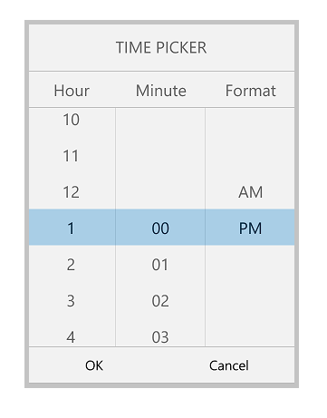

# Looping

The Looping support is used to automatically navigate the first item to repeat the list of items after reached the last item. Each forward iteration is followed by a backward iteration in the picker control. This can be achieved by `EnableLooping` property.

## EnableLooping

The looping support is achieved by setting the `EnableLooping` property to true.





	xmlns:d="http://schemas.microsoft.com/expression/blend/2008"
	xmlns:mc="http://schemas.openxmlformats.org/markup-compatibility/2006"
	xmlns:syncfusion="using:Syncfusion.UI.Xaml.Controls.Input"
	mc:Ignorable="d">
    
	<Page.DataContext>
	 <local:ColorInfo/>
	</Page.DataContext>
    
	<Grid Background="{ThemeResource ApplicationPageBackgroundThemeBrush}">
		<Button x:Name="button"
		 HorizontalAlignment="Center" 
		 Click="Button_Click" 
		 VerticalAlignment="Center" 
		 Height="30" Width="200" 
		 Content="Open picker"/>

		<syncfusion:SfPicker x:Name="picker" 
					EnableLooping="True" 
					Header="Select a color"  
					Height="300" 
					ShowHeader="True" 
					ItemsSource="{Binding Color}" 
					ColumnHeaderText="Color" 
					PickerMode="Dialog" 
					ShowColumnHeader="True"/>
	</Grid>
</Page





SfPicker picker = new SfPicker();

ColorInfo info = new ColorInfo();

picker.ItemsSource = info.Colors;

// Enable Looping in carousel control
picker.EnableLooping = true;





You can find the complete Looping sample from this [link.](http://www.syncfusion.com/downloads/support/directtrac/general/ze/LoopingUWP2032409493.zip)

# How to restrict Looping in a particular column of the picker

The looping support can be restricted in a particular column of the picker by setting the `EnableLooping` of ColumnLoaded event argument to false.





<syncfusion:SfPicker 
    x:Name="picker" 
    ColumnLoaded="date_ColumnLoaded"/>





private void date_ColumnLoaded(object source, ColumnLoadedEventArgs args)
        {
            if (args.Column == 1)
            {
                args.EnableLooping = false;
            }
        }




You can find sample from this [link.](http://www.syncfusion.com/downloads/support/directtrac/general/ze/ColumnEnableLooping-642618465.zip)