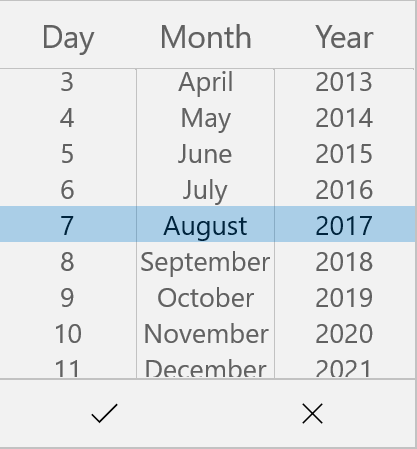
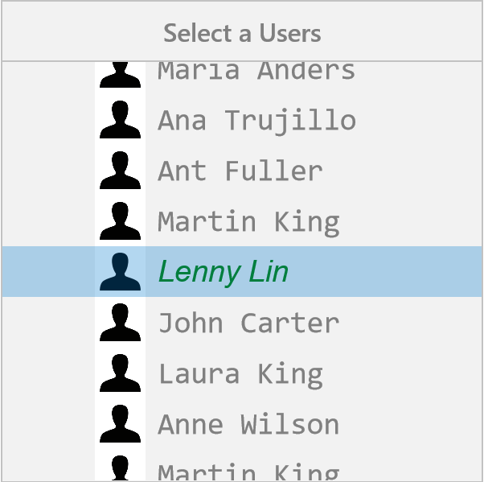

# Populating Items

This section explains about the ways of populating items for SfPicker control

## Binding Data Source

SfPicker is bound the external data source to display the data’s. It supports any collections that’s implements the `IEnumerable` interface.

To bind the data source in SfPicker, set the `SfPicker.ItemsSource` property as show in below code.





     <Page
        x:Class="PopulatingItems.MainPage"
        xmlns="http://schemas.microsoft.com/winfx/2006/xaml/presentation"
        xmlns:x="http://schemas.microsoft.com/winfx/2006/xaml"
        xmlns:local="using:PopulatingItems"
        xmlns:syncfusion="using:Syncfusion.UI.Xaml.Controls.Input">

      <Grid>
        
        <syncfusion:SfPicker x:Name="picker" Header="Select a Color" ItemsSource="{Binding Colors}" />
    
      </Grid>
    
    </Page>





    using Syncfusion.UI.Xaml.Controls.Input;
    using Windows.UI.Xaml;

    namespace PopulatingItems

    {

    public sealed partial class MainPage : Page

    {

        public MainPage()

        {

            this.InitializeComponent();

            SfPicker picker = new SfPicker();

            ColorInfo colorinfo = new ColorInfo();

            this.DataContext = colorinfo;

            picker.ItemsSource = colorinfo.Colors;

            this.Content = picker;

        }

      }

    }





## Multi-Column Items

The SfPicker automatically populate the items as Multi-Column based on the Data Source.

Collection of items can be created and assigned to a Collection and each item Collection is a column of SfPicker. 

The following code example illustrates about to populate Month, Day and Year values in each column of SfPicker.





    <Page
    x:Class="MultiColumn.MainPage"
    xmlns="http://schemas.microsoft.com/winfx/2006/xaml/presentation"
    xmlns:x="http://schemas.microsoft.com/winfx/2006/xaml"
    xmlns:local="using:MultiColumn"
    xmlns:syncfusion="using:Syncfusion.UI.Xaml.Controls.Input">

      <Grid>

          <syncfusion:SfPicker x:Name="picker" Header="Select a Color" ItemsSource="{Binding Dates}" />

      </Grid>

    </Page>




    
    using Syncfusion.UI.Xaml.Controls.Input;
    using Windows.UI.Xaml;

    namespace MultiColumn
 
     {    

      public sealed partial class MainPage : Page
 
       {

        public MainPage()
 
         {

            this.InitializeComponent();
 
            DatesInfo datesinfo = new DatesInfo();
 
            this.DataContext = datesinfo;

        }
        
        public class DatesInfo
 
         {
        
        public ObservableCollection<object> Dates { get; set; }

        //Day is the collection of day numbers
 
        private ObservableCollection<string> Day { get; set; }

        // Month is the collection of Month Names
 
        private ObservableCollection<string> Month { get; set; }

        //Year is the collection of Years from 1990 to 2050
 
        private ObservableCollection<string> Year { get; set; }

        public ObservableCollection<string> Headers { get; set; }

        public DatesInfo()
 
        {
            Dates = new ObservableCollection<object>();

            Headers = new ObservableCollection<string>();

            //Populate Day, Month and Year values of each collection
 
            PopulateDates();

            //first column of SfPicker
 
            Dates.Add(Day);

            //second column of SfPicker
 
            Dates.Add(Month);

            //third column of SfPicker
 
            Dates.Add(Year);

            //first column header of SfPicker
 
            Headers.Add("Day");

            //second column header of SfPicker
 
            Headers.Add("Month");

            //third column header of SfPicker
 
            Headers.Add("Year");
 
         }

        private void PopulateDates()
 
        {
 
            Day = new ObservableCollection<string>();

            Month = new ObservableCollection<string>();

            Year = new ObservableCollection<string>();

            for (int i = 1; i <= 31; i++)

                Day.Add(i.ToString());

            for (int i = 1; i <= 12; i++)

                Month.Add(System.Globalization.CultureInfo.CurrentCulture.DateTimeFormat.GetMonthName(i));

            for (int i = 1990; i <= 2050; i++)

                Year.Add(i.ToString());

        }

      }

    }





MultiColumn sample from the following link

Sample link: [MultiColumn](http://www.syncfusion.com/downloads/support/directtrac/general/MULTIC~2682826403.ZIP)

Screen shot for the above code.

## Set Items Colors and Font Attributes customization

In SfPicker, items text color and font both selected and unselected item of SfPicker control can be customized as shown below.  

### Selected Item Customization

##### Text Color 

Selected item text color can be customized by setting `SfPicker.SelectedItemForeground` property of SfPicker.




    
    <Page
        x:Class="PopulatingItems.MainPage"
        xmlns="http://schemas.microsoft.com/winfx/2006/xaml/presentation"
        xmlns:x="http://schemas.microsoft.com/winfx/2006/xaml"
        xmlns:local="using:PopulatingItems"
        xmlns:syncfusion="using:Syncfusion.UI.Xaml.Controls.Input">       
    
        <Grid>
            
            <syncfusion:SfPicker x:Name="picker" SelectedItemForeground="Green" />
        
        </Grid>
    
    </Page>





    using Syncfusion.UI.Xaml.Controls.Input;
    using Windows.UI.Xaml;

    namespace PopulatingItems

    {    

      public sealed partial class MainPage : Page

        {

            public MainPage()

            {

                this.InitializeComponent();

                SfPicker picker = new SfPicker();

                picker.SelectedItemForeground = new SolidColorBrush(Windows.UI.Colors.Green);

                this.Content = picker;

          }

       }

    }





##### Font 

This section explains about the customization of Selected Item Font.

###### 	FontFamily

Selected item text FontFamily can be customized by setting `SfPicker.SelectedItemFontFamily` property of SfPicker.





    <Page
        x:Class="PopulatingItems.MainPage"
        xmlns="http://schemas.microsoft.com/winfx/2006/xaml/presentation"
        xmlns:x="http://schemas.microsoft.com/winfx/2006/xaml"
        xmlns:local="using:PopulatingItems"
        xmlns:syncfusion="using:Syncfusion.UI.Xaml.Controls.Input"
           
        <Grid>
           
            <syncfusion:SfPicker x:Name="picker" SelectedItemFontFamily="Arial" />       
        
        </Grid>
    
    </Page>





    using Syncfusion.UI.Xaml.Controls.Input;
    using Windows.UI.Xaml;

    namespace PopulatingItems
 
    {    

     public sealed partial class MainPage : Page
 
        {
            public MainPage()
 
            {
 
                this.InitializeComponent();

                SfPicker picker = new SfPicker();
 
                picker.SelectedItemFontFamily = new FontFamily("Ariel");
 
                this.Content = picker;
 
          }
 
       }
 
    }

 



###### 	FontSize

Selected item text FontSize can be customized by setting `SfPicker.SelectedItemFontSize` property of SfPicker.





    <Page
        x:Class="PopulatingItems.MainPage"
        xmlns="http://schemas.microsoft.com/winfx/2006/xaml/presentation"
        xmlns:x="http://schemas.microsoft.com/winfx/2006/xaml"
        xmlns:local="using:PopulatingItems"
        xmlns:syncfusion="using:Syncfusion.UI.Xaml.Controls.Input"
            
        <Grid>
           
            <syncfusion:SfPicker x:Name="picker" SelectedItemFontSize="25" />       
        
        </Grid>
    
    </Page>

 



    using Syncfusion.UI.Xaml.Controls.Input;
    using Windows.UI.Xaml;

    namespace PopulatingItems
 
    {    

      public sealed partial class MainPage : Page
 
        {

            public MainPage()
 
            {
 
                this.InitializeComponent();

                SfPicker picker = new SfPicker();
 
                picker.SelectedItemFontSize = 25;
 
                this.Content = picker;
 
            }
 
        }
 
    }





###### 	FontAttribute

Selected item text FontAttribute can be customized by setting `SfPicker.SelectedItemFontStyle` property of SfPicker.





    <Page
        x:Class="PopulatingItems.MainPage"
        xmlns="http://schemas.microsoft.com/winfx/2006/xaml/presentation"
        xmlns:x="http://schemas.microsoft.com/winfx/2006/xaml"
        xmlns:local="using:PopulatingItems"
        xmlns:syncfusion="using:Syncfusion.UI.Xaml.Controls.Input">
            
        <Grid>
           
            <syncfusion:SfPicker x:Name="picker" SelectedItemFontStyle="Italic" />       
        
        </Grid>
    
    </Page>





    using Syncfusion.UI.Xaml.Controls.Input;
    using Windows.UI.Xaml;

    namespace PopulatingItems
 
    {    

       public sealed partial class MainPage : Page
 
        {

            public MainPage()
 
            {

                this.InitializeComponent();
 
                SfPicker picker = new SfPicker();
 
                picker.SelectedItemFontStyle = Windows.UI.Text.FontStyle.Italic;
 
                this.Content = picker;
 
          }
 
        }
 
   }





### UnSelected Item Customization

##### Text Color

Unselected item text color can be customized by setting `SfPicker.UnSelectedItemTextColor` property of SfPicker.





    <Page
        x:Class="PopulatingItems.MainPage"
        xmlns="http://schemas.microsoft.com/winfx/2006/xaml/presentation"
        xmlns:x="http://schemas.microsoft.com/winfx/2006/xaml"
        xmlns:local="using:PopulatingItems"
        xmlns:syncfusion="using:Syncfusion.UI.Xaml.Controls.Input"
           
        <Grid>
           
            <syncfusion:SfPicker x:Name="picker"  Foreground="Gray" />       
        
        </Grid>
    
    </Page>





    using Syncfusion.UI.Xaml.Controls.Input;
    using Windows.UI.Xaml;

    namespace PopulatingItems

    {    

     public sealed partial class MainPage : Page

        {

            public MainPage()

            {

                this.InitializeComponent();

                SfPicker picker = new SfPicker();

                picker.Foreground = new SolidColorBrush(Windows.UI.Colors.Gray);

                this.Content = picker;

          }

       }

    }
    




##### Font

This section explains about the customization of unselected items Font.

###### 	FontFamily

Unselected item text FontFamily can be customized by setting `SfPicker.UnSelectedItemFontFamily` property of SfPicker.


    
  

    <Page
        x:Class="PopulatingItems.MainPage"
        xmlns="http://schemas.microsoft.com/winfx/2006/xaml/presentation"
        xmlns:x="http://schemas.microsoft.com/winfx/2006/xaml"
        xmlns:local="using:PopulatingItems"
        xmlns:syncfusion="using:Syncfusion.UI.Xaml.Controls.Input"
           
        <Grid>
           
            <syncfusion:SfPicker x:Name="picker"  FontFamily="Consolas" />       
        
        </Grid>
    
    </Page>





    using Syncfusion.UI.Xaml.Controls.Input;
    using Windows.UI.Xaml;

    namespace PopulatingItems

    {    

     public sealed partial class MainPage : Page

        {

            public MainPage()

            {

                this.InitializeComponent();

                SfPicker picker = new SfPicker();

                picker.FontFamily = new FontFamily("Consolas");

                this.Content = picker;

          }

       }

    }





###### 	FontSize

Unselected item text FontSize can be customized by setting `SfPicker.UnSelectedItemTextSize` property of SfPicker.




 
    <Page
        x:Class="PopulatingItems.MainPage"
        xmlns="http://schemas.microsoft.com/winfx/2006/xaml/presentation"
        xmlns:x="http://schemas.microsoft.com/winfx/2006/xaml"
        xmlns:local="using:PopulatingItems"
        xmlns:syncfusion="using:Syncfusion.UI.Xaml.Controls.Input"
            
        <Grid>
           
            <syncfusion:SfPicker x:Name="picker" FontSize="20" />       
        
        </Grid>
    
    </Page>

 



    using Syncfusion.UI.Xaml.Controls.Input;
    using Windows.UI.Xaml;

    namespace PopulatingItems
  
    {    

      public sealed partial class MainPage : Page

        {

            public MainPage()

            {

                this.InitializeComponent();

                SfPicker picker = new SfPicker();

                picker.FontSize = 20;

                this.Content = picker;

            }

        }

    }
    




###### 	FontAttribute

Unselected item text FontAttribute can be customized by setting `SfPicker.UnSelectedItemFontStyle` property of SfPicker.





    <Page
        x:Class="PopulatingItems.MainPage"
        xmlns="http://schemas.microsoft.com/winfx/2006/xaml/presentation"
        xmlns:x="http://schemas.microsoft.com/winfx/2006/xaml"
        xmlns:local="using:PopulatingItems"
        xmlns:syncfusion="using:Syncfusion.UI.Xaml.Controls.Input">
            
        <Grid>
           
            <syncfusion:SfPicker x:Name="picker" FontStyle="Normal" />       
        
        </Grid>
    
    </Page>





    using Syncfusion.UI.Xaml.Controls.Input;
    using Windows.UI.Xaml;

    namespace PopulatingItems
 
    {    

       public sealed partial class MainPage : Page
 
        {

            public MainPage()
 
            {
             
                this.InitializeComponent();

                SfPicker picker = new SfPicker();
 
                picker.FontStyle = Windows.UI.Text.FontStyle.Normal;
 
                this.Content = picker;
 
          }
 
        }
 
    }





## Adding Custom View Items

In SfPicker, the items can be customized with custom view of each item by adding all the item with custom view.





    <Page
        x:Class="PopulatingItems.MainPage"
        xmlns="http://schemas.microsoft.com/winfx/2006/xaml/presentation"
        xmlns:x="http://schemas.microsoft.com/winfx/2006/xaml"
        xmlns:local="using:PopulatingItems"
        xmlns:syncfusion="using:Syncfusion.UI.Xaml.Controls.Input">
            
      <Grid>
         
        <Button Click="Button_Click" HorizontalAlignment="Center"  VerticalAlignment="Center" Height="60" Width="200" Content="Open picker"/>

        <syncfusion:SfPicker x:Name="picker" ItemsSource="{Binding Users}" VerticalAlignment="Center" HorizontalAlignment="Center" Height="400" Width="400" FontStyle="Normal" FontSize="25" FontFamily="Consolas" Foreground="Gray" SelectedItemFontStyle="Italic" SelectedItemForeground="Green"     SelectedItemFontSize="25" SelectedItemFontFamily="Arial" ShowHeader="True"  Header="Select a Users" ShowColumnHeader="True" ColumnHeaderText="Users" PickerMode="Dialog" >
        
            <syncfusion:SfPicker.ItemTemplate>
        
                    <DataTemplate>
                        
                        <Grid>
           
                            <Grid.ColumnDefinitions>
           
                                <ColumnDefinition Width="50" />
           
                                <ColumnDefinition Width="*" />
           
                            </Grid.ColumnDefinitions>                            
           
                            <Image Margin="8,0,0,0" Name="image" Source="user.png"  />
           
                            <TextBlock Grid.Column="1" Height="50" Width="200" Text="{Binding}" />                        
           
                        </Grid>
                        
                    </DataTemplate>
           
                </syncfusion:SfPicker.ItemTemplate>
           
            </syncfusion:SfPicker>

     </Grid>    

    </Page>





    using Syncfusion.UI.Xaml.Controls.Input;
    using Windows.UI.Xaml;

    namespace PopulatingItems
  
     { 

      public sealed partial class MainPage : Page
  
       {
           
        public MainPage()
  
        {
  
            this.InitializeComponent();
  
            UsersInfo userInfo = new UsersInfo();
  
            this.DataContext = userInfo;
  
        }

        private void Button_Click(object sender, RoutedEventArgs e)
  
        {
  
            picker.IsOpen = true;
  
        }
  
       }
       
        public class UserInfo

        {

        private ObservableCollection<string> _user;
            
        public ObservableCollection<string> Users
            
            {

                get { return _user; }

                set { _user = value; }

            }
    
            public UserInfo()

            {

            Users = new ObservableCollection<string>();

            Users.Add("Maria Anders");

            Users.Add("Ana Trujillo");

            Users.Add("Ant Fuller");

            Users.Add("Martin King");

            Users.Add("Lenny Lin");

            Users.Add("John Carter");

            Users.Add("Laura King");

            Users.Add("Anne Wilson");

            Users.Add("Martin King");

            Users.Add("Gina Irene");

            }

        }
    
    }    





Screen shot for the above code.

