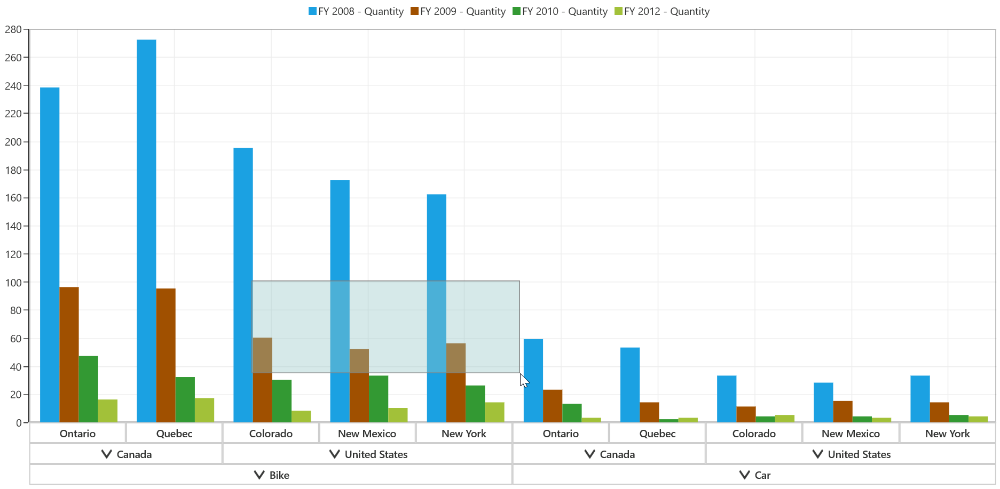

# Zooming and Panning

SfPivotChart allows you to zoom-in, zoom-out, and pan the chart area with the help of this support. Zooming is mostly used to view the in-depth information of specific chart area, when there are number of data points inside the chart. Panning is mostly used to navigate the chart area.

Zooming and panning provides you to take a close-up look of the data point plotted in the series.

**Initialization**

By using the `ZoomPanBehavior` property in the SfPivotChart, you can enable the zooming and panning support as shown in the following code snippet:





<syncfusion:SfPivotChart.ZoomPanBehavior>
   <syncfusion:PivotChartZoomPanBehavior/>
</syncfusion:SfPivotChart.ZoomPanBehavior>





PivotChart1.ZoomPanBehavior = new PivotChartZoomPanBehavior();





PivotChart1.ZoomPanBehavior = New PivotChartZoomPanBehavior()





## Zooming chart area

Zooming can be performed by any of the following ways:

### Mouse wheel zooming

Zooming can be performed by mouse wheel action by setting `EnableMouseWheelZooming` property to true as shown in the following code snippet:





<syncfusion:SfPivotChart.ZoomPanBehavior>
   <syncfusion:PivotChartZoomPanBehavior EnableMouseWheelZooming="True"/>
</syncfusion:SfPivotChart.ZoomPanBehavior>





PivotChart1.ZoomPanBehavior = new PivotChartZoomPanBehavior();
PivotChart1.ZoomPanBehavior.EnableMouseWheelZooming = true;





PivotChart1.ZoomPanBehavior = New PivotChartZoomPanBehavior()
PivotChart1.ZoomPanBehavior.EnableMouseWheelZooming = True





**Zooming relative to cursor**

To enable the zooming relative to cursor position, you can set `ZoomRelativeToCursor` property to true. This support is applicable only for the mouse wheel zooming.





<syncfusion:SfPivotChart.ZoomPanBehavior>
   <syncfusion:PivotChartZoomPanBehavior EnableMouseWheelZooming="True" ZoomRelativeToCursor="True"/>
</syncfusion:SfPivotChart.ZoomPanBehavior>





PivotChart1.ZoomPanBehavior = new PivotChartZoomPanBehavior();
PivotChart1.ZoomPanBehavior.EnableMouseWheelZooming = true;
PivotChart1.ZoomPanBehavior..ZoomRelativeToCursor = true;





PivotChart1.ZoomPanBehavior = New PivotChartZoomPanBehavior()
PivotChart1.ZoomPanBehavior.EnableMouseWheelZooming = True
PivotChart1.ZoomPanBehavior.ZoomRelativeToCursor = True





### Pinch zooming

If you want to zoom the chart area using fingers by touch, then you have to set `EnablePinchZooming` property to true as shown in the below code snippet:





<syncfusion:SfPivotChart.ZoomPanBehavior>
   <syncfusion:PivotChartZoomPanBehavior EnablePinchZooming="True"/>
</syncfusion:SfPivotChart.ZoomPanBehavior>





PivotChart1.ZoomPanBehavior = new PivotChartZoomPanBehavior();
PivotChart1.ZoomPanBehavior.EnablePinchZooming = true;





PivotChart1.ZoomPanBehavior = New PivotChartZoomPanBehavior()
PivotChart1.ZoomPanBehavior.EnablePinchZooming = True





### Selection zooming

Zooming can also be performed by selecting a particular region in rectangular form. To enable the selection zooming, you have to set `EnableSelectionZooming` property to true as illustrated below:





<syncfusion:SfPivotChart.ZoomPanBehavior>
   <syncfusion:PivotChartZoomPanBehavior EnableSelectionZooming ="True"/>
</syncfusion:SfPivotChart.ZoomPanBehavior>





PivotChart1.ZoomPanBehavior = new PivotChartZoomPanBehavior();
PivotChart1.ZoomPanBehavior.EnableSelectionZooming = true;





PivotChart1.ZoomPanBehavior = New PivotChartZoomPanBehavior()
PivotChart1.ZoomPanBehavior.EnableSelectionZooming = True





**Customizing the selection rectangle**

The rectangle which is seen while selecting a region for zooming can be customized by using the properties of `Fill`, `Stroke`, and `StrokeThickness` as shown below:





<syncfusion:SfPivotChart.ZoomPanBehavior>
   <syncfusion:PivotChartZoomPanBehavior EnableSelectionZooming="True" Fill="LightBlue" Stroke="Black" StrokeThickness="2"/>
</syncfusion:SfPivotChart.ZoomPanBehavior>





PivotChart1.ZoomPanBehavior = new PivotChartZoomPanBehavior();
PivotChart1.ZoomPanBehavior.EnableSelectionZooming = true;
PivotChart1.ZoomPanBehavior.Fill  = new SolidColorBrush(Colors.LightBlue);
PivotChart1.ZoomPanBehavior.Stroke  = new SolidColorBrush(Colors.Black);
PivotChart1.ZoomPanBehavior.StrokeThickness  = true;





PivotChart1.ZoomPanBehavior = New PivotChartZoomPanBehavior()
PivotChart1.ZoomPanBehavior.EnableSelectionZooming = True
PivotChart1.ZoomPanBehavior.Fill = New SolidColorBrush(Colors.LightBlue)
PivotChart1.ZoomPanBehavior.Stroke = New SolidColorBrush(Colors.Black)
PivotChart1.ZoomPanBehavior.StrokeThickness = True





## Zooming mode

Zooming can be done horizontally and vertically based on the axis that is defined by using `ZoomMode` property. By default, `ZoomMode` is set as `XY`, so that the zooming can be performed on both the axes.

**Zooming along x-axis**





<syncfusion:SfPivotChart.ZoomPanBehavior>
   <syncfusion:PivotChartZoomPanBehavior EnableSelectionZooming="True" ZoomMode="X"/>
</syncfusion:SfPivotChart.ZoomPanBehavior>





PivotChart1.ZoomPanBehavior = new PivotChartZoomPanBehavior();
PivotChart1.ZoomPanBehavior.EnableSelectionZooming = true;
PivotChart1.ZoomPanBehavior.ZoomMode = ZoomMode.X;





PivotChart1.ZoomPanBehavior = New PivotChartZoomPanBehavior()
PivotChart1.ZoomPanBehavior.EnableSelectionZooming = True
PivotChart1.ZoomPanBehavior.ZoomMode = ZoomMode.X





**Zooming along y-axis**





<syncfusion:SfPivotChart.ZoomPanBehavior>
   <syncfusion:PivotChartZoomPanBehavior EnableSelectionZooming="True" ZoomMode="Y"/>
</syncfusion:SfPivotChart.ZoomPanBehavior>





PivotChart1.ZoomPanBehavior = new PivotChartZoomPanBehavior();
PivotChart1.ZoomPanBehavior.EnableSelectionZooming = true;
PivotChart1.ZoomPanBehavior.ZoomMode = ZoomMode.Y;





PivotChart1.ZoomPanBehavior = New PivotChartZoomPanBehavior()
PivotChart1.ZoomPanBehavior.EnableSelectionZooming = True
PivotChart1.ZoomPanBehavior.ZoomMode = ZoomMode.Y





## Zoom level

You can also limit the zooming by setting the property of `MaximumZoomLevel` as illustrated in the following code snippet:





<syncfusion:SfPivotChart.ZoomPanBehavior>
   <syncfusion:PivotChartZoomPanBehavior MaximumZoomLevel="5"/>
</syncfusion:SfPivotChart.ZoomPanBehavior>





PivotChart1.ZoomPanBehavior = new PivotChartZoomPanBehavior();
PivotChart1.ZoomPanBehavior.MaximumZoomLevel = 5;





PivotChart1.ZoomPanBehavior = New PivotChartZoomPanBehavior()
PivotChart1.ZoomPanBehavior.MaximumZoomLevel = 5





## Zooming toolbar

Zooming toolbar is encompassed with buttons for performing actions like zoom in, zoom-out, reset, pan, etc. You can add the zooming toolbar to the chart area by enabling the property of `EnableZoomingToolBar` as shown below:





<syncfusion:SfPivotChart.ZoomPanBehavior>
    <syncfusion:PivotChartZoomPanBehavior EnableZoomingToolBar="True" EnableSelectionZooming="True"/>
</syncfusion:SfPivotChart.ZoomPanBehavior>





PivotChart1.ZoomPanBehavior = new PivotChartZoomPanBehavior();
PivotChart1.ZoomPanBehavior.EnableZoomingToolBar = true;
PivotChart1.ZoomPanBehavior.EnableSelectionZooming = true;





PivotChart1.ZoomPanBehavior = New PivotChartZoomPanBehavior()
PivotChart1.ZoomPanBehavior.EnableZoomingToolBar = True
PivotChart1.ZoomPanBehavior.EnableSelectionZooming = True





**Positioning zooming toolbar**

Zooming toolbar can be positioned by using the `HorizontalPosition` and `VerticalPosition` properties as illustrated in the following code snippet:





<syncfusion:SfPivotChart.ZoomPanBehavior>
   <syncfusion:PivotChartZoomPanBehavior EnableZoomingToolBar="True" HorizontalPosition="Left" VerticalPosition="Bottom"/>
</syncfusion:SfPivotChart.ZoomPanBehavior>





PivotChart1.ZoomPanBehavior = new PivotChartZoomPanBehavior();
PivotChart1.ZoomPanBehavior.EnableZoomingToolBar  = true;
PivotChart1.ZoomPanBehavior.HorizontalPosition = HorizontalAlignment.Left;
PivotChart1.ZoomPanBehavior.VerticalPosition = VerticalAlignment.Bottom;





PivotChart1.ZoomPanBehavior = New PivotChartZoomPanBehavior()
PivotChart1.ZoomPanBehavior.EnableZoomingToolBar = True
PivotChart1.ZoomPanBehavior.HorizontalPosition = HorizontalAlignment.Left
PivotChart1.ZoomPanBehavior.VerticalPosition = VerticalAlignment.Bottom





**Customization of zooming toolbar**

Zooming toolbar can be customized by using the following properties:

* `ToolBarBackground` - Represents the background of zooming toolbar.
* `ToolBarItems` - Represents the collection of toolbar items.
* `ToolBarItemMargin` - Represents the margin for the toolbar item.
* `ToolBarItemWidth` - Represents the width of the toolbar item.
* `ToolBarItemHeight` - Represents the height of the toolbar item.
* `ToolBarOrientation` - Represents the orientation of the toolbar.





<syncfusion:SfPivotChart.ZoomPanBehavior>
    <syncfusion:PivotChartZoomPanBehavior EnableZoomingToolBar="True" ToolBarBackground="SaddleBrown" ToolBarItems="All" ToolBarOrientation="Vertical" ToolBarItemHeight="15" ToolBarItemWidth="15" ToolBarItemMargin="5"/>
</syncfusion:SfPivotChart.ZoomPanBehavior>





PivotChart1.ZoomPanBehavior = new PivotChartZoomPanBehavior();
PivotChart1.ZoomPanBehavior.EnableZoomingToolBar  = true;
PivotChart1.ZoomPanBehavior.ToolBarBackground = new SolidColorBrush(Colors.SaddleBrown);
PivotChart1.ZoomPanBehavior.ToolBarItems = ZoomToolBarItems.All;
PivotChart1.ZoomPanBehavior.ToolBarOrientation = Orientation.Vertical;
PivotChart1.ZoomPanBehavior.ToolBarItemHeight = 15;
PivotChart1.ZoomPanBehavior.ToolBarItemWidth = 15;
PivotChart1.ZoomPanBehavior.ToolBarItemMargin = new Thickness(5);





PivotChart1.ZoomPanBehavior = New PivotChartZoomPanBehavior()
PivotChart1.ZoomPanBehavior.EnableZoomingToolBar = True
PivotChart1.ZoomPanBehavior.ToolBarBackground = New SolidColorBrush(Colors.SaddleBrown)
PivotChart1.ZoomPanBehavior.ToolBarItems = ZoomToolBarItems.All
PivotChart1.ZoomPanBehavior.ToolBarOrientation = Orientation.Vertical
PivotChart1.ZoomPanBehavior.ToolBarItemHeight = 15
PivotChart1.ZoomPanBehavior.ToolBarItemWidth = 15
PivotChart1.ZoomPanBehavior.ToolBarItemMargin = New Thickness(5)





## Panning chart area

Panning allows to navigate the visible area of the chart when it is zoomed in. To enable panning, you can set `EnablePanning` property to true as shown below:





<syncfusion:SfPivotChart.ZoomPanBehavior>
   <syncfusion:PivotChartZoomPanBehavior EnablePanning="True"/>
</syncfusion:SfPivotChart.ZoomPanBehavior>





PivotChart1.ZoomPanBehavior = new PivotChartZoomPanBehavior();
PivotChart1.ZoomPanBehavior.EnablePanning = true;





PivotChart1.ZoomPanBehavior = New PivotChartZoomPanBehavior()
PivotChart1.ZoomPanBehavior.EnablePanning = True





## Reset zooming and panning

SfPivotChart provides support to reset to the default view when you double-tap the chart area by setting `ResetOnDoubleTap` property to true.





<syncfusion:SfPivotChart.ZoomPanBehavior>
   <syncfusion:PivotChartZoomPanBehavior ResetOnDoubleTap="True"/>
</syncfusion:SfPivotChart.ZoomPanBehavior>





PivotChart1.ZoomPanBehavior = new PivotChartZoomPanBehavior();
PivotChart1.ZoomPanBehavior.ResetOnDoubleTap = true;





PivotChart1.ZoomPanBehavior = New PivotChartZoomPanBehavior()
PivotChart1.ZoomPanBehavior.ResetOnDoubleTap = True



