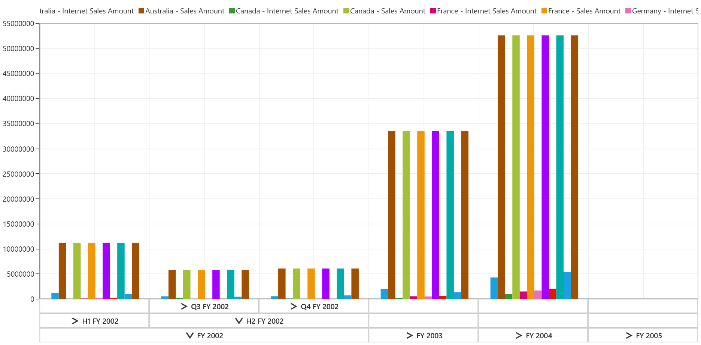

# Drill Operation

## Drill Down/Drill Up

This is the basic feature of SfPivotChart through which the amount of information can be limited for a better view. It allows you to drill down to access the detailed level of data or drill up to see the summarized data by using the expanders present in the primary axis' labels.

Drill up, also called as roll up; it navigates from more detailed data to less detailed data by climbing up a concept hierarchy for a dimension.

Drill down, also called as roll down; it is the reverse of drill up operation which navigates from less detailed data to more detailed data by climbing down the concept hierarchy for the dimension.

While binding hierarchical dimensions (for example, the time dimension could include 3 levels namely Year, Quarter, and Month), the SfPivotChart allows you to visualize the data for different levels by using the collapsible labels which are illustrated in the following screenshot.

## Drill types

The following drill types are supported in the SfPivotChart.

* Drill Member
* Drill Position
* Drill Replace

**Drill member**

The drill member is the default drilling type performed in the SfPivotChart. When multiple dimensions are added in an axis, expanding a single member expands the corresponding member element across all of its positions. The following code snippet and screenshot illustrate how the elements are drilled in drill member type.





pivotChart1.OlapDataManager.CurrentReport.DrillType = DrillType.DrillMember;





pivotChart1.OlapDataManager.CurrentReport.DrillType = DrillType.DrillMember





**Drill position**

The drill position type enables the user to drill only the current position of the selected member in the OLAP report. This excludes the drilled data of the selected member in other positions by using the MDX query. Please refer the below code snippet:





pivotChart1.OlapDataManager.CurrentReport.DrillType = DrillType.DrillPosition;





pivotChart1.OlapDataManager.CurrentReport.DrillType = DrillType.DrillPosition





**Drill replace**

SfPivotChart supports the drill replace type, in which the control would tend to display only the immediate child members and ancestors on the drill-down. The following code snippet and screenshot illustrates, how the elements are drilled in the drill member type.





pivotChart1.OlapDataManager.CurrentReport.DrillType = DrillType.DrillReplace;





pivotChart1.OlapDataManager.CurrentReport.DrillType = DrillType.DrillReplace





N> The drilled-down member will be replaced with the drilled data and it cannot be drilled-up.

N> Since the property `DrillType` interacts with the `OlapDataManager`, you should call `DataBind()` method of SfPivotChart after assigning the value to this property.

## Show/Hide expanders

The expander refers to the arrow sign prior to a member present in the primary axis labels. The visibility of expanders in the SfPivotChart can be toggled with the help of `ShowExpanders` property available in the OLAP report.

Please refer the below code snippet to hide expanders in the SfPivotChart.





pivotChart1.OlapDataManager.CurrentReport.ShowExpanders = false;





pivotChart1.OlapDataManager.CurrentReport.ShowExpanders = False





N> Since the property `ShowExpanders` interacts with the `OlapDataManager`, you should call `DataBind()` method of SfPivotChart after assigning the value to this property.