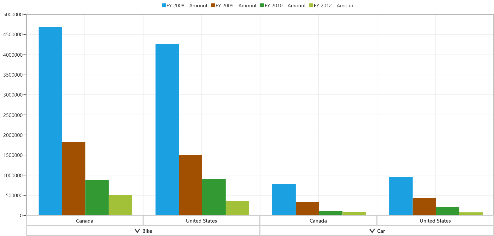

# Getting Started

This section explains about the steps required to create a simple SfPivotChart control bound to relational data source such as IList, IEnumerable, etc.

## Control initialization

SfPivotChart control can be initialized and added to an application through the following ways:

1. Through designer.
2. Through XAML.
3. Through code-behind.

## Adding control through designer

Open Visual Studio IDE and navigate to *File > New > Project > Universal > Blank APP(Universal Windows)* under windows option inside the Visual C# Templates to create a new UWP application.

N> Once the UWP application is created, select **"Properties"** under the project shown in the solution explorer and change the target version of the application as **"Windows 10 (10.0; Build 10240)".**

Now, select toolbox from the view menu and it will appear inside the VisualStudio IDE. From the toolbox, select SfPivotChart control under “Syncfusion Controls for UWP XAML” group, then drag and drop it into the designer section of the MainPage.xaml file.

Finally name the added SfPivotChart control as “PivotChart1” in MainPage.xaml to refer it in code-behind as follows:





<PivotChart:SfPivotChart x:Name="PivotChart1"/>





## Adding control through XAML

Open Visual Studio IDE and navigate to *File > New > Project > Universal > Blank APP(Universal Windows)* under windows option inside the Visual C# Templates to create a new UWP application.

Then, name the project as "SfPivotChartDemo" while creating the application to access the project later.

To add the SfPivotChart control manually in the XAML, the following assembly references must be added in the project:

* Syncfusion.SfPivotChart.UWP
* Syncfusion.SfChart.UWP
* Syncfusion.Olap.UWP
* Syncfusion.Data.UWP
* Syncfusion.SfBusyIndicator.UWP
* Syncfusion.PivotAnalysis.UWP

You can find these libraries under the following location.

&lt;Installed Drive&gt;:\Program Files (x86)\Syncfusion\Essential Studio\\&lt;Version&gt;\Assemblies for Universal Windows\10.0

Or else, the SfPivotChart control can be added to the project by choosing SDK reference as follows:

Right-click on **References** and select Add Reference > Universal Windows > Extensions > Syncfusion Controls for UWP XAML.

Now, add the following namespace in the MainPage.xaml file.





xmlns:syncfusion="using:Syncfusion.UI.Xaml.PivotChart"





Then initialize the SfPivotChart control inside the grid by using the specified namespace and naming the control as "PivotChart1".





<Page
    xmlns="http://schemas.microsoft.com/winfx/2006/xaml/presentation"
    xmlns:x="http://schemas.microsoft.com/winfx/2006/xaml"
    xmlns:local="using:SfPivotChartDemo"
    xmlns:d="http://schemas.microsoft.com/expression/blend/2008"
    xmlns:mc="http://schemas.openxmlformats.org/markup-compatibility/2006"
    x:Class="SfPivotChartDemo.MainPage"
    xmlns:syncfusion="using:Syncfusion.UI.Xaml.PivotChart"
    mc:Ignorable="d">

    <Grid Background="{ThemeResource ApplicationPageBackgroundThemeBrush}">
        <syncfusion:SfPivotChart x:Name="PivotChart1"/>
    </Grid>
</Page>





## Adding control through code-behind

Open Visual Studio IDE and navigate to *File > New > Project > Universal > Blank APP(Universal Windows)* under windows option inside the Visual C# Templates to create a new UWP application.

Then, name the project as "SfPivotChartDemo" while creating the application to access the project later.

To add SfPivotChart control manually in code-behind, the following assembly references must be added in the project:

* Syncfusion.SfPivotChart.UWP
* Syncfusion.SfChart.UWP
* Syncfusion.Olap.UWP
* Syncfusion.Data.UWP
* Syncfusion.SfBusyIndicator.UWP
* Syncfusion.PivotAnalysis.UWP

You can find these libraries under the following location.

&lt;Installed Drive&gt;:\Program Files (x86)\Syncfusion\Essential Studio\\&lt;Version&gt;\Assemblies for Universal Windows\10.0

Or else, the SfPivotChart control can be added to the project by choosing SDK reference as follows:

Right-click the **References** and select Add Reference > Universal Windows > Extensions > Syncfusion Controls for UWP XAML.

Now, open the MainPage.xaml file, and include name for the grid as “Root_Grid” to refer it in code-behind.





<Page
    xmlns="http://schemas.microsoft.com/winfx/2006/xaml/presentation"
    xmlns:x="http://schemas.microsoft.com/winfx/2006/xaml"
    xmlns:local="using:SfPivotChartDemo"
    xmlns:d="http://schemas.microsoft.com/expression/blend/2008"
    xmlns:mc="http://schemas.openxmlformats.org/markup-compatibility/2006"
    x:Class="SfPivotChartDemo.MainPage"
    mc:Ignorable="d">

    <Grid Background="{ThemeResource ApplicationPageBackgroundThemeBrush}" x:Name="Root_Grid">
    </Grid>
</Page>





Add the namespace - "Syncfusion.UI.Xaml.PivotChart" in MainPage.xaml.cs file. Then initialize the SfPivotChart control and assign a name for it as “PivotChart1”. Then add the control in the parent grid as follows:





using Windows.UI.Xaml.Controls;
using Syncfusion.UI.Xaml.PivotChart;

namespace SfPivotChartDemo
{
    /// 

    /// An empty page that can be used on its own or navigated to within a Frame.
    /// 

    public sealed partial class MainPage : Page
    {
        public MainPage()
        {
            this.InitializeComponent();
            SfPivotChart pivotChart = new SfPivotChart();
            pivotChart.Name = "PivotChart1";
            Root_Grid.Children.Add(pivotChart);
        }
    }
}





Imports Windows.UI.Xaml.Controls
Imports Syncfusion.UI.Xaml.PivotChart

Namespace SfPivotChartDemo

    Public NotInheritable Partial Class MainPage
        Inherits Page

        Public Sub New()
            Me.InitializeComponent()
            Dim pivotChart As SfPivotChart = New SfPivotChart()
            pivotChart.Name = "PivotChart1"
            Root_Grid.Children.Add(pivotChart)
        End Sub
    End Class
End Namespace





## Adding relational data source to SfPivotChart control

Right-click the project in the solution explorer and select *Add > New Folder* and then name the folder as **"ViewModel"**.

Then create a new class file by right-clicking the project in the solution explorer and select *Add > New Item > Class*. In "Add New Item" window, provide the name of the class as ProductSales.cs and click **OK**.

The ItemSource for the SfPivotChart control will be initialized in this file. Please refer the below code sample:





public class ProductSales
{
    private object productSalesData;
    public string Product { get; set; }
    public string Date { get; set; }
    public string Country { get; set; }
    public double Amount { get; set; }

    public object ProductSalesData
    {
      get
        {
          this.productSalesData = this.productSalesData ?? ProductSales.GetSalesData();
          return this.productSalesData;
        }
      set { this.productSalesData = (ProductSales.ProductSalesCollection)value; }      
    }
    
    public static ProductSalesCollection GetSalesData()
    {
        // Geography
        string[] countries = new string[] { "Germany", "Canada", "United States"};

        // Time
        string[] dates = new string[] { "FY 2008", "FY 2009", "FY 2010", "FY 2012" };

        // Products
        string[] products = new string[] { "Bike", "Car" };
        Random r = new Random(123345);

        int numberOfRecords = 1000;
        ProductSalesCollection listOfProductSales = new ProductSalesCollection();
        for (int i = 0; i < numberOfRecords; i++)
        {
            ProductSales sales = new ProductSales();
            sales.Country = countries[r.Next(1, countries.GetLength(0))];
            sales.Amount = (3000 * r.Next(1, 12));
            sales.Date = dates[r.Next(r.Next(dates.GetLength(0) + 1))];
            sales.Product = products[r.Next(r.Next(products.GetLength(0) + 1))];
            listOfProductSales.Add(sales);
        }
        return listOfProductSales;
    }

    public class ProductSalesCollection : List<ProductSales>
    {
    }
}





Public Class ProductSales

    Private productSalesData As Object

    Public Property Product As String

    Public Property Date As String

    Public Property Country As String

    Public Property Amount As Double

    Public Property ProductSalesData As Object
        Get
            Me.productSalesData = If(Me.productSalesData, ProductSales.GetSalesData())
            Return Me.productSalesData
        End Get

        Set(ByVal value As Object)
            Me.productSalesData = CType(value, ProductSales.ProductSalesCollection)
        End Set
    End Property

    Public Shared Function GetSalesData() As ProductSalesCollection
        Dim countries As String() = New String() {"Germany", "Canada", "United States"}
        Dim dates As String() = New String() {"FY 2008", "FY 2009", "FY 2010", "FY 2012"}
        Dim products As String() = New String() {"Bike", "Car"}
        Dim r As Random = New Random(123345)
        Dim numberOfRecords As Integer = 1000
        Dim listOfProductSales As ProductSalesCollection = New ProductSalesCollection()
        For i As Integer = 0 To numberOfRecords - 1
            Dim sales As ProductSales = New ProductSales()
            sales.Country = countries(r.[Next](1, countries.GetLength(0)))
            sales.Amount =(3000 * r.[Next](1, 12))
            sales.Date = dates(r.[Next](r.[Next](dates.GetLength(0) + 1)))
            sales.Product = products(r.[Next](r.[Next](products.GetLength(0) + 1)))
            listOfProductSales.Add(sales)
        Next

        Return listOfProductSales
    End Function

    Public Class ProductSalesCollection
        Inherits List(Of ProductSales)

    End Class
End Class





Above mentioned GetSalesData method is used to get the collection that needs to be populated in the SfPivotChart control. Now, you have to bind the collection to the SfPivotChart control as its ItemSource. It can be done through XAML or code-behind.

### Binding ItemSource, defining PivotItems, and PivotComputations to SfPivotChart through XAML

If you need to initialize the ItemSource through XAML, the DataContext is used. Please refer the following code:





<Page
    xmlns="http://schemas.microsoft.com/winfx/2006/xaml/presentation"
    x:Class="SfPivotChartDemo.MainPage"
    xmlns:x="http://schemas.microsoft.com/winfx/2006/xaml"
    xmlns:local="using:SfPivotChartDemo"
    xmlns:d="http://schemas.microsoft.com/expression/blend/2008"
    xmlns:mc="http://schemas.openxmlformats.org/markup-compatibility/2006"
    xmlns:syncfusion="using:Syncfusion.UI.Xaml.PivotChart"
    xmlns:pivots="using:Syncfusion.PivotAnalysis.UWP"
    xmlns:viewModel="using:SfPivotChartDemo.ViewModel"
    mc:Ignorable="d">

    <Grid Background="{ThemeResource ApplicationPageBackgroundThemeBrush}">
        <Grid.DataContext>
            <viewModel:ProductSales/>
        </Grid.DataContext>
        <syncfusion:SfPivotChart x:Name="PivotChart1" ItemSource="{Binding ProductSalesData}">
            <syncfusion:SfPivotChart.PivotAxis>
                    <pivots:PivotItem FieldCaption="Product" FieldMappingName="Product" TotalHeader="Total"/>
                    <pivots:PivotItem FieldCaption="Country" FieldMappingName="Country" TotalHeader="Total"/>
            </syncfusion:SfPivotChart.PivotAxis>
            <syncfusion:SfPivotChart.PivotLegend>
                    <pivots:PivotItem FieldCaption="Date" FieldMappingName="Date" TotalHeader="Total"/>
                </syncfusion:SfPivotChart.PivotLegend>
            <syncfusion:SfPivotChart.PivotCalculations>
                    <pivots:PivotComputationInfo FieldCaption="Amount" FieldName="Amount" Format="#.##" SummaryType="DoubleTotalSum"/>
                </syncfusion:SfPivotChart.PivotCalculations>
        </syncfusion:SfPivotChart>
    </Grid>
</Page>





### Binding ItemSource, defining PivotItems, and PivotComputations to SfPivotChart through code-behind

If you need to initialize the ItemSource through code-behind, please refer the below code sample:





using Windows.UI.Xaml.Controls;
using Syncfusion.UI.Xaml.PivotChart;
using Syncfusion.PivotAnalysis.UWP;

namespace SfPivotChartDemo
{
    /// 

    /// An empty page that can be used on its own or navigated to within a Frame.
    /// 

    public sealed partial class MainPage : Page
    {
        public MainPage()
        {
            InitializeComponent();
            SfPivotChart PivotChart = new SfPivotChart();
            PivotChart.Name = "PivotChart1";
            Root_Grid.Children.Add(PivotChart);
            PivotChart.ItemSource = ProductSales.GetSalesData();
            //Adding PivotRows to the Control
            PivotChart.PivotAxis.Add(new Syncfusion.PivotAnalysis.UWP.PivotItem { FieldMappingName = "Product", TotalHeader = "Total" });
            PivotChart.PivotAxis.Add(new Syncfusion.PivotAnalysis.UWP.PivotItem { FieldMappingName = "Country", TotalHeader = "Country" });

            // Adding PivotColumns to the Control
            PivotChart.PivotLegend.Add(new Syncfusion.PivotAnalysis.UWP.PivotItem { FieldMappingName = "Date", TotalHeader = "Date" });

            // Adding PivotCalculations to the Control
            PivotChart.PivotCalculations.Add(new PivotComputationInfo { FieldName = "Amount", Format = "#.##", SummaryType = SummaryType.DoubleTotalSum });
        }
    }
}





Imports Windows.UI.Xaml.Controls
Imports Syncfusion.UI.Xaml.PivotChart
Imports Syncfusion.PivotAnalysis.UWP

Namespace SfPivotChartDemo

    Public NotInheritable Partial Class MainPage
        Inherits Page

        Public Sub New()
            InitializeComponent()
            Dim PivotChart As SfPivotChart = New SfPivotChart()
            PivotChart.Name = "PivotChart1"
            Root_Grid.Children.Add(PivotChart)
            PivotChart.ItemSource = ProductSales.GetSalesData()
            PivotChart.PivotAxis.Add(New Syncfusion.PivotAnalysis.UWP.PivotItem With {.FieldMappingName = "Product", .TotalHeader = "Total"})
            PivotChart.PivotAxis.Add(New Syncfusion.PivotAnalysis.UWP.PivotItem With {.FieldMappingName = "Country", .TotalHeader = "Country"})
            PivotChart.PivotLegend.Add(New Syncfusion.PivotAnalysis.UWP.PivotItem With {.FieldMappingName = "Date", .TotalHeader = "Date"})
            PivotChart.PivotCalculations.Add(New PivotComputationInfo With {.FieldName = "Amount", .Format = "#.##", .SummaryType = SummaryType.DoubleTotalSum})
        End Sub
    End Class
End Namespace





**Run** the application, the following output will be generated.

