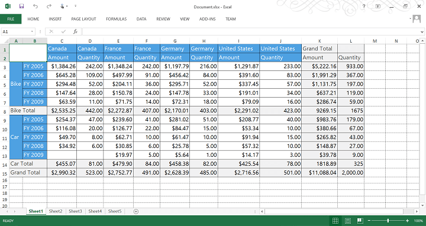
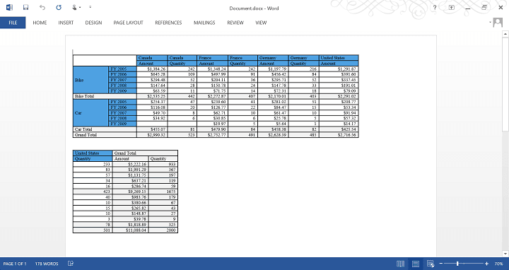
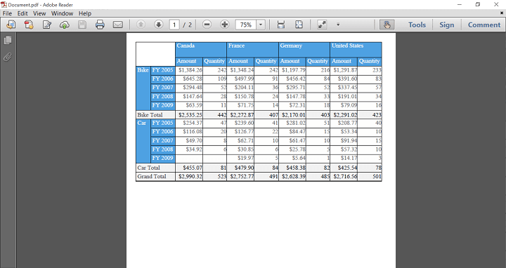
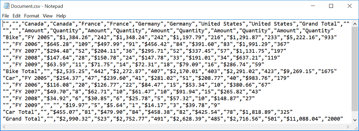
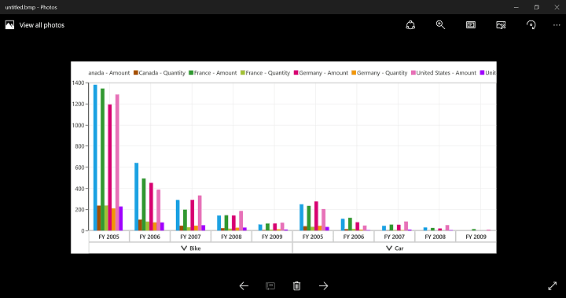
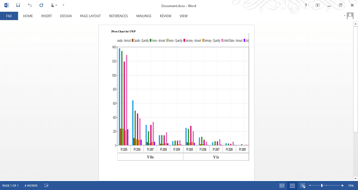
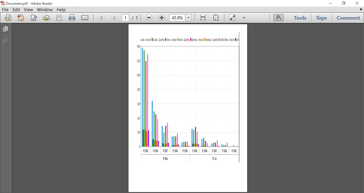

# Exporting

## Exporting PivotGrid

By clicking the respective icons in the PivotGrid's toolbar, the user can export the PivotGrid to the required file format.

| Icon | Name | Description |
| ---- | ---- | ----------- |
|  | Export to Excel | Exports the PivotGrid to an Excel document |
|  | Export to Word | Exports the PivotGrid to a Word document |
|  | Export to PDF | Exports the PivotGrid to a PDF document |
|  | Export to CSV | Exports the PivotGrid to a CSV document |

The following screenshots illustrate the exported PivotGrid.

## Exporting PivotChart

By clicking the respective icons in the PivotChart's toolbar, the user can export the PivotChart to the required file format.

| Icon | Name | Description |
| ---- | ---- | ----------- |
|  | Export as Image | Saves the PivotChart as an image |
|  | Export to Word | Exports the PivotChart to a Word document |
|  | Export to PDF | Exports the PivotChart to a PDF document |

The following screenshots illustrate the exported PivotChart.

