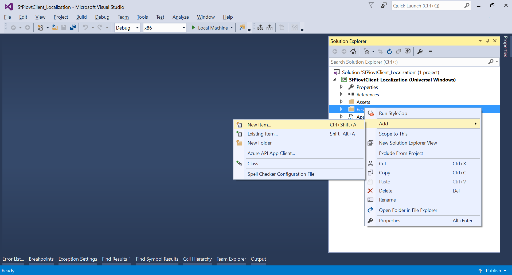
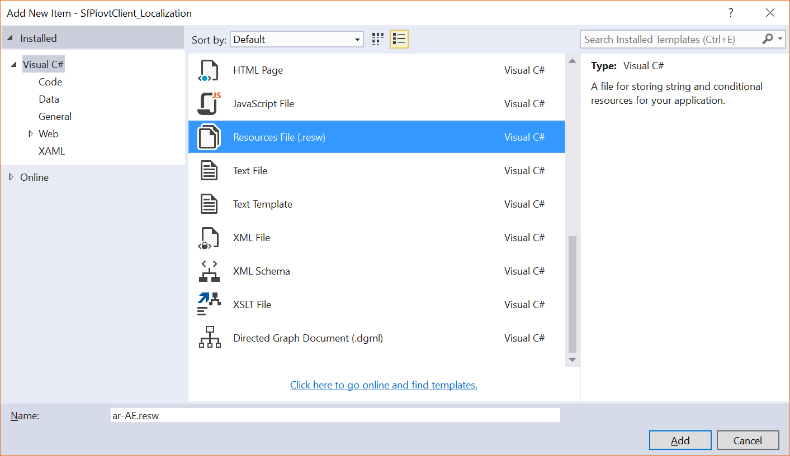
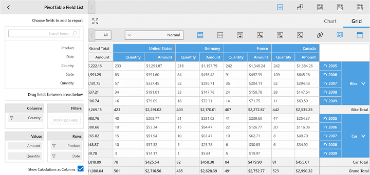

# Localization

Localization is the key feature for providing IT solutions targeted at global users. SfPivotClient allows users to localize the control to a specific locale. SfPivotClient supports “resx” based localization.

You need to perform the following steps in-order to localize the control.

* Translation
* Resource file and file name conventions
* Culture specification

## Translation

The first step in localization is translating the strings that can be localized to the destination locale.

N> Localization key field should be same for the all locales. Do not translate the key fields.

## Resource File and File Name Conventions

After translating the strings, perform the following steps in the application.

1.Right-click the project file to create a new folder in the project by selecting Add-> New Folder and rename the folder as “Resources”.
2.Then, right-click the **Resources** folder to create a new resource file by selecting Add -> New Item.

N> The resource file name should be in the format “&lt;Culture Code&gt;.resx”.

3.Then, copy and paste the translated locale to the resource file which is created in the previous step.

## Culture Specification

You need to specify the CurrentUICulture in either Application_Startup method in App.xaml.cs file or constructor in MainPage.xaml.cs file.

N> If you are specifying the current culture in the constructor of MainPage, then make sure that the culture is specified before calling the InitializeComponent() method.





public sealed partial class MainPage : Page
{
    public MainPage()
    {
        ApplicationLanguages.PrimaryLanguageOverride = "ar-AE";
        this.InitializeComponent();
    }
}





Public NotInheritable Partial Class MainPage
    Inherits Page
    Public Sub New()
        ApplicationLanguages.PrimaryLanguageOverride = "ar-AE"
        Me.InitializeComponent()
    End Sub
End Class





## RTL

SfPivotClient provides RTL support to display the content from right to left direction by setting the property of `FlowDirection` property as **RightToLeft**.





<pivotclient:SfPivotClient x:Name="PivotClient1" FlowDirection="RightToLeft"
                           ItemsSource="{Binding ProductSalesData}" PivotColumns="{Binding PivotColumns}"
                           PivotRows="{Binding PivotRows}" PivotCalculations="{Binding PivotCalculations}"/>





PivotClient1.FlowDirection = FlowDirection.RightToLeft;





PivotClient1.FlowDirection = FlowDirection.RightToLeft





A demo sample is available at the following location.

{system drive}:\Users\&lt;User Name&gt;\AppData\Local\Syncfusion\EssentialStudio\&lt;Version Number&gt;\Samples\UWP\SampleBrowser\PivotClient\PivotClient\View\Localization.xaml