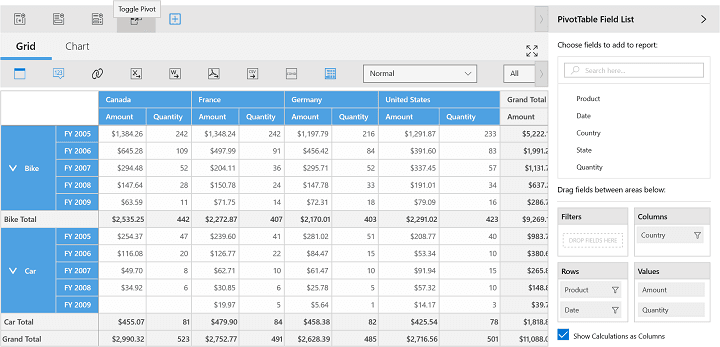
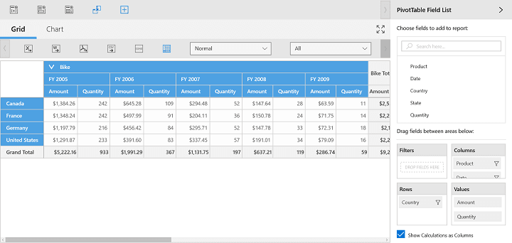

# Toggle Axis

Toggle axis support swaps all the axis elements between column and row axes, which in turn refreshes the view of the SfPivotChart and SfPivotGrid. This option is available in the toolbar of the SfPivotClient.

For example, the product and date elements are present in the row section and the country element is present in the column section.

After clicking the *Toggle Pivot* icon  in the client toolbar, the product and date elements are moved to the column section and the country element is moved to the row section. Based on the toggle pivot selection, the SfPivotGrid and SfPivotChart will display the resultant data.

