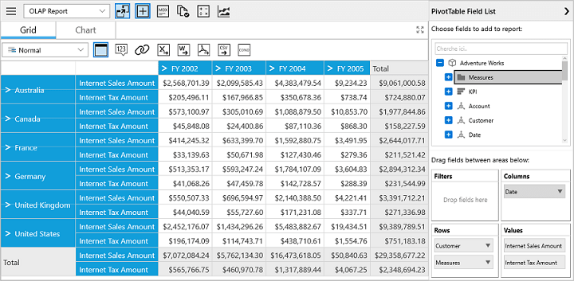

# Getting Started  

This section covers the information required to create a simple SfPivotClient control bound to OLAP data source and also about creating a WCF service which helps to bind OLAP data with SfPivotClient control through OlapDataManager.

### Control Initialization

SfPivotClient control can be initialized and added to an application through the following ways:

1. Through designer
2. Through XAML
3. Through code-behind

## Adding Control through Designer

Open Visual Studio IDE and navigating to *File > New > Project > Universal > Blank APP(Universal Windows)* under Windows option inside the Visual C# Templates to create a new UWP application.

N> Once the UWP application is created, select **"Properties"** under the project shown in Solution Explorer and change the Target Version of the application as **"Windows 10 (10.0; Build 10240)".**

Now select Toolbox options from View menu and it will appear inside the VisualStudio IDE. From the toolbox select SfPivotClient control under “Syncfusion Controls for UWP XAML” group, then drag and drop it into the designer section of MainPage.xaml file.

Finally name the added SfPivotClient control as “PivotClient1” in MainPage.xaml to refer it in code-behind as follows:



<PivotClient:SfPivotClient x:Name="PivotClient1"/>



## Adding Control through XAML

Open Visual Studio IDE and navigating to *File > New > Project > Universal > Blank APP(Universal Windows)* under Windows option inside the Visual C# Templates to create a new UWP application.

Then name the project as "SfPivotClientDemo" while creating the application to access the project later.

In order to add SfPivotClient control manually in XAML, the following assembly references must be added into the project.
	
 * Syncfusion.SfPivotClient.UWP
 * Syncfusion.SfPivotGrid.UWP
 * Syncfusion.SfPivotChart.UWP
 * Syncfusion.SfPivotGridConverter.UWP
 * Syncfusion.SfPivotChartConverter.UWP
 * Syncfusion.SfPivotShared.UWP
 * Syncfusion.Olap.UWP
 * Syncfusion.PivotAnalysis.UWP
 * Syncfusion.Data.UWP
 * Syncfusion.SfCellGrid.UWP
 * Syncfusion.SfGrid.UWP
 * Syncfusion.SfGridCommon.UWP
 * Syncfusion.SfShared.UWP
 * Syncfusion.SfInput.UWP
 * Syncfusion.SfBusyIndicator.UWP
 * Syncfusion.SfChart.UWP
 * Syncfusion.SfColorPickers.UWP
 * Syncfusion.SfTabControl.UWP

You can find these libraries under following location.

&lt;Installed Drive&gt;:\Program Files (x86)\Syncfusion\Essential Studio\\&lt;Version&gt;\Universal Windows\10.0\SDK\References\CommonConfiguration\neutral\

Or else, the SfPivotClient control can be added to the project by choosing SDK reference as follows:

Right click on **References** and select *Add Reference > Universal Windows > Extensions > Syncfusion Controls for UWP XAML*. 
 
Now add the following namespace in MainPage.xaml file.



xmlns:syncfusion="using:Syncfusion.UI.Xaml.PivotClient"



Then initialize the SfPivotClient control inside the Grid by using the specified namespace and name the control as “PivotClient1”.



<Page
    xmlns="http://schemas.microsoft.com/winfx/2006/xaml/presentation"
    xmlns:x="http://schemas.microsoft.com/winfx/2006/xaml"
    xmlns:local="using:SfPivotClientDemo"
    xmlns:d="http://schemas.microsoft.com/expression/blend/2008"
    xmlns:mc="http://schemas.openxmlformats.org/markup-compatibility/2006"
    x:Class="SfPivotClientDemo.MainPage"
    xmlns:syncfusion="using:Syncfusion.UI.Xaml.PivotClient"
    mc:Ignorable="d">

    <Grid Background="{ThemeResource ApplicationPageBackgroundThemeBrush}">
        <syncfusion:SfPivotClient x:Name="PivotClient1"/>
    </Grid>
</Page>



## Adding Control through Code-Behind

Open Visual Studio IDE and navigating to *File > New > Project > Universal > Blank APP(Universal Windows)* under Windows option inside the Visual C# Templates to create a new UWP application.

Then name the project as "SfPivotClientDemo" while creating the application to access the project later.

In order to add SfPivotClient control manually in code-behind, the following assembly references must be added into the project.

 * Syncfusion.SfPivotClient.UWP
 * Syncfusion.SfPivotGrid.UWP
 * Syncfusion.SfPivotChart.UWP
 * Syncfusion.SfPivotGridConverter.UWP
 * Syncfusion.SfPivotChartConverter.UWP
 * Syncfusion.SfPivotShared.UWP
 * Syncfusion.Olap.UWP
 * Syncfusion.PivotAnalysis.UWP
 * Syncfusion.Data.UWP
 * Syncfusion.SfCellGrid.UWP
 * Syncfusion.SfGrid.UWP
 * Syncfusion.SfGridCommon.UWP
 * Syncfusion.SfShared.UWP
 * Syncfusion.SfInput.UWP
 * Syncfusion.SfBusyIndicator.UWP
 * Syncfusion.SfChart.UWP
 * Syncfusion.SfColorPickers.UWP
 * Syncfusion.SfTabControl.UWP

You can find these libraries under the following location.

&lt;Installed Drive&gt;:\Program Files (x86)\Syncfusion\Essential Studio\\&lt;Version&gt;\Universal Windows\10.0\SDK\References\CommonConfiguration\neutral\

Or else, the SfPivotClient control can be added to the project by choosing SDK reference as follows:

Right click on **References** and select *Add Reference > Universal Windows > Extensions > Syncfusion Controls for UWP XAML*.

Now open the MainPage.xaml file and include name for the Grid as “Root_Grid” to refer it in code-behind.



<Page
    xmlns="http://schemas.microsoft.com/winfx/2006/xaml/presentation"
    xmlns:x="http://schemas.microsoft.com/winfx/2006/xaml"
    xmlns:local="using:SfPivotClientDemo"
    xmlns:d="http://schemas.microsoft.com/expression/blend/2008"
    xmlns:mc="http://schemas.openxmlformats.org/markup-compatibility/2006"
    x:Class="SfPivotClientDemo.MainPage"
    mc:Ignorable="d">

    <Grid Background="{ThemeResource ApplicationPageBackgroundThemeBrush}" x:Name="Root_Grid">
    </Grid>
</Page>



Add the namespace - "Syncfusion.UI.Xaml.PivotClient" in MainPage.xaml.cs file. Then initialize the SfPivotClient control and add it into the parent Grid as follows.



using Windows.UI.Xaml.Controls;
using Syncfusion.UI.Xaml.PivotClient;

namespace SfPivotClientDemo
{
    /// 

    /// An empty page that can be used on its own or navigated to within a Frame.
    /// 

    public sealed partial class MainPage : Page
    {
        public MainPage()
        {
            this.InitializeComponent();
            SfPivotClient PivotClient = new SfPivotClient();
            PivotClient.Name = "PivotClient1";
            Root_Grid.Children.Add(PivotClient);
        }
    }
}



## Adding Service Reference to Project

N> The following steps explain about how to refer the online service in Universal Windows Platform application in-order to bind the Cube information in SfPivotClient. The service URL used here refers our demo Cube - “Adventure Works”, mainly for illustration purpose. To create your own WCF service, please refer the topic of [Creating WCF Service Application.](http://help.syncfusion.com/uwp/sfpivotclient/getting-started#creating-wcf-service-application).

After initializing SfPivotClient control, right click on **References** and select **Add Service Reference** option. 

In “Add Service Reference” window, enter the following address and click “Go” button to add the online service.

[http://bi.syncfusion.com/OlapUWPTestService/OlapManager.svc/mex](http://bi.syncfusion.com/OlapUWPTestService/OlapManager.svc/mex).

Name the service namespace as “OlapManagerService” and click “OK” button to add the service reference.

Include the following namespace in code-behind for using OlapDataManager and OlapReport in the application.

 * Syncfusion.Olap.UWP.Manager
 * Syncfusion.Olap.UWP.Reports

Then include the following code to initialize the OlapDataManager and to create OlapReport through loaded event of SfPivotClient control.   



using Syncfusion.Olap.UWP.Manager;
using Syncfusion.Olap.UWP.Reports;

namespace SfPivotClientDemo
{
    public sealed partial class MainPage : Page
    {
        public MainPage()
        {
            this.InitializeComponent();
            PivotClient1.Loaded += PivotClient_Loaded;
        }

        private void PivotClient_Loaded(object sender, Windows.UI.Xaml.RoutedEventArgs e)
        {
            OlapDataManager olapDataManager = new OlapDataManager();
            olapDataManager.OlapDataChanged += OlapDataManager_OlapDataChanged;
            olapDataManager.GetCubeSchema += OlapDataManager_GetCubeSchema;
            olapDataManager.GetCubeInfoCollection += OlapDataManager_GetCubeInfoCollection;
            olapDataManager.GetChildMembers += OlapDataManager_GetChildMembers;
            olapDataManager.GetChildrenByMDX += OlapDataManager_GetChildrenByMDX;
            olapDataManager.GetOlapDataWithTotalCount += OlapDataManager_GetOlapDataWithTotalCount;
            // Assign created report to current report of OlapDataManager.
            olapDataManager.SetCurrentReport(CreateOlapReport());
            PivotClient1.OlapDataManager = olapDataManager;
        }

        private void OlapDataManager_OlapDataChanged(object sender, OlapDataChangedEventArgs args) {}

        private OlapReport CreateOlapReport() 
        {
            OlapReport olapReport = new OlapReport();
            olapReport.CurrentCubeName = "Adventure Works";

            DimensionElement dimensionElementColumn = new DimensionElement();
            dimensionElementColumn.Name = "Customer";
            dimensionElementColumn.HierarchyName = "Customer Geography";
            dimensionElementColumn.AddLevel("Customer Geography", "Country");

            MeasureElements measureElementColumn = new MeasureElements();
            measureElementColumn.Elements.Add(new MeasureElement {
                Name = "Internet Sales Amount" });
        
            DimensionElement dimensionElementRow = new DimensionElement();
            dimensionElementRow.Name = "Date";
            dimensionElementRow.AddLevel("Fiscal", "Fiscal Year");

            olapReport.CategoricalElements.Add(dimensionElementColumn);
            olapReport.CategoricalElements.Add(measureElementColumn);
            olapReport.SeriesElements.Add(dimensionElementRow);

            return olapReport;
        }
    }
}



N> **OlapDataChanged** event should be hooked before setting the current report to OlapDataManager.

Next declare a global reference to OlapManagerService’s IOlapDataProvider. Then include the following code to initialize the connection and to get the Cube information as JSON data through online WCF service reference.  



namespace SfPivotClientDemo
{
    public sealed partial class MainPage: Page
    {
        OlapManagerService.IOlapDataProvider clientChannel;

        public MainPage()
        {
            //SfPivotClient control Initialization
        }

        private void OlapDataManager_OlapDataChanged(object sender, OlapDataChangedEventArgs args)
        {
            if (sender is OlapDataManager)
            {
                SetConnection();
                (sender as OlapDataManager).JSONData = clientChannel.GetJSONDataAsync(args.MDXQuery, args.SerializedReport).Result;
            }
        }

        private string OlapDataManager_GetCubeSchema(object sender, GetCubeSchemaEventArgs args)
        {
            if (args.CubeName != null && sender is OlapDataManager)
            {
                SetConnection();
                return clientChannel.GetJSONCubeSchemaAsync(args.CubeName).Result;
            }
            return null;
        }

        private string OlapDataManager_GetCubeInfoCollection(object sender, GetCubeInfoCollectionEventArgs args)
        {
            if (sender is OlapDataManager)
            {
                SetConnection();
                return clientChannel.GetJSONCubesAsync().Result;
            }
            return null;
        }

        private string OlapDataManager_GetChildMembers(object sender, GetChildMembersEventArgs args)
        {
            if (args.LevelName != null && sender is OlapDataManager)
            {
                SetConnection();
                return clientChannel.GetJSONChildMembersAsync(args.CubeName, args.LevelName).Result;
            }
            return "";
        }

        private string OlapDataManager_GetChildrenByMDX(object sender, GetChildrenByMDXEventArgs args)
        {
            if (!string.IsNullOrEmpty(args.Command))
            {
                SetConnection();
                return clientChannel.GetJSONChildrenByMDXAsync(args.Command).Result;
            }
            return "";
        }

        private string OlapDataManager_GetOlapDataWithTotalCount(object sender, GetOlapDataWithTotalCountEventArgs args)
        {
            if (sender is OlapDataManager)
            {
                SetConnection();
                return clientChannel.GetJSONDataWithTotalCountAsync(args.SerializedReport).Result;
            }
            return null;
        }

        private void OlapDataManager_OlapDataChanged(object sender, OlapDataChangedEventArgs args) {
            if (args.MDXQuery != null && sender is OlapDataManager) {
                SetConnection();
                (sender as OlapDataManager).JSONData = clientChannel.GetJSONDataAsync(args.MDXQuery, args.SerializedReport).Result;
            }
        }

        private void SetConnection()
        {
            BasicHttpBinding basicHttpBinding = new BasicHttpBinding();
            basicHttpBinding.MaxReceivedMessageSize = 2147483647;
            basicHttpBinding.MaxBufferSize = 2147483647;
            // Use the hosted WCF service URL as service reference
            EndpointAddress address = new EndpointAddress("http://bi.syncfusion.com/OlapUWPTestService/OlapManager.svc/");
            ChannelFactory<OlapManagerService.IOlapDataProvider> clientFactory = new ChannelFactory<OlapManagerService.IOlapDataProvider>(basicHttpBinding, address);
            clientChannel = clientFactory.CreateChannel();
        }
    }
}



Run the appplication, the SfPivotClient control is rendered as shown below. 

 

## Creating WCF Service Application

Create a new **WCF** Service application by using Visual Studio IDE and name the WCF project as **"OlapManagerService"**

Add the following dependency assemblies into your WCF service application.  

* Syncfusion.Olap.Base
* Syncfusion.OlapUWP.BaseWrapper

You can find these libraries under the following location.

&lt;Installed Drive&gt;:\Program Files (x86)\Syncfusion\Essential Studio\\&lt;Version&gt;\Assemblies\4.6\

N> ADOMD.NET assembly (Microsoft.AnalysisServices.AdomdClient.dll) is required to create SfPivotClient control.
The above assembly can be obtainable after installing the following setup files.
SQLSERVER2008_ASADOMD10.msi and SQLSERVER2008_ASOLEDB10.msi
These setup files can be downloaded at [Microsoft download center](https://www.microsoft.com/en-us/download).
If you have installed any version of SQL Server Analysis Service (SSAS) or Microsoft ADOMD.NET utility, then the location of Microsoft.AnalysisServices.AdomdClient library is [system drive:\Program Files (x86)\Microsoft.NET\ADOMD.NET].

Now the "Service1.svc" would look like:



<%@ ServiceHost Language="C#" Debug="true" Service="OlapManagerService.Service1" CodeBehind="Service1.svc.cs" %>



Then open the "Service1.svc.cs" file under “OlapManagerService” project and replace the existing code with the exact following code.



using Syncfusion.Olap.UWP.Common;
using Syncfusion.Olap.UWP.Data;
using Syncfusion.Olap.UWP.Manager;
using System.ServiceModel;
using System.ServiceModel.Activation;

namespace OlapManagerService
{
    [AspNetCompatibilityRequirements(RequirementsMode = AspNetCompatibilityRequirementsMode.Allowed)]
    [ServiceBehavior(IncludeExceptionDetailInFaults = true)]
    public class Service1 : IOlapDataProvider
    {
        #region Private variables

        private readonly OlapDataProvider _dataProvider;

        #endregion

        #region Constructor
        /// 

        /// Initializes a new instance of the <see cref="Service1"/> class.
        /// 

        public Service1()
        {
            string connectionString = "Data Source=http://bi.syncfusion.com/olap/msmdpump.dll; Initial Catalog=Adventure Works DW 2008 SE;";
            _dataProvider = new OlapDataProvider(connectionString);
        }

        #endregion

        #region IOlapDataProvider Members

        public string GetJSONData(string mDXQuery, string serializedReport)
        {
            CellSet cellSet = _dataProvider.ExecuteMdxQuery(mDXQuery, serializedReport);
            _dataProvider.DataProvider.CloseConnection();
            return cellSet != null ? Utils.Serialize(cellSet) : string.Empty;
        }

        public string GetJSONCubeSchema(string cubeName)
        {
            CubeSchema cubeSchema = _dataProvider.GetCubeSchema(cubeName);
            _dataProvider.DataProvider.CloseConnection();
            return cubeSchema != null ? Utils.Serialize(cubeSchema) : string.Empty;
        }

        public string GetJSONCubes()
        {
            CubeInfoCollection cubeInfoCollection = _dataProvider.GetCubes();
            _dataProvider.DataProvider.CloseConnection();
            return cubeInfoCollection != null ? Utils.Serialize(cubeInfoCollection) : string.Empty;
        }
        
        public string GetJSONChildMembers(string cubeName, string levelName)
        {
            MemberCollection memberCollection = _dataProvider.GetChildMembers(cubeName, levelName);
            _dataProvider.DataProvider.CloseConnection();
            return memberCollection != null ? Utils.Serialize(memberCollection) : string.Empty;
        }

        public string GetJSONChildrenByMDX(string command)
        {
            MemberCollection memberCollection = _dataProvider.GetChildrenByMDX(command);
            _dataProvider.DataProvider.CloseConnection();
            return memberCollection != null ? Utils.Serialize(memberCollection) : string.Empty;
        }

        public string GetJSONDataWithTotalCount(string serializedReport)
        {
            SerializableDictionary<string, object> count = _dataProvider.GetCellSetWithTotalCount(serializedReport);
            _dataProvider.DataProvider.CloseConnection();
            return count != null ? Utils.Serialize(count) : string.Empty;
        }

        #endregion
    }
}



N> Here we have specified our demo cube path for demonstration purpose. You can modify the connection string as per your requirement.

Include the basic HTTP binding and service endpoint address in the web.config file by replacing the following code snippet of **"ServiceModel"** section.



<system.serviceModel>
    <bindings>
      <basicHttpBinding>
        <!-- Create a custom binding for our service to enable sending large amount of data -->
        <binding name="MyBasicHttpBinding" maxBufferPoolSize="2147483647" maxReceivedMessageSize="2147483647" maxBufferSize="2147483647">
          <readerQuotas maxArrayLength="2147483647" maxBytesPerRead="2147483647" maxDepth="2147483647" maxNameTableCharCount="2147483647" maxStringContentLength="2147483647" />
        </binding>
      </basicHttpBinding>
    </bindings>
    <behaviors>
      <serviceBehaviors>
        <behavior name="">
          <serviceMetadata httpGetEnabled="true" httpsGetEnabled="true" />
          <serviceDebug includeExceptionDetailInFaults="false" />
          <dataContractSerializer maxItemsInObjectGraph="2147483647" />
        </behavior>
        <!-- Enable the serializer to serialize greater number of records -->
        <behavior name="OlapService.OlapManager">
          <serviceMetadata httpGetEnabled="true" />
          <serviceDebug includeExceptionDetailInFaults="true" />
          <dataContractSerializer maxItemsInObjectGraph="2147483647" />
        </behavior>
      </serviceBehaviors>
    </behaviors>
    
    <protocolMapping>
        <add binding="basicHttpsBinding" scheme="https"/>
    </protocolMapping>    
    
    <serviceHostingEnvironment multipleSiteBindingsEnabled="false"/>
    <services>
      <!--Bind the WCF service to our custom binding-->
      <service behaviorConfiguration="OlapService.OlapManager" name="OlapService.OlapManager">
        <endpoint address="" binding="basicHttpBinding" bindingConfiguration="MyBasicHttpBinding" contract="Syncfusion.Olap.UWP.Manager.IOlapDataProvider" />
        <endpoint address="mex" binding="mexHttpBinding" contract="IMetadataExchange" />
      </service>
    </services>
</system.serviceModel>



Then build and host this WCF service in IIS. Refer the hosted URL as service reference in your Universal Windows Platform application (client application). This is how we have hosted our service in IIS and referred the obtained URL as service reference in the sample illustrated in [Adding Service Reference to Project section.](https://help.syncfusion.com/uwp/sfpivotclient/getting-started#adding-service-reference-to-project)