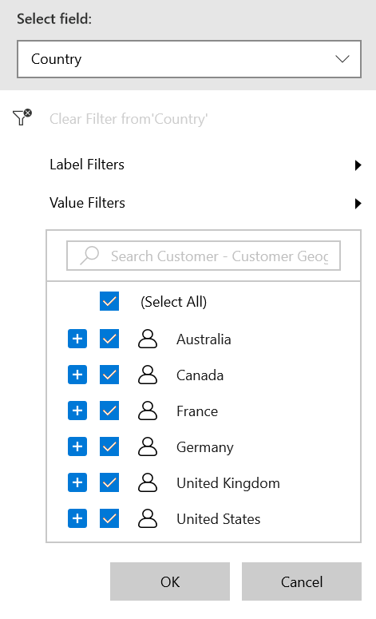
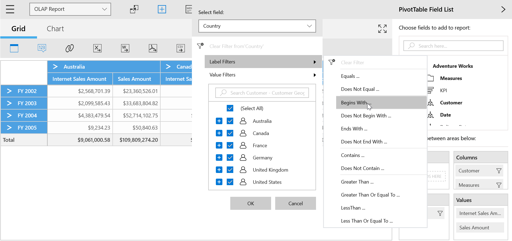
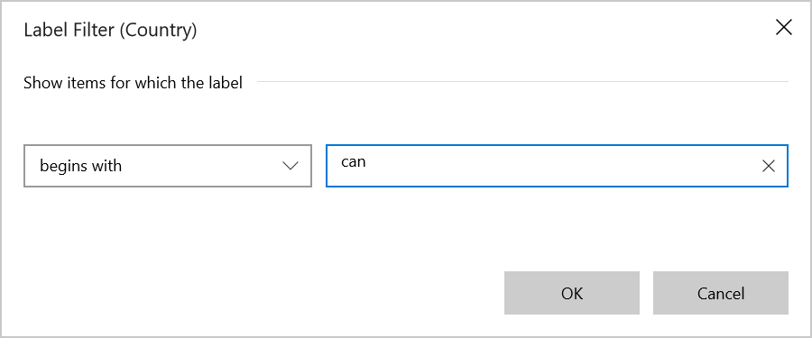
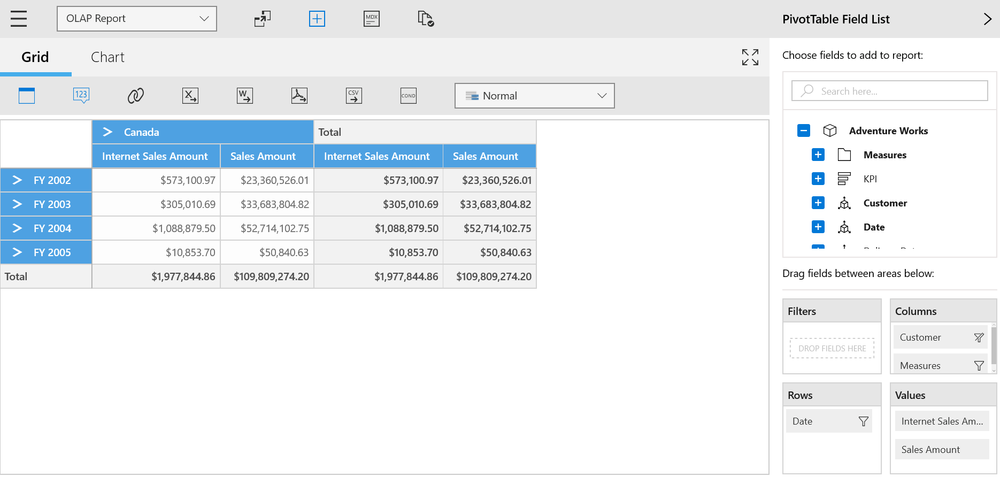
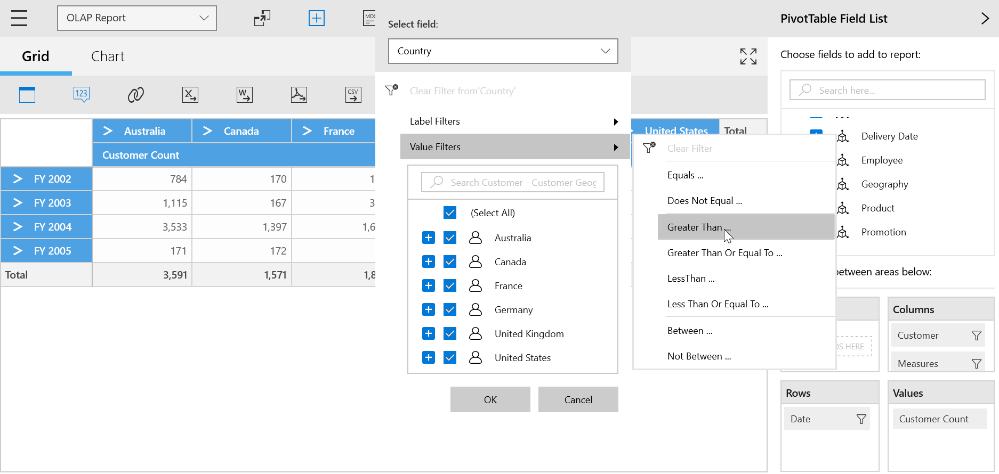
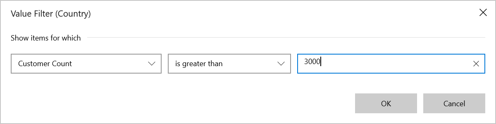
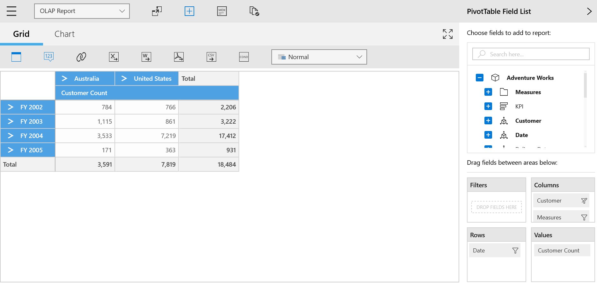

# Advanced Filtering

The SfPivotClient provides an advanced filtering support through which members can be filtered based on value and label fields, and this can be achieved with the help of `EnableAdvancedFilter` property. The following code snippet illustrates how to enable **Advanced Filtering** in the SfPivotClient.





<pivotclient:SfPivotClient x:Name="PivotClient1" EnableAdvancedFilter="True" OlapDataManager="{Binding OlapDataManager}"/>





PivotClient1.EnableAdvancedFilter = true;





PivotClient1.EnableAdvancedFilter = True





## Label filtering

Label filtering provides an option to filter members of the selected field based on their caption. The following screenshots describe how the label filtering is applied in the SfPivotClient.

*SfPivotClient applied with label filter*

## Value filtering

Value filtering provides an option to filter members based on total values of the appropriate measure between the level members. The following screenshots describe how the value filtering is applied in the SfPivotClient.

*SfPivotClient applied with value filter*

A demo sample is available in the following location.

{system drive}:\Users\&lt;User Name&gt;\AppData\Local\Syncfusion\EssentialStudio\&lt;Version Number&gt;\Samples\UWP\SampleBrowser\PivotClient\PivotClient\View\AdvancedFiltering.xaml