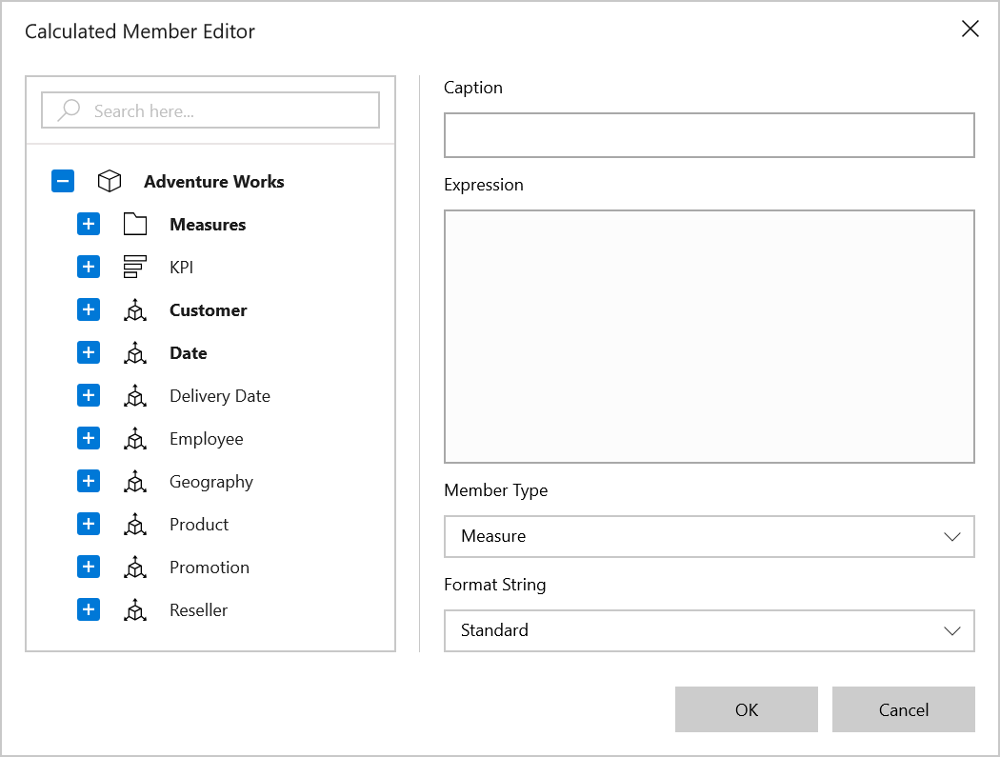

# Calculated Members and Measures

SfPivotGrid allows users to add calculated measures and members in the OLAP report. There are two ways to define the calculated member or measure in SfPivotClient such as illustrated below.

**Using Calculated Member Editor Dialog**

The calculated member editor dialog can be opened by clicking the *Create a Calculated Member/Measure* button  available in the SfPivotClient's toolbar. This icon will be visible only if the property `EnableCalculatedMembers` is enabled as mentioned below.





<pivotclient:SfPivotClient x:Name="PivotClient1" EnableCalculatedMembers="True" OlapDataManager="{Binding OlapDataManager}"/>





PivotClient1.EnableCalculatedMembers = true;





PivotClient1.EnableCalculatedMembers = True





**Using OLAP Report**

You can define the calculated member or measure and it can be added to any axis of the current OLAP report as specified in the following code snippet.





OlapReport olapReport = new OlapReport
{
    Name = "Calculated Report",
    CurrentCubeName = "Adventure Works"
};

DimensionElement dimensionElementColumn = new DimensionElement();
dimensionElementColumn.Name = "Customer";
dimensionElementColumn.HierarchyName = "Customer Geography";
dimensionElementColumn.AddLevel("Customer Geography", "Country");

MeasureElements measureElementColumn = new MeasureElements();
measureElementColumn.Elements.Add(new MeasureElement { Name = "Internet Sales Amount" });
measureElementColumn.Elements.Add(new MeasureElement { Name = "Sales Amount" });

DimensionElement dimensionElementRow = new DimensionElement();
dimensionElementRow.Name = "Date";
dimensionElementRow.AddLevel("Fiscal", "Fiscal Year");

// Calculated measure
CalculatedMember calculatedMeasure1 = new CalculatedMember();
calculatedMeasure1.Name = "Order on Discount Sale";
calculatedMeasure1.Expression = "[Measures].[Order Quantity] + ([Measures].[Order Quantity] * 0.10)";
calculatedMeasure1.AddElement(new MeasureElement { Name = "Order Quantity" });
olapReport.CalculatedMembers.Add(calculatedMeasure1);

// Adding column members
olapReport.CategoricalElements.Add(dimensionElementColumn);
olapReport.CategoricalElements.Add(calculatedMeasure1);

// Adding measure element
olapReport.CategoricalElements.Add(measureElementColumn);

// Adding row members
olapReport.SeriesElements.Add(dimensionElementRow);

PivotClient1.OlapDataManager.SetCurrentReport(olapReport);





Dim olapReport As New OlapReport() With { _
    Key .Name = "Calculated Report", _
    Key .CurrentCubeName = "Adventure Works" _
}

Dim dimensionElementColumn As New DimensionElement()
dimensionElementColumn.Name = "Customer"
dimensionElementColumn.HierarchyName = "Customer Geography"
dimensionElementColumn.AddLevel("Customer Geography", "Country")

Dim measureElementColumn As New MeasureElements()
measureElementColumn.Elements.Add(New MeasureElement() With { _
    Key .Name = "Internet Sales Amount" _
})
measureElementColumn.Elements.Add(New MeasureElement() With { _
    Key .Name = "Sales Amount" _
})

Dim dimensionElementRow As New DimensionElement()
dimensionElementRow.Name = "Date"
dimensionElementRow.AddLevel("Fiscal", "Fiscal Year")

' Calculated measure
Dim calculatedMeasure1 As New CalculatedMember()
calculatedMeasure1.Name = "Order on Discount Sale"
calculatedMeasure1.Expression = "[Measures].[Order Quantity] + ([Measures].[Order Quantity] * 0.10)"
calculatedMeasure1.AddElement(New MeasureElement() With { _
    Key .Name = "Order Quantity" _
})
olapReport.CalculatedMembers.Add(calculatedMeasure1)

' Adding column members
olapReport.CategoricalElements.Add(dimensionElementColumn)
olapReport.CategoricalElements.Add(calculatedMeasure1)

' Adding measure element
olapReport.CategoricalElements.Add(measureElementColumn)

' Adding row members
olapReport.SeriesElements.Add(dimensionElementRow)

PivotClient1.OlapDataManager.SetCurrentReport(olapReport)





A demo sample is available at the following location.

{system drive}:\Users\&lt;User Name&gt;\AppData\Local\Syncfusion\EssentialStudio\&lt;Version Number&gt;\Samples\UWP\SampleBrowser\PivotClient\PivotClient\View\CalculatedMembers.xaml