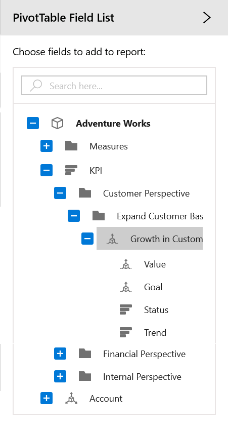
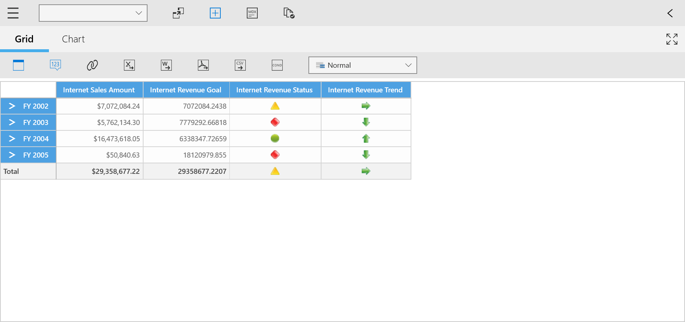

# Key Performance Indicator (KPI)

Key Performance Indicators (KPIs) are business metrics that help to figure out the progress of an enterprise in meeting its business goals. Typically, these calculations are a combination of Multi-Dimensional Expressions (MDX) or Calculated Members. The KPIs also have an additional metadata which provides information about how the client applications should display the results of KPI’s calculations.

## Indicator Types

There are four types of indicators available in KPI as listed below.

* KPI Goal
* KPI Status
* KPI Trend
* KPI Value

## Adding KPI Elements

There are two ways to define KPI elements in SfPivotClient such as illustrated below.

**Using Drag and Drop**

You can dynamically drag and drop KPI elements from Cube Dimension browser to Axis Element Builder to add KPI in current report.

N> If the current report does not contain a measure element, then the KPI element cannot be added to the current report.

The below screen shot illustrates the collection of KPI elements available in the connected OLAP cube.

**Using OLAP Report**

You can define KPI elements in OLAP report along with its associated measures and it can be added to any axis of the current OLAP report. The below code specifies how to define the KPI elements in the OLAP report.

N> KPI elements must be specified in the same axis containing Measure elements.





OlapReport kpiReport = new OlapReport
{
    Name = "KPI Report",
    CurrentCubeName = "Adventure Works"
};

DimensionElement dimensionElementColumn = new DimensionElement();
dimensionElementColumn.Name = "Customer";
dimensionElementColumn.HierarchyName = "Customer Geography";
dimensionElementColumn.AddLevel("Customer Geography", "Country");

MeasureElements measureElementColumn = new MeasureElements();
measureElementColumn.Elements.Add(new MeasureElement { Name = "Internet Sales Amount" });
measureElementColumn.Elements.Add(new MeasureElement { Name = "Sales Amount" });

KpiElements kpiElements = new KpiElements();
kpiElements.Elements.Add(new KpiElement() { Name = "Internet Revenue" });

DimensionElement dimensionElementRow = new DimensionElement();
dimensionElementRow.Name = "Date";
dimensionElementRow.AddLevel("Fiscal", "Fiscal Year");

// Adding column members
kpiReport.CategoricalElements.Add(dimensionElementColumn);

// Adding measure element
kpiReport.CategoricalElements.Add(measureElementColumn);

kpiReport.CategoricalElements.Add(kpiElements);

// Adding row members
kpiReport.SeriesElements.Add(dimensionElementRow);

PivotClient1.OlapDataManager.SetCurrentReport(kpiReport);





Dim kpiReport As New OlapReport() With { _
    Key .Name = "KPI Report", _
    Key .CurrentCubeName = "Adventure Works" _
}

Dim dimensionElementColumn As New DimensionElement()
dimensionElementColumn.Name = "Customer"
dimensionElementColumn.HierarchyName = "Customer Geography"
dimensionElementColumn.AddLevel("Customer Geography", "Country")

Dim measureElementColumn As New MeasureElements()
measureElementColumn.Elements.Add(New MeasureElement() With { _
    Key .Name = "Internet Sales Amount" _
})
measureElementColumn.Elements.Add(New MeasureElement() With { _
    Key .Name = "Sales Amount" _
})

Dim kpiElements As New KpiElements()
kpiElements.Elements.Add(New KpiElement() With { _
    Key .Name = "Internet Revenue" _
})

Dim dimensionElementRow As New DimensionElement()
dimensionElementRow.Name = "Date"
dimensionElementRow.AddLevel("Fiscal", "Fiscal Year")

' Adding column members
kpiReport.CategoricalElements.Add(dimensionElementColumn)

' Adding measure element
kpiReport.CategoricalElements.Add(measureElementColumn)

kpiReport.CategoricalElements.Add(kpiElements)

' Adding row members
kpiReport.SeriesElements.Add(dimensionElementRow)

PivotClient1.OlapDataManager.SetCurrentReport(kpiReport)





