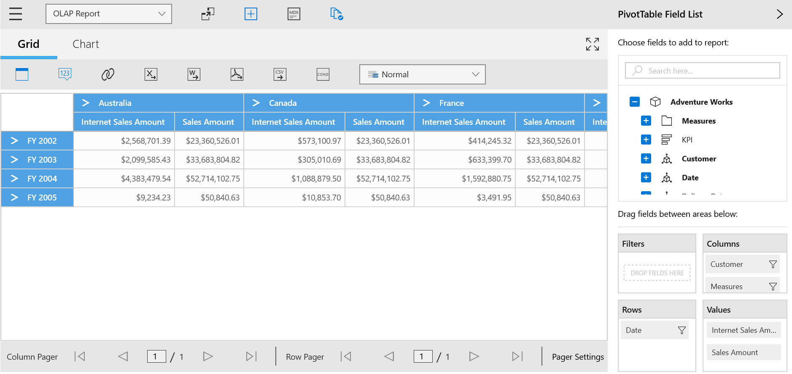
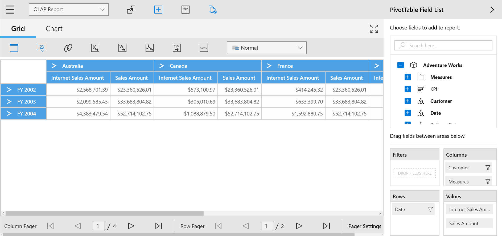
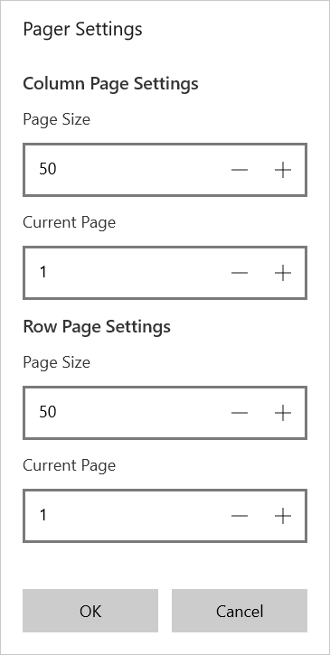

# Paging

Paging in SfPivotClient provides you the support to load and render large amount of data without any performance constraint.

When you process large CellSet, it is split into several number of segments and each segment is assigned and rendered in a separate page. You can navigate back and forth in all possible way by using the UI options available in SfPivotPager.

Paging can be enabled in any of the following ways as illustrated below.

**Using 'EnablePaging' Property**

To enable paging, `EnablePaging` property must be set as true. SfPivotPager is included and the OlapDataManager object of SfPivotClient is bounded to respective instance of the SfPivotPager. The below code snippet and screen shot illustrates how to enable the paging option in SfPivotClient.





<pivotclient:SfPivotClient x:Name="PivotClient1" EnablePaging="True" OlapDataManager="{Binding OlapDataManager}"/>





PivotClient1.EnablePaging = true;





PivotClient1.EnablePaging = True





N> Paging can be enabled or disabled at run time by using the *Pivot Pager* button  in the Pivot Client's toolbar. The visibility of the pager button in the toolbar can be modified with the help of `PagerButtonVisibility` property.

**Using OLAP Report**

The current OLAP report can be specified with paging options to enable the SfPivotPager bounded with the SfPivotClient. The following code snippet shows how to enable the paging via the OLAP report.





private OlapReport CreateOlapReport()
{
    OlapReport olapReport = new OlapReport
    {
        Name = "Paging Report",
        CurrentCubeName = "Adventure Works"
    };

    olapReport.EnablePaging = true;
    olapReport.PagerOptions.CategorialPageSize = 3;
    olapReport.PagerOptions.SeriesPageSize = 3;

    DimensionElement dimensionElementColumn = new DimensionElement();
    dimensionElementColumn.Name = "Customer";
    dimensionElementColumn.HierarchyName = "Customer Geography";
    dimensionElementColumn.AddLevel("Customer Geography", "Country");

    MeasureElements measureElementColumn = new MeasureElements();
    measureElementColumn.Elements.Add(new MeasureElement { Name = "Internet Sales Amount" });
    measureElementColumn.Elements.Add(new MeasureElement { Name = "Sales Amount" });

    DimensionElement dimensionElementRow = new DimensionElement();
    dimensionElementRow.Name = "Date";
    dimensionElementRow.AddLevel("Fiscal", "Fiscal Year");

    // Adding column members
    olapReport.CategoricalElements.Add(dimensionElementColumn);

    // Adding measure element
    olapReport.CategoricalElements.Add(measureElementColumn);

    // Adding row members
    olapReport.SeriesElements.Add(dimensionElementRow);

    return olapReport;
}





Private Function CreateOlapReport() As OlapReport
    Dim olapReport As New OlapReport() With { _
        Key .Name = "Paging Report", _
        Key .CurrentCubeName = "Adventure Works" _
    }

    olapReport.EnablePaging = True
    olapReport.PagerOptions.CategorialPageSize = 3
    olapReport.PagerOptions.SeriesPageSize = 3

    Dim dimensionElementColumn As New DimensionElement()
    dimensionElementColumn.Name = "Customer"
    dimensionElementColumn.HierarchyName = "Customer Geography"
    dimensionElementColumn.AddLevel("Customer Geography", "Country")

    Dim measureElementColumn As New MeasureElements()
    measureElementColumn.Elements.Add(New MeasureElement() With { _
        Key .Name = "Internet Sales Amount" _
    })
    measureElementColumn.Elements.Add(New MeasureElement() With { _
        Key .Name = "Sales Amount" _
    })

    Dim dimensionElementRow As New DimensionElement()
    dimensionElementRow.Name = "Date"
    dimensionElementRow.AddLevel("Fiscal", "Fiscal Year")

    ' Adding column members
    olapReport.CategoricalElements.Add(dimensionElementColumn)

    ' Adding measure element
    olapReport.CategoricalElements.Add(measureElementColumn)

    ' Adding row members
    olapReport.SeriesElements.Add(dimensionElementRow)

    Return olapReport
End Function





## Pager Settings

The page size and current page of both column and row section can be modified by using the options available in the pager settings dialog. The pager settings dialog can be opened by clicking the *Settings button* in the pager.

A demo sample is available at the following location.

{system drive}:\Users\&lt;User Name&gt;\AppData\Local\Syncfusion\EssentialStudio\&lt;Version Number&gt;\Samples\Universal
Windows\SampleBrowser\PivotClient\PivotClient\View\Paging.xaml