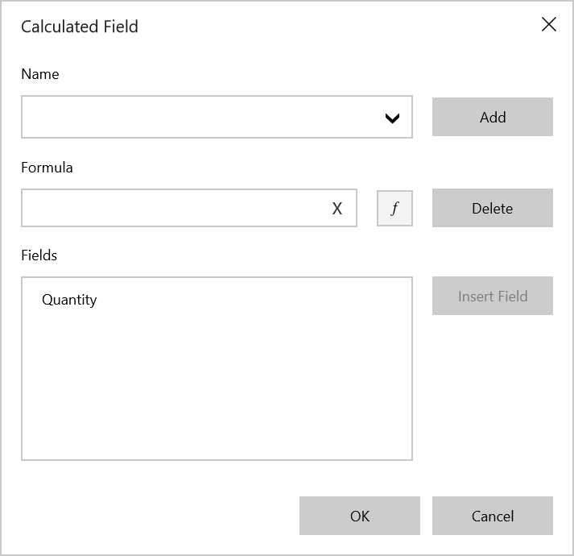
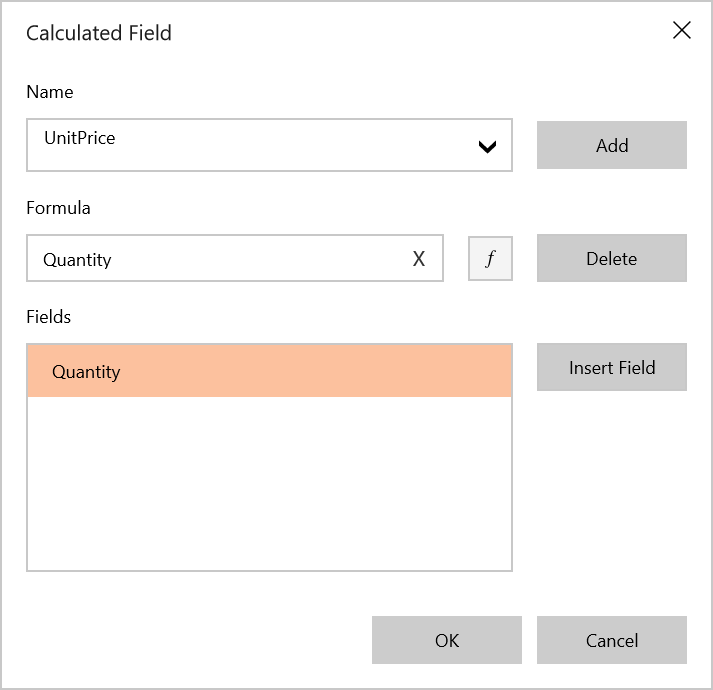
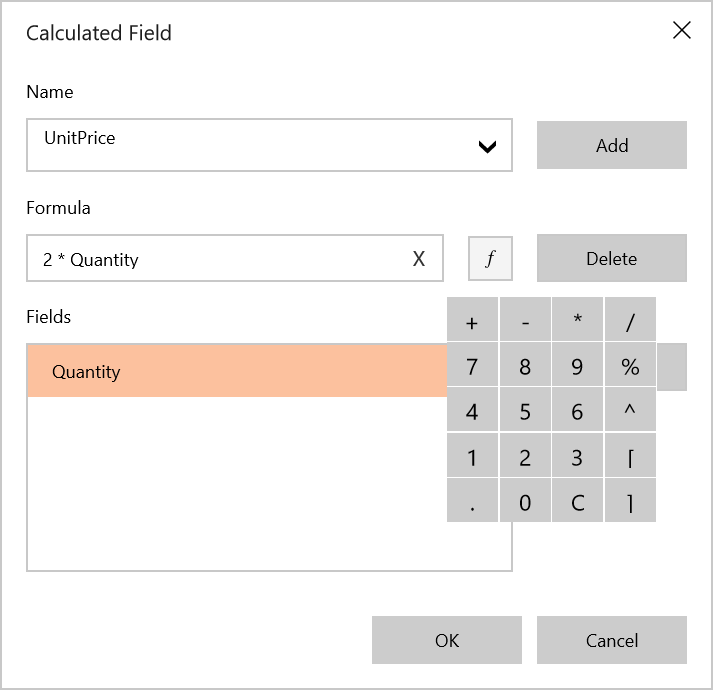
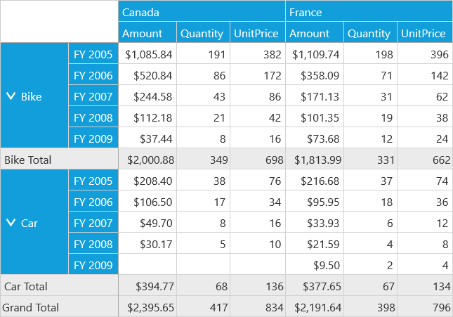

# Calculated Field

SfPivotClient provides support to add a new calculated field based on existing calculated items using the calculated field dialog.

**Adding a Calculated Field**

* To add a calculated field, click the *Calculated Field* button  in the client toolbar. In result, the calculated field dialog will be opened as shown below.

* **Name** for the calculated field should be defined.

 

* **Formula** can be entered by inserting calculation fields through **Fields** section. For inserting numerical operator, you can use formula pop-up as shown in the below screen-shot.

* Click the **Add** button for adding that calculated field and then click the **OK** button to populate the values in SfPivotClient.

