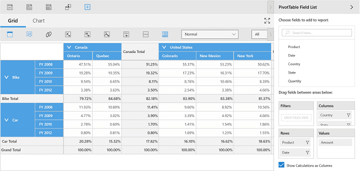
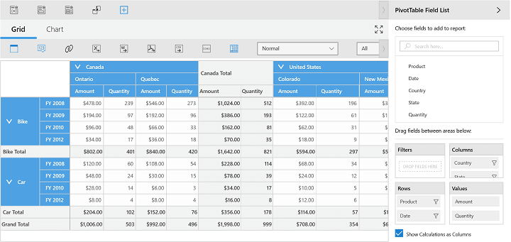

# Custom Calculations

**CalculationType** is an enumerator, used to specify the type of the calculation and it is defined in the PivotComputationInfo class. Various types of calculations are used for performing calculations as specified below.

* **NoCalculation** - Removes the custom calculations and restores the original values (default values). Pivot values are displayed as default values.
* **PercentageOfGrandTotal** - Displays a value cell as a percentage of grand total of all value cells of Pivot Engine.
* **PercentageOfColumnTotal** - Displays all value cells in each column as a percentage of its corresponding column total.
* **PercentageOfRowTotal** - Displays all value cells in each row as a percentage of its corresponding row total.
* **PercentageOfParentColumnTotal** - Displays a value cell as a percentage of parent column item values.
* **PercentageOfParentRowTotal** - Displays a value cell as a percentage of parent row item values.
* **PercentageOfParentTotal** - Displays a value cell as a percentage of base field (Parent row or column total).
* **Index** - Displays a value cell as an index value based on Pivot Engine generation.
* **Formula** - Displays a calculation based on a well formed algebraic expression involving other calculations.
* **PercentageOf** - Displays value as a percentage of value of base item in the base field.
* **DifferenceFrom** - Displays value as the difference from the value of the base item in the base field.
* **PercentageOfDifferenceFrom** - Displays value as the percentage difference from the value of the base item in the base field.
* **RunningTotalIn** - Displays the value for successive items in the base field as a running total.
* **PercentageOfRunningTotalIn** - Calculates the value for successive items in the base field that are displayed as a running total as a percentage.
* **RankSmallestToLargest** - Displays the rank of selected values in a specific field, listing the smallest item in the field as 1, and each larger value will have a higher rank value.
* **RankLargestToSmallest** - Displays the rank of selected values in a specific field, listing the largest item in the field as 1, and each smaller value will have a higher rank value.
* **Distinct** - Displays the subtotals based on the distinct values of base item defined for calculation item.

The following code snippet illustrates how to specify the calculation type for pivot calculations.





<syncfusion:SfPivotClient Name="PivotClient1" ItemSource="{Binding ProductSalesData}"
                        PivotRows="{Binding PivotRows}" PivotColumns="{Binding PivotColumns}">
    <syncfusion:SfPivotClient.PivotCalculations>
        <syncfusion:PivotComputationInfo CalculationName="Total" FieldName="Amount" Format="C" CalculationType="PercentageOfColumnTotal"/>
    </syncfusion:SfPivotClient.PivotCalculations>
</syncfusion:SfPivotClient>





PivotClient1.PivotCalculations.Add(new PivotComputationInfo
{
    FieldName = "Amount",
    Format = "C",
    CalculationType = CalculationType.PercentageOfColumnTotal
});





PivotClient1.PivotCalculations.Add(New PivotComputationInfo() With
{ _
    Key .FieldName = "Amount", _
    Key .Format = "C", _
    Key .CalculationType = CalculationType.PercentageOfColumnTotal _
})





## Providing Expression Field Calculation for Summaries

SfPivotClient supports calculated field for summary cells despite any options provided in summaries such as sum, count, max, min, etc.. This support can be achieved by setting the calculation type as "Formula" and by specifying the appropriate formula as specified in the below code snippet.





<syncfusion:SfPivotClient Name="PivotClient1" ItemSource="{Binding ProductSalesData}"
                        PivotRows="{Binding PivotRows}" PivotColumns="{Binding PivotColumns}">
<syncfusion:SfPivotClient.PivotCalculations>
<syncfusion:PivotComputationInfo CalculationName="Total" FieldName="Amount" Format="C" CalculationType="Formula" Formula="Quantity * 2"/>
<syncfusion:PivotComputationInfo CalculationName="Total" FieldName="Quantity" Format"#.##" />
</syncfusion:SfPivotClient.PivotCalculations>
</syncfusion:SfPivotClient>





PivotClient1.PivotCalculations.Add(new PivotComputationInfo { FieldName = "Amount", Format = "C", CalculationType = CalculationType.Formula, Formula = "Quantity * 2" });
PivotClient1.PivotCalculations.Add(new PivotComputationInfo { FieldName = "Quantity", Format = "#.##" });





PivotClient1.PivotCalculations.Add(New PivotComputationInfo() With { _
    Key .FieldName = "Amount", _
    Key .Format = "C", _
    Key .CalculationType = CalculationType.Formula, _
    Key .Formula = "Quantity * 2" _
})
PivotClient1.PivotCalculations.Add(New PivotComputationInfo() With { _
    Key .FieldName = "Quantity", _
    Key .Format = "#.##" _
})





